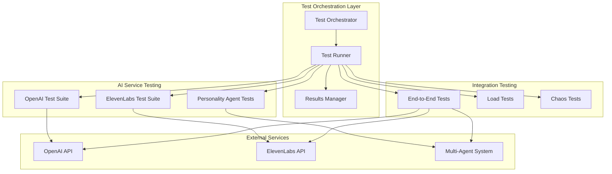

# AI Integration Testing Design Document

## Overview

This design document outlines the architecture and implementation approach for comprehensive AI integration testing within the Storytailor Story Intelligence™ platform. The system will validate OpenAI story generation, ElevenLabs voice synthesis, multi-agent personality coordination, and end-to-end storytelling workflows.

## Architecture

### High-Level Architecture



### Component Architecture

#### 1. Test Orchestration Layer

**Test Orchestrator**
- Coordinates test execution across all AI services
- Manages test scheduling and parallel execution
- Handles test environment setup and teardown
- Provides unified reporting and metrics collection

**Test Runner**
- Executes individual test suites
- Manages test data and fixtures
- Handles test isolation and cleanup
- Provides real-time test progress updates

**Results Manager**
- Aggregates test results from all suites
- Generates comprehensive test reports
- Tracks performance metrics and trends
- Manages test artifacts and logs

#### 2. AI Service Testing Components

**OpenAI Test Suite**
- Story generation validation tests
- Content quality assessment
- Age-appropriate content verification
- Error handling and fallback testing
- Rate limiting and cost optimization tests

**ElevenLabs Test Suite**
- Voice synthesis quality validation
- Audio format and encoding tests
- Voice consistency and character matching
- Synthesis job tracking and status management
- Error recovery and retry mechanism tests

**Personality Agent Tests**
- Multi-agent coordination validation
- Personality consistency testing
- Emotional intelligence response verification
- Age-appropriate adaptation testing
- Character trait persistence validation

#### 3. Integration Testing Components

**End-to-End Tests**
- Complete story creation workflows
- Cross-service integration validation
- User journey simulation
- Data flow verification
- Performance benchmarking

**Load Tests**
- Concurrent request handling
- Service scalability validation
- Resource utilization monitoring
- Performance degradation detection
- Bottleneck identification

**Chaos Tests**
- Service failure simulation
- Network partition handling
- API rate limit scenarios
- Partial service degradation
- Recovery mechanism validation

## Components and Interfaces

### 1. Test Configuration System

```typescript
interface TestConfiguration {
  openai: {
    apiKey: string;
    model: string;
    maxTokens: number;
    temperature: number;
  };
  elevenlabs: {
    apiKey: string;
    voiceIds: string[];
    outputFormat: string;
  };
  agents: {
    personalityEndpoint: string;
    safetyEndpoint: string;
    emotionEndpoint: string;
  };
  thresholds: {
    responseTime: number;
    errorRate: number;
    qualityScore: number;
  };
}
```

### 2. Test Execution Engine

```typescript
interface TestExecutionEngine {
  executeTestSuite(suite: TestSuite): Promise<TestResults>;
  runParallelTests(tests: Test[]): Promise<TestResults[]>;
  validateServiceHealth(): Promise<HealthStatus>;
  generateTestReport(results: TestResults[]): TestReport;
}
```

### 3. AI Service Validators

```typescript
interface OpenAIValidator {
  validateStoryGeneration(prompt: string, preferences: UserPreferences): Promise<ValidationResult>;
  assessContentQuality(story: string, ageRange: AgeRange): Promise<QualityScore>;
  verifyContentSafety(story: string): Promise<SafetyResult>;
}

interface ElevenLabsValidator {
  validateVoiceSynthesis(text: string, voiceId: string): Promise<AudioValidationResult>;
  assessAudioQuality(audioUrl: string): Promise<AudioQualityScore>;
  verifyVoiceConsistency(audioSamples: string[]): Promise<ConsistencyResult>;
}
```

### 4. Performance Monitoring

```typescript
interface PerformanceMonitor {
  trackResponseTime(service: string, operation: string, duration: number): void;
  recordErrorRate(service: string, errors: number, total: number): void;
  monitorResourceUsage(service: string, metrics: ResourceMetrics): void;
  generatePerformanceReport(): PerformanceReport;
}
```

## Data Models

### Test Result Models

```typescript
interface TestResult {
  testId: string;
  testName: string;
  status: 'passed' | 'failed' | 'skipped';
  duration: number;
  timestamp: Date;
  metrics: TestMetrics;
  errors?: TestError[];
}

interface TestMetrics {
  responseTime: number;
  throughput: number;
  errorRate: number;
  qualityScore?: number;
  costEstimate?: number;
}

interface TestError {
  code: string;
  message: string;
  stack?: string;
  context: Record<string, any>;
}
```

### AI Service Models

```typescript
interface StoryGenerationResult {
  story: string;
  metadata: {
    model: string;
    tokens: number;
    cost: number;
    generationTime: number;
  };
  qualityMetrics: {
    readabilityScore: number;
    ageAppropriateness: number;
    creativityScore: number;
  };
}

interface VoiceSynthesisResult {
  audioUrl: string;
  duration: number;
  format: string;
  metadata: {
    voiceId: string;
    model: string;
    cost: number;
    synthesisTime: number;
  };
  qualityMetrics: {
    clarity: number;
    naturalness: number;
    consistency: number;
  };
}
```

## Error Handling

### Error Classification

1. **Service Errors**
   - API authentication failures
   - Rate limiting exceeded
   - Service unavailability
   - Invalid request parameters

2. **Content Errors**
   - Inappropriate content generation
   - Quality threshold failures
   - Age-inappropriate content
   - Safety filter violations

3. **Performance Errors**
   - Response time exceeded
   - Throughput below threshold
   - Resource exhaustion
   - Timeout errors

### Error Recovery Strategies

```typescript
interface ErrorRecoveryStrategy {
  retryWithBackoff(operation: () => Promise<any>, maxRetries: number): Promise<any>;
  fallbackToAlternativeService(primaryService: string, fallbackService: string): Promise<any>;
  gracefulDegradation(requiredFeatures: string[], availableFeatures: string[]): Promise<any>;
  circuitBreakerPattern(service: string, threshold: number): Promise<any>;
}
```

## Testing Strategy

### 1. Unit Testing
- Individual AI service client testing
- Mock service response validation
- Error handling verification
- Configuration validation

### 2. Integration Testing
- Cross-service workflow validation
- Data transformation testing
- Service dependency verification
- End-to-end user journey testing

### 3. Performance Testing
- Load testing with realistic traffic patterns
- Stress testing beyond normal capacity
- Endurance testing for extended periods
- Spike testing for sudden traffic increases

### 4. Chaos Engineering
- Random service failure injection
- Network latency simulation
- Partial service degradation
- Resource constraint simulation

### 5. Security Testing
- API key validation and rotation
- Content injection attack prevention
- Rate limiting bypass attempts
- Data privacy compliance verification

## Quality Assurance

### Content Quality Metrics

```typescript
interface ContentQualityMetrics {
  readabilityScore: number; // Flesch-Kincaid grade level
  creativityIndex: number; // Uniqueness and imagination score
  ageAppropriateness: number; // Age-specific content suitability
  safetyScore: number; // Child safety compliance score
  coherenceRating: number; // Story flow and consistency
}
```

### Audio Quality Metrics

```typescript
interface AudioQualityMetrics {
  clarityScore: number; // Speech clarity and pronunciation
  naturalnessRating: number; // Human-like speech quality
  consistencyIndex: number; // Voice character consistency
  emotionalExpression: number; // Appropriate emotional tone
  technicalQuality: number; // Audio encoding and format quality
}
```

### Performance Benchmarks

- **Story Generation**: < 15 seconds for 500-word stories
- **Voice Synthesis**: < 30 seconds for 5-minute audio
- **End-to-End Flow**: < 45 seconds total completion time
- **Error Rate**: < 1% for all AI service calls
- **Availability**: 99.9% uptime for critical path services

## Monitoring and Observability

### Real-Time Monitoring

```typescript
interface MonitoringSystem {
  trackServiceHealth(service: string): HealthMetrics;
  monitorPerformance(operation: string): PerformanceMetrics;
  alertOnThresholds(metric: string, threshold: number): void;
  generateDashboard(): MonitoringDashboard;
}
```

### Logging Strategy

- **Structured Logging**: JSON format with consistent fields
- **Correlation IDs**: Track requests across services
- **Performance Logs**: Response times and resource usage
- **Error Logs**: Detailed error context and stack traces
- **Audit Logs**: Security and compliance events

### Alerting Framework

- **Critical Alerts**: Service failures, security breaches
- **Warning Alerts**: Performance degradation, high error rates
- **Info Alerts**: Threshold approaching, maintenance windows
- **Escalation Policies**: Automated escalation based on severity

## Deployment and CI/CD Integration

### Continuous Testing Pipeline

```yaml
stages:
  - unit_tests
  - integration_tests
  - ai_service_validation
  - performance_benchmarks
  - chaos_engineering
  - security_scanning
  - deployment_verification
```

### Test Environment Management

- **Staging Environment**: Production-like AI service integration
- **Load Testing Environment**: Scalable infrastructure for performance tests
- **Chaos Testing Environment**: Isolated environment for failure simulation
- **Development Environment**: Local testing with mocked services

### Quality Gates

1. **Unit Test Coverage**: Minimum 90% code coverage
2. **Integration Test Success**: 100% critical path tests passing
3. **Performance Benchmarks**: All metrics within acceptable thresholds
4. **Security Scans**: No high or critical vulnerabilities
5. **AI Service Validation**: Content quality and safety scores met

## Cost Optimization

### AI Service Cost Management

```typescript
interface CostOptimizer {
  trackUsageCosts(service: string, operation: string, cost: number): void;
  optimizeRequestBatching(requests: AIRequest[]): BatchedRequest[];
  implementCaching(cacheKey: string, ttl: number): CacheStrategy;
  monitorBudgetThresholds(service: string, budget: number): BudgetAlert[];
}
```

### Testing Cost Controls

- **Budget Limits**: Daily/monthly spending caps for test execution
- **Resource Optimization**: Efficient test data management
- **Parallel Execution**: Minimize test duration through parallelization
- **Smart Caching**: Reuse test results where appropriate
- **Environment Scaling**: Auto-scaling test infrastructure based on demand