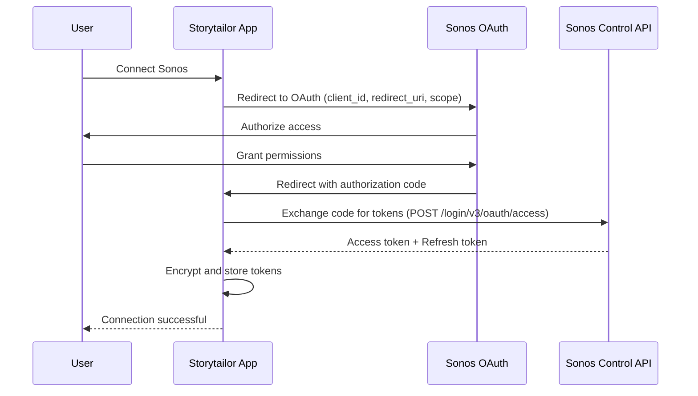

# Sonos Spatial Audio Orchestration - Specification

**Status**: Design Phase  
**Priority**: High  
**Target**: Premium Immersive Storytelling Experience  
**Last Updated**: 2025-12-14  
**Audience**: Internal | Engineering Team

## Vision

Transform a child's room (especially hospital rooms) into a fully immersive story environment where:
- **Narration** plays from the main speaker (clear, centered)
- **Sound effects** come from different speakers around the room (spatial immersion)
- **Music/Ambiance** plays from dedicated speakers (atmospheric background)
- The child feels **surrounded by the story**, not just listening to it

## Sonos Control API Overview

### API Documentation
- **Base URL**: `https://api.ws.sonos.com/control/api/v1`
- **Authentication**: OAuth 2.0
- **Documentation**: https://developer.sonos.com/
- **API Version**: v1 (current)

### Key API Endpoints

**Households:**
- `GET /households` - List user's Sonos households
- `GET /households/{householdId}` - Get household details

**Groups:**
- `GET /households/{householdId}/groups` - List speaker groups
- `POST /households/{householdId}/groups/{groupId}/playback/play` - Start playback
- `POST /households/{householdId}/groups/{groupId}/playback/pause` - Pause playback
- `POST /households/{householdId}/groups/{groupId}/playback/seek` - Seek in track

**Audio:**
- `POST /households/{householdId}/groups/{groupId}/audioClip` - Play audio clip
- `POST /households/{householdId}/groups/{groupId}/playback/loadAudioClip` - Load audio clip

**Volume:**
- `POST /households/{householdId}/groups/{groupId}/groupVolume` - Set group volume
- `POST /households/{householdId}/players/{playerId}/playerVolume` - Set individual player volume

## OAuth 2.0 Authentication Flow

### Registration Requirements

1. **Sonos Developer Account**: Register at https://developer.sonos.com/
2. **Application Registration**: Create OAuth application
3. **Redirect URI**: Configure callback URL
4. **Scopes**: Request required permissions
   - `playback-control`
   - `playback-control-all`
   - `household-control`

### OAuth Flow



### Token Management

**Token Storage:**
- Encrypted in `sonos_tokens` table (AES-256-GCM)
- Refresh tokens stored separately
- Automatic refresh 5 minutes before expiry
- Token rotation every 30 days

**Code Reference Pattern:**
- Similar to `packages/smart-home-agent/src/token/TokenManager.ts`
- Extend `SmartHomeTokenManager` base class
- Use `TokenEncryptionService` for encryption

## Three-Stream Audio Orchestration

### Stream Separation Architecture

**Three Independent Audio Streams:**

1. **Narration Stream** (Main Speaker)
   - Frankie's voice / story narration
   - Clear, centered, primary focus
   - Volume: 70-80% (adjustable)
   - Speaker: Primary/center speaker
   - Priority: High

2. **Sound Effects Stream** (Spatial Speakers)
   - Story-specific sound effects (thunder, birds, footsteps, magic)
   - Distributed across multiple speakers
   - Spatial positioning based on story context
   - Volume: 40-60% (adjustable)
   - Speakers: Surround/positional speakers
   - Priority: Medium

3. **Music/Ambiance Stream** (Background Speakers)
   - Background music
   - Ambient sounds (forest, ocean, city)
   - Very subtle, atmospheric
   - Volume: 15-25% (adjustable)
   - Speakers: All speakers (very soft) or dedicated ambiance speakers
   - Priority: Low

### Speaker Configuration

```typescript
interface SpeakerConfiguration {
  mainSpeaker: {
    id: string;
    role: 'narration';
    volume: number; // 0.7-0.8
    priority: 'high';
  };
  
  spatialSpeakers: Array<{
    id: string;
    role: 'sound_effects';
    position: 'left' | 'right' | 'back_left' | 'back_right' | 'front_left' | 'front_right';
    volume: number; // 0.4-0.6
    priority: 'medium';
  }>;
  
  ambianceSpeakers: Array<{
    id: string;
    role: 'music' | 'ambiance';
    volume: number; // 0.15-0.25
    priority: 'low';
  }>;
}
```

## Spatial Positioning Logic

### Sound Effect Positioning

**Position Mapping:**
- **Left side of story** → Left speakers
- **Right side of story** → Right speakers
- **Behind character** → Back speakers
- **Character movement** → Sound moves between speakers
- **Environmental sounds** → Distributed across all spatial speakers

### Example Story Moment

```
Story: "The dragon flew from the left side of the room to the right..."

Audio:
- Narration: Main speaker (center) - 75% volume
- Dragon wing flaps: Start on left speaker → Move to right speaker - 50% volume
- Wind effects: All spatial speakers (subtle) - 30% volume
- Background music: All speakers (very soft) - 20% volume
```

### Spatial Audio Algorithm

```typescript
function selectSpeakerForPosition(
  position: string,
  speakers: SpeakerDevice[]
): SpeakerDevice {
  // Position mapping logic
  const positionMap = {
    'left': ['left', 'front_left', 'back_left'],
    'right': ['right', 'front_right', 'back_right'],
    'center': ['center'],
    'back': ['back_left', 'back_right'],
    'front': ['front_left', 'front_right']
  };
  
  const targetPositions = positionMap[position] || ['center'];
  
  // Find speaker matching position
  for (const targetPos of targetPositions) {
    const speaker = speakers.find(s => s.location === targetPos);
    if (speaker) return speaker;
  }
  
  // Fallback to first available spatial speaker
  return speakers[0];
}
```

## Hospital Room Optimization

### Single Speaker (Most Common)

**Configuration:**
- **Narration**: Main speaker
- **Sound Effects**: Same speaker (with spatial effects if possible)
- **Music**: Same speaker (very soft)
- **Fallback**: Still immersive, just not multi-speaker

**Implementation:**
```typescript
if (speakers.length === 1) {
  // Single speaker mode
  await playOnSpeaker(speakers[0], {
    narration: { volume: 0.75 },
    soundEffects: { volume: 0.50, mixWithNarration: true },
    music: { volume: 0.20, mixWithNarration: true }
  });
}
```

### Two Speakers (Common)

**Configuration:**
- **Narration**: Primary speaker (near bed)
- **Sound Effects**: Secondary speaker (opposite side)
- **Music**: Both speakers (soft)

**Implementation:**
```typescript
if (speakers.length === 2) {
  await playOnSpeaker(speakers[0], {
    narration: { volume: 0.75 }
  });
  await playOnSpeaker(speakers[1], {
    soundEffects: { volume: 0.50 },
    music: { volume: 0.20 }
  });
}
```

### Multiple Speakers (Rare but Magical)

**Configuration:**
- **Narration**: Center speaker
- **Sound Effects**: Distributed across all speakers
- **Music**: All speakers (atmospheric)

## Volume Limits and Safety Controls

### Volume Restrictions

**Default Limits:**
- Maximum volume: 80% (configurable by parent)
- Hospital mode: 60% maximum
- Age-appropriate limits: Lower for younger children

**Age-Based Limits:**
- **3-5 years**: Max 60%
- **6-8 years**: Max 70%
- **9+ years**: Max 80%

**Code Reference Pattern:**
- Similar to `packages/smart-home-agent/src/lighting/LightingOrchestrator.ts:72` (age restrictions)

### Safety Controls

**Parental Controls:**
- Volume limits per child
- Time limits for audio sessions
- Emergency stop functionality
- Override capabilities

**Hospital Mode:**
- Automatic volume reduction
- Respect for shared rooms
- Medical equipment compatibility
- Quiet hours support

## Error Handling and Fallback Strategies

### Connection Failures

**Fallback Chain:**
1. Retry with exponential backoff (3 attempts)
2. Fallback to single speaker mode
3. Fallback to local device audio
4. Graceful degradation (narration only)

### Speaker Unavailability

**Handling:**
- Detect unavailable speakers
- Redistribute audio to available speakers
- Notify user of reduced experience
- Continue with available speakers

### Token Refresh Failures

**Handling:**
- Attempt token refresh
- If refresh fails, prompt user to reconnect
- Maintain session state for reconnection
- Clear sensitive data on permanent failure

## Integration Points

### With MultiSpeakerAudioService

**File**: `lambda-deployments/content-agent/src/services/MultiSpeakerAudioService.ts`

**Enhancements:**
- Complete Sonos OAuth integration
- Three-stream separation (narration, effects, music)
- Spatial positioning logic
- Speaker role assignment (main, spatial, ambiance)
- Hospital room optimization

### With LightingOrchestrator

**File**: `packages/smart-home-agent/src/lighting/LightingOrchestrator.ts`

**Coordination:**
- Synchronize audio and lighting changes
- Story beat coordination
- Emotional moment synchronization
- Narrative event alignment

### With SmartHomeAgent

**File**: `packages/smart-home-agent/src/SmartHomeAgent.ts`

**Integration:**
- Device discovery coordination
- Token management integration
- Privacy control enforcement
- Health monitoring

## Database Schema

### Sonos Devices Table

```sql
CREATE TABLE sonos_devices (
  id UUID PRIMARY KEY DEFAULT gen_random_uuid(),
  user_id UUID REFERENCES users NOT NULL,
  device_id TEXT NOT NULL, -- Sonos device ID
  name TEXT NOT NULL,
  room_id TEXT NOT NULL,
  household_id TEXT NOT NULL, -- Sonos household ID
  capabilities JSONB DEFAULT '{}', -- Volume, stereo, grouping
  location TEXT, -- 'left', 'right', 'center', 'back_left', etc.
  role TEXT, -- 'main', 'spatial', 'ambiance'
  connection_status TEXT DEFAULT 'disconnected',
  created_at TIMESTAMPTZ DEFAULT NOW(),
  updated_at TIMESTAMPTZ DEFAULT NOW()
);

CREATE INDEX idx_sonos_devices_user_id ON sonos_devices(user_id);
CREATE INDEX idx_sonos_devices_household_id ON sonos_devices(household_id);
```

### Sonos Tokens Table

```sql
CREATE TABLE sonos_tokens (
  id UUID PRIMARY KEY DEFAULT gen_random_uuid(),
  user_id UUID REFERENCES users NOT NULL,
  household_id TEXT NOT NULL,
  access_token_encrypted TEXT NOT NULL, -- AES-256-GCM encrypted
  refresh_token_encrypted TEXT NOT NULL,
  expires_at TIMESTAMPTZ NOT NULL,
  last_refresh TIMESTAMPTZ,
  refresh_attempts INTEGER DEFAULT 0,
  token_status TEXT DEFAULT 'active', -- 'active', 'expired', 'revoked'
  created_at TIMESTAMPTZ DEFAULT NOW(),
  updated_at TIMESTAMPTZ DEFAULT NOW()
);

CREATE INDEX idx_sonos_tokens_user_id ON sonos_tokens(user_id);
CREATE INDEX idx_sonos_tokens_household_id ON sonos_tokens(household_id);
```

### Sonos Groups Table

```sql
CREATE TABLE sonos_groups (
  id UUID PRIMARY KEY DEFAULT gen_random_uuid(),
  user_id UUID REFERENCES users NOT NULL,
  group_id TEXT NOT NULL, -- Sonos group ID
  name TEXT NOT NULL,
  room_id TEXT NOT NULL,
  household_id TEXT NOT NULL,
  speaker_ids TEXT[] NOT NULL, -- Array of device IDs in group
  group_type TEXT, -- 'main', 'spatial', 'ambiance'
  created_at TIMESTAMPTZ DEFAULT NOW(),
  updated_at TIMESTAMPTZ DEFAULT NOW()
);

CREATE INDEX idx_sonos_groups_user_id ON sonos_groups(user_id);
CREATE INDEX idx_sonos_groups_household_id ON sonos_groups(household_id);
```

## Privacy & Compliance

### COPPA Compliance

**Data Sent to Sonos:**
- **User ID**: Not sent (only device tokens)
- **Age Information**: Not sent
- **Child Profile Data**: Not sent
- **Story Content**: Not sent
- **Audio URLs**: Sent (for playback)
- **Volume Commands**: Sent (for control)
- **Device Tokens**: Stored encrypted in Supabase, not sent to Sonos

**Data Protection Measures:**
1. **Token Encryption**: All device tokens encrypted at rest (AES-256-GCM)
2. **No PII Transmission**: No child-identifying data sent to Sonos API
3. **Parental Consent Required**: Children under 13 require verified parent consent before device connection
4. **Age-Appropriate Restrictions**: COPPA-protected users have volume restrictions
5. **Data Minimization**: Only necessary audio control data sent
6. **Retention Policy**: Device tokens retained only while device is connected, deleted on disconnection
7. **RLS Protection**: Device tokens protected by Row Level Security policies

**Compliance Status:**
- ✅ **COPPA Compliant**: No child-identifying data sent to Sonos
- ✅ **GDPR Compliant**: Data minimization, consent management, retention policies
- ✅ **UK Children's Code Compliant**: Privacy by default, age-appropriate design

## Implementation Phases

### Phase 1: Sonos OAuth Integration (Q1 2025)
- Sonos OAuth 2.0 flow implementation
- Token management and encryption
- Device discovery
- Basic speaker control

### Phase 2: Spatial Audio Orchestration (Q2 2025)
- Three-stream separation
- Spatial positioning logic
- Speaker role assignment
- Hospital room optimization

### Phase 3: Advanced Features (Q3 2025)
- Character movement tracking
- Real-time spatial audio adaptation
- Cross-room coordination
- Family participation features

## Related Documentation

- **Sonos Integration Guide**: See [Sonos Integration](./sonos.md)
- **Sonos Manager Spec**: See [Sonos Manager Specification](./sonos-manager-spec.md)
- **API Endpoints**: See [Sonos API Endpoints](./sonos-api-endpoints.md)
- **Smart Home Agent**: See [Smart Home Agent Documentation](./README.md)
- **MultiSpeakerAudioService**: See `lambda-deployments/content-agent/src/services/MultiSpeakerAudioService.ts`
