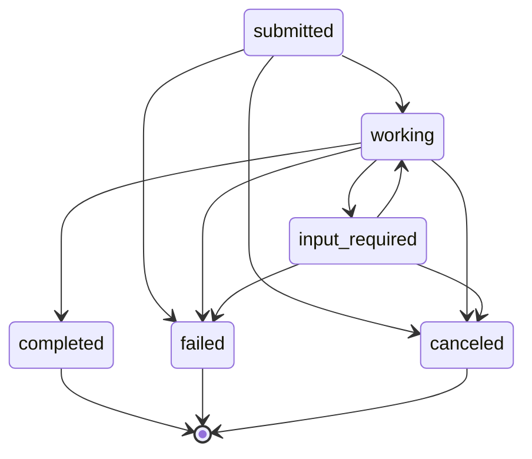

# A2A Protocol (Agent-to-Agent) — Overview

## Purpose

A2A is Storytailor’s **partner-facing** protocol for agent discovery, JSON-RPC method invocation, long-running task delegation, task status streaming (SSE), and webhook notifications.

This documentation describes the **production implementation** as wired in the REST gateway and implemented by the A2A adapter.

- **A2A routes (HTTP)**: mounted by [`packages/universal-agent/src/api/RESTAPIGateway.ts`](../../../../packages/universal-agent/src/api/RESTAPIGateway.ts)
- **A2A adapter implementation (core behavior + types)**: [`packages/a2a-adapter/src`](../../../../packages/a2a-adapter/src)

## Base URL and Route Prefix

All endpoints are prefixed with `/a2a/`.

- **Production base**: `https://storyintelligence.dev`
- **Staging base**: `https://api-staging.storytailor.dev`

Notes:
- In code, the adapter is configured from `A2A_BASE_URL`/`APP_URL`, with defaults in the gateway:
  - `baseUrl`: `process.env.A2A_BASE_URL || process.env.APP_URL || 'https://api.storytailor.dev'`
  - `webhookUrl`: `process.env.A2A_WEBHOOK_URL || ${APP_URL}/a2a/webhook`
  - `healthUrl`: `process.env.A2A_HEALTH_URL || ${APP_URL}/health`

## Endpoints (Complete)

The production gateway registers exactly these A2A endpoints:

1. `GET /a2a/discovery`
2. `POST /a2a/message`
3. `POST /a2a/task`
4. `GET /a2a/status` (JSON or SSE)
5. `POST /a2a/webhook`

See detailed endpoint docs:
- `01-authentication.md`
- `02-discovery.md`
- `03-messaging.md`
- `04-task-delegation.md`
- `05-task-status.md`
- `06-webhooks.md`
- `07-error-catalog.md`
- `08-complete-examples.md`

## Core Data Model (Canonical)

The canonical A2A shapes are defined in [`packages/a2a-adapter/src/types.ts`](../../../../packages/a2a-adapter/src/types.ts).

### JSON-RPC 2.0 Envelope

**Request (`JsonRpcRequest`)**

```json
{
  "jsonrpc": "2.0",
  "id": "string-or-number-or-null",
  "method": "string",
  "params": {
    "key": "value"
  }
}
```

- `jsonrpc`: must be exactly `"2.0"`.
- `id`: may be `string | number | null`.
- `method`: non-empty string.
- `params`: may be an object (`Record<string, unknown>`) OR an array (`unknown[]`).

**Response (`JsonRpcResponse`)**

Success variant:

```json
{
  "jsonrpc": "2.0",
  "id": "same-as-request-id",
  "result": {
    "any": "shape"
  }
}
```

Error variant:

```json
{
  "jsonrpc": "2.0",
  "id": "same-as-request-id-or-null",
  "error": {
    "code": -32603,
    "message": "string",
    "data": {
      "any": "json"
    }
  }
}
```

### Task Lifecycle

**Task object (`Task`)**

```json
{
  "taskId": "uuid",
  "state": "submitted|working|input-required|completed|failed|canceled",
  "method": "string",
  "params": {
    "key": "value"
  },
  "result": {
    "any": "json"
  },
  "error": {
    "code": -32603,
    "message": "string",
    "data": {
      "any": "json"
    }
  },
  "sessionId": "string",
  "clientAgentId": "string",
  "remoteAgentId": "string",
  "createdAt": "ISO-8601",
  "updatedAt": "ISO-8601",
  "completedAt": "ISO-8601",
  "estimatedCompletion": "ISO-8601",
  "progress": 0
}
```

Notes:
- `taskId` is generated as a UUID.
- `state` is a strict state machine.
- `result` is present for completed tasks (may be `Artifact` or other result object).
- `error` is present for failed tasks.
- `progress` is only meaningful for long-running tasks and constrained to 0–100.

**State machine (exact transition rules)**

These rules are enforced by the task manager:



## Authentication (Summary)

A2A authentication is implemented in [`packages/a2a-adapter/src/Authentication.ts`](../../../../packages/a2a-adapter/src/Authentication.ts).

Supported schemes:
- **API key**: `X-API-Key: [REDACTED_API_KEY]
- **OAuth2 bearer token (JWT)**: `Authorization: Bearer [REDACTED_JWT]
- **OpenID Connect / JWKS validation** (JWT signature verification) via `A2A_JWKS_URL`, issuer, audience.

Important implementation notes:
- API key auth is attempted first.
- If no API key succeeds, bearer token auth is attempted.
- If neither succeeds, authentication fails.
- Scope is validated per method (see `01-authentication.md`).

## Rate Limiting (Summary)

Rate limits are configured in the gateway:
- `A2A_RATE_LIMIT_PER_MINUTE` (default `60`)

The implementation detail of enforcement is documented in `01-authentication.md` and `07-error-catalog.md`.

## Errors (Summary)

A2A uses JSON-RPC errors (not HTTP error bodies) for `/a2a/message`.

- Standard JSON-RPC codes:
  - `-32700` Parse error
  - `-32600` Invalid Request
  - `-32601` Method not found
  - `-32602` Invalid params
  - `-32603` Internal error

- A2A-specific codes:
  - `-32000` Task not found
  - `-32001` Task already completed
  - `-32002` Task canceled
  - `-32003` Invalid task state
  - `-32004` Agent not found
  - `-32005` Capability not supported
  - `-32006` Authentication failed
  - `-32007` Rate limit exceeded
  - `-32008` Webhook delivery failed
  - `-32009` Invalid agent card
  - `-32010` Task timeout

Full catalog and exhaustive examples: `07-error-catalog.md`.

## Transport Variants (Complete)

A2A supports the following transport-level response variants:

### `GET /a2a/discovery`

- `200` JSON: `{ "agentCard": { ... } }`
- `503` JSON: `{ "error": "A2A adapter not available" }`
- `500` JSON: `{ "error": "Failed to retrieve agent card" }`

### `POST /a2a/message`

- `200` JSON-RPC response envelope (`result` or `error`) returned in body
- `503` JSON-RPC error envelope with `-32603` and message `A2A adapter not available`
- `500` JSON-RPC error envelope with `-32603` and message `Internal error`

### `POST /a2a/task`

- `200` JSON: `Task`
- `400` JSON: missing `method` OR missing `clientAgentId`
- `503` JSON: adapter not available
- `500` JSON: task creation failed

### `GET /a2a/status`

- `200` JSON: `Task` (standard)
- `200` SSE stream: `text/event-stream` (if `Accept` contains `text/event-stream`)
- `400` JSON: missing `taskId` query parameter
- `503` JSON: adapter not available
- `500` JSON: status check failed

### `POST /a2a/webhook`

- `200` JSON: `{ "success": true }`
- `503` JSON: adapter not available
- `500` JSON: webhook processing failed

## Minimal Quick Start (Synchronous)

### 1) Discover capabilities

```bash
curl -sS -X GET "https://storyintelligence.dev/a2a/discovery" \
  -H "Accept: application/json"
```

### 2) Call a JSON-RPC method

```bash
curl -sS -X POST "https://storyintelligence.dev/a2a/message" \
  -H "Content-Type: application/json" \
  -H "X-API-Key: [REDACTED_API_KEY]" \
  -d '{
    "jsonrpc": "2.0",
    "id": "req-1",
    "method": "story.generate",
    "params": {
      "characterId": "char_123",
      "storyType": "adventure",
      "theme": "friendship"
    }
  }'
```

## Minimal Quick Start (Asynchronous Task + SSE)

### 1) Create a task

```bash
curl -sS -X POST "https://storyintelligence.dev/a2a/task" \
  -H "Content-Type: application/json" \
  -H "Authorization: Bearer [REDACTED_JWT]" \
  -d '{
    "method": "story.generate",
    "params": {
      "characterId": "char_123",
      "storyType": "adventure"
    },
    "clientAgentId": "partner-agent",
    "sessionId": "session-456"
  }'
```

### 2) Stream status

```bash
curl -N -sS "https://storyintelligence.dev/a2a/status?taskId=TASK_ID" \
  -H "Accept: text/event-stream" \
  -H "X-API-Key: [REDACTED_API_KEY]"
```

## Version

This implementation identifies the agent card as:
- `agentId`: `storytailor-agent`
- `agentName`: `Storytailor Agent`
- `agentVersion`: `1.0.0`

See `02-discovery.md` for full agent card fields and variants.
