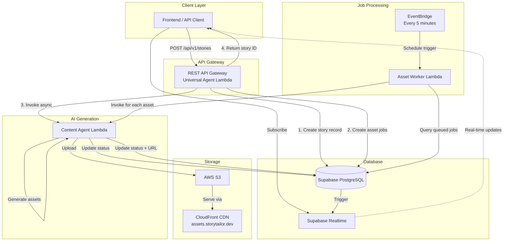
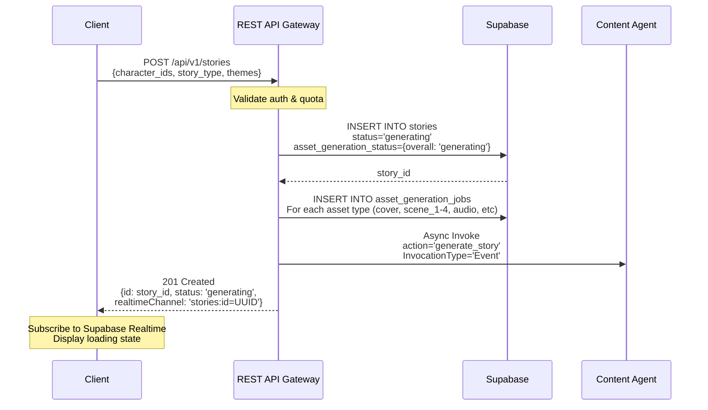
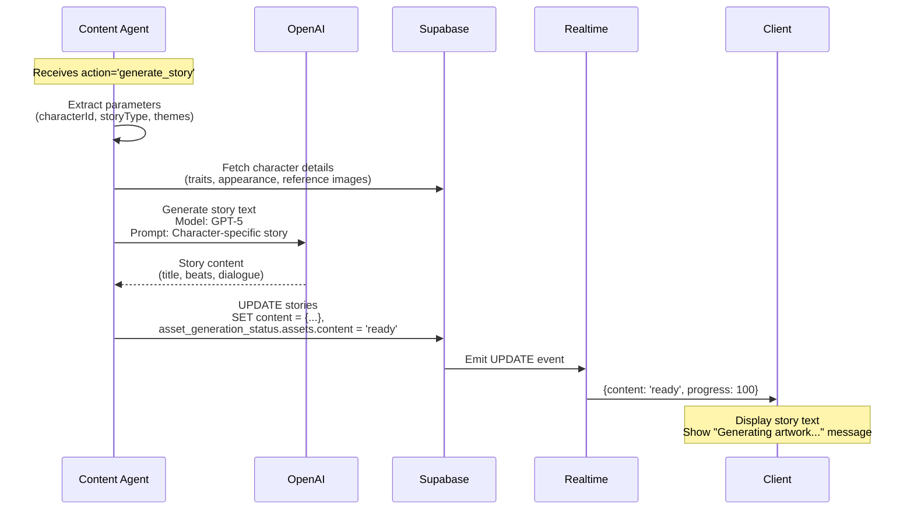
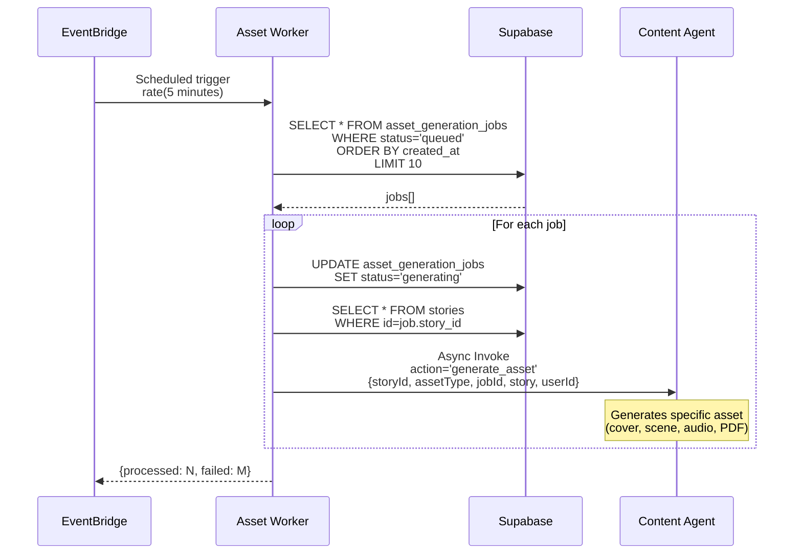
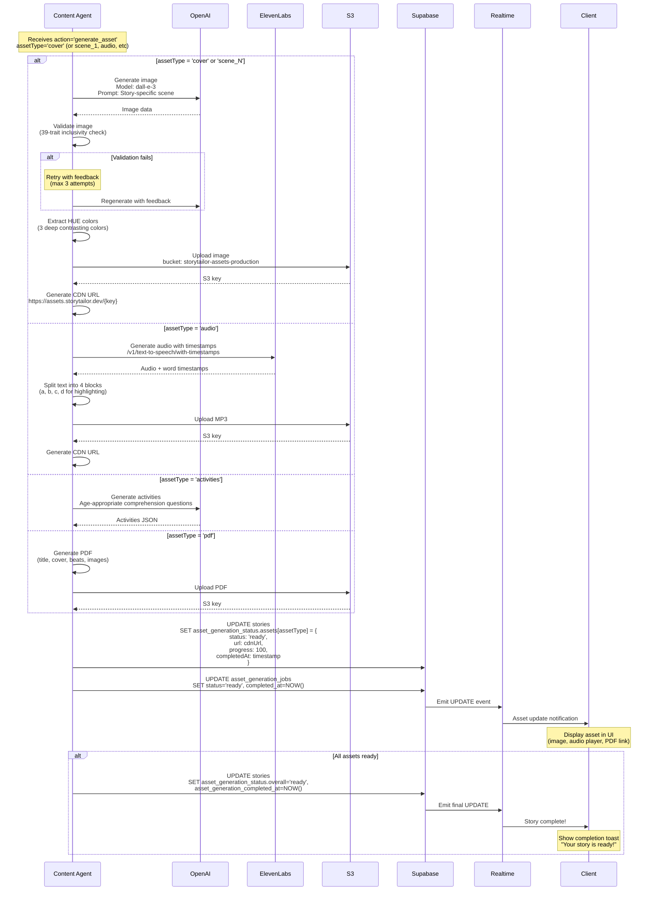

# Story Creation Pipeline - Complete Flow Documentation

**Version**: 1.0.0  
**Last Updated**: December 28, 2025  
**Status**: ✅ Production  

---

## Overview

This document provides a complete, detailed explanation of how stories are created in the Storytailor platform, from initial REST API request through final asset generation. This pipeline handles AI-generated content, images, audio, and PDFs with real-time progress tracking.

---

## Table of Contents

1. [Architecture Overview](#architecture-overview)
2. [Complete Story Creation Flow](#complete-story-creation-flow)
3. [Component Responsibilities](#component-responsibilities)
4. [Database Schema](#database-schema)
5. [Real-Time Progress Tracking](#real-time-progress-tracking)
6. [Error Handling](#error-handling)
7. [Performance Characteristics](#performance-characteristics)
8. [Troubleshooting Guide](#troubleshooting-guide)

---

## Architecture Overview

The story creation pipeline uses an **async job queue architecture** with the following components:



**Key Architectural Decisions:**
- **Async Processing**: Story creation returns immediately; assets generate in background
- **Job Queue**: Decouples API layer from expensive AI generation
- **Event-Driven**: EventBridge triggers asset processing every 5 minutes
- **Real-Time Updates**: Frontend receives progress via Supabase Realtime
- **Retry Logic**: Failed jobs can be retried; timeouts prevent stuck jobs

---

## Complete Story Creation Flow

### Phase 1: Story Record Creation (0-2 seconds)



**API Request Example:**
```json
POST /api/v1/stories
Authorization: Bearer {token}
Content-Type: application/json

{
  "character_ids": ["uuid-1", "uuid-2"],
  "story_type": "adventure",
  "themes": ["courage", "friendship"],
  "generateAssets": true
}
```

**API Response Example:**
```json
{
  "success": true,
  "data": {
    "id": "01234567-89ab-cdef-0123-456789abcdef",
    "status": "generating",
    "asset_generation_status": {
      "overall": "generating",
      "assets": {
        "content": { "status": "generating", "progress": 0 },
        "cover": { "status": "pending", "progress": 0 },
        "scene_1": { "status": "pending", "progress": 0 },
        "scene_2": { "status": "pending", "progress": 0 },
        "scene_3": { "status": "pending", "progress": 0 },
        "scene_4": { "status": "pending", "progress": 0 },
        "audio": { "status": "pending", "progress": 0 },
        "activities": { "status": "pending", "progress": 0 },
        "pdf": { "status": "pending", "progress": 0 }
      }
    },
    "realtimeChannel": "stories:id=01234567-89ab-cdef-0123-456789abcdef"
  }
}
```

**What Happens:**
1. ✅ User authenticated and quota checked
2. ✅ Story record created with `status='generating'`
3. ✅ Asset jobs created with `status='queued'`
4. ✅ Content Agent invoked asynchronously
5. ✅ Story ID returned immediately
6. ✅ Frontend can subscribe to real-time updates

---

### Phase 2: Story Content Generation (30-60 seconds)



**Content Agent Logic:**
```typescript
// Content Agent Lambda Handler
async function generateStory(request: StoryGenerationRequest) {
  // 1. Fetch character details
  const character = await supabase
    .from('characters')
    .select('*, reference_images')
    .eq('id', request.characterId)
    .single();
  
  // 2. Generate story content with OpenAI
  const prompt = buildStoryPrompt(character, request.storyType, request.themes);
  const story = await openai.chat.completions.create({
    model: 'gpt-5',
    messages: [{ role: 'system', content: prompt }]
  });
  
  // 3. Parse and structure story content
  const content = parseStoryContent(story.choices[0].message.content);
  
  // 4. Save to database
  await supabase
    .from('stories')
    .update({
      content,
      asset_generation_status: {
        ...existing,
        assets: {
          ...existing.assets,
          content: { status: 'ready', progress: 100, completedAt: new Date().toISOString() }
        }
      }
    })
    .eq('id', request.storyId);
  
  return { success: true, storyId: request.storyId };
}
```

**What Happens:**
1. ✅ Content Agent receives async invocation
2. ✅ Fetches character details and reference images
3. ✅ Generates story text using OpenAI GPT-5
4. ✅ Saves story content to database
5. ✅ Updates `asset_generation_status.assets.content` to `'ready'`
6. ✅ Supabase Realtime notifies frontend
7. ✅ Frontend displays story text

---

### Phase 3: Asset Job Processing (Every 5 minutes)



**Asset Worker Lambda Code:**
```typescript
// Asset Worker Lambda Handler
export const handler: Handler = async (event) => {
  // 1. Query queued jobs
  const { data: jobs } = await supabase
    .from('asset_generation_jobs')
    .select('*')
    .eq('status', 'queued')
    .order('created_at', { ascending: true })
    .limit(10);
  
  // 2. Process each job
  for (const job of jobs) {
    // Mark as generating
    await supabase
      .from('asset_generation_jobs')
      .update({ status: 'generating', started_at: new Date().toISOString() })
      .eq('id', job.id);
    
    // Get story details
    const { data: story } = await supabase
      .from('stories')
      .select('*, creator_user_id')
      .eq('id', job.story_id)
      .single();
    
    // Invoke Content Agent for this specific asset
    await lambda.send(new InvokeCommand({
      FunctionName: 'storytailor-content-agent-production',
      InvocationType: 'Event', // Async
      Payload: JSON.stringify({
        action: 'generate_asset',
        storyId: job.story_id,
        assetType: job.asset_type,
        jobId: job.id,
        story,
        userId: story.creator_user_id
      })
    }));
  }
  
  return { processed: jobs.length };
};
```

**What Happens:**
1. ✅ EventBridge triggers Asset Worker every 5 minutes
2. ✅ Asset Worker queries for `status='queued'` jobs (max 10)
3. ✅ For each job, marks as `'generating'`
4. ✅ Invokes Content Agent asynchronously with `action='generate_asset'`
5. ✅ Content Agent generates specific asset (next phase)

---

### Phase 4: Individual Asset Generation (30-90 seconds each)



**Asset Generation Code (Content Agent):**
```typescript
// Content Agent - Generate Specific Asset
async function generateAsset(request: GenerateAssetRequest) {
  const { storyId, assetType, story, userId } = request;
  
  switch (assetType) {
    case 'cover':
    case 'scene_1':
    case 'scene_2':
    case 'scene_3':
    case 'scene_4':
      return await generateStoryImage(story, assetType, userId);
      
    case 'audio':
      return await generateAudioNarration(story, userId);
      
    case 'activities':
      return await generateActivities(story);
      
    case 'pdf':
      return await generatePDF(story);
  }
}

async function generateStoryImage(story: Story, assetType: string, userId: string) {
  // 1. Build image prompt with character reference
  const prompt = buildImagePrompt(story, assetType);
  
  // 2. Generate image with validation retries
  let imageUrl, attempts = 0;
  while (attempts < 3) {
    const response = await openai.images.generate({
      model: 'dall-e-3',
      prompt,
      size: '1024x1024',
      quality: 'hd'
    });
    
    imageUrl = response.data[0].url;
    
    // 3. Validate image (39-trait inclusivity check)
    const validation = await validateImage(imageUrl, story.characters);
    if (validation.passed) break;
    
    attempts++;
    prompt += `\n\nFeedback: ${validation.feedback}`;
  }
  
  // 4. Download and upload to S3
  const imageBuffer = await downloadImage(imageUrl);
  const s3Key = `stories/${story.id}/${assetType}.png`;
  
  await s3.putObject({
    Bucket: 'storytailor-assets-production',
    Key: s3Key,
    Body: imageBuffer,
    ContentType: 'image/png',
    CacheControl: 'public, max-age=31536000'
  });
  
  // 5. Extract HUE colors
  const colors = await extractColors(imageBuffer);
  
  // 6. Update database
  const cdnUrl = `https://assets.storytailor.dev/${s3Key}`;
  
  await supabase
    .from('stories')
    .update({
      asset_generation_status: {
        ...existing,
        assets: {
          ...existing.assets,
          [assetType]: {
            status: 'ready',
            url: cdnUrl,
            progress: 100,
            completedAt: new Date().toISOString()
          }
        }
      },
      hue_extracted_colors: {
        ...existing,
        [assetType]: colors
      }
    })
    .eq('id', story.id);
  
  // 7. Mark job as complete
  await supabase
    .from('asset_generation_jobs')
    .update({ status: 'ready', completed_at: new Date().toISOString() })
    .eq('id', request.jobId);
  
  return { success: true, url: cdnUrl };
}
```

**What Happens:**
1. ✅ Content Agent receives `action='generate_asset'` invocation
2. ✅ Generates specific asset based on `assetType`
3. ✅ For images: OpenAI DALL-E 3 + validation + color extraction
4. ✅ For audio: ElevenLabs with word timestamps + text splitting
5. ✅ For PDF: Generate with all content and images
6. ✅ Upload to S3 via CDN (`assets.storytailor.dev`)
7. ✅ Update `asset_generation_status.assets[type]` to `'ready'` with URL
8. ✅ Mark job in `asset_generation_jobs` as `'ready'`
9. ✅ Supabase Realtime notifies frontend
10. ✅ Frontend displays asset
11. ✅ When all assets ready, set `overall='ready'` + send completion notification

---

### V2 Parity: Advanced Image Generation (December 2025)

**Status**: ✅ Production  
**Reference**: `docs/agents/content-agent/v2-to-v3-parity.md`

The story image generation system now matches V2 (Buildship) quality through a 3-pass architecture:

#### 3-Pass System Overview

**Pass 1: Story Analysis (GPT-5.2)**
```typescript
// Analyze story for emotional arc and generate custom palette
const { motif, paletteJourney } = await generateStoryPaletteJourney(fullStory);
// Returns: motif ("Overcoming Fear") + 5-step palette arc
```

**Pass 2: Scene Analysis (GPT-5.2 × 5)**
```typescript
// Generate cinematic descriptions for cover + 4 beats
for (scene of [cover, ...beats]) {
  const description = await analyzeSceneForVisualDynamism(scene);
  // Returns: Action, camera angle, depth, atmosphere
}
```

**Pass 3: Image Generation (gpt-image-1.5)**
```typescript
// Cover: References character images only
const coverImage = await openai.images.edit({
  image: characterReferences,
  prompt: buildPrompt(coverDescription, paletteJourney[0], motif)
});

// Beats: Reference ONLY cover (not previous beats)
for (beatIndex of [1,2,3,4]) {
  const beatImage = await openai.images.edit({
    image: coverImage,  // Cover-only reference forces pose variation
    prompt: buildPrompt(beatDescription[beatIndex], paletteJourney[beatIndex], motif)
  });
}
```

#### Key Quality Improvements

1. **Pose Variation**: Beats reference only cover (not previous beats) to force distinct poses
2. **Custom Palettes**: Story-analyzed 5-step arc (not generic fallback)
3. **Scene Analysis**: GPT-5.2 cinematic descriptions (not static text)
4. **Motif Integration**: Subtle thematic symbols woven throughout
5. **Model Flexibility**: No hardcoded models (environment-configurable)

#### CloudWatch Verification

Monitor these log entries to verify V2 parity execution:

```bash
# Palette generation (once per story)
info: Story palette journey generated {"motif":"Overcoming Fear","paletteSteps":5,"tokensUsed":99}

# Scene analysis (5 times: cover + 4 beats)
info: Scene analysis complete {"isCover":true,"outputLength":748,"tokensUsed":224}
info: Cover scene analysis complete {"analysisLength":748}

# Image generation
info: Generating cover with GLOBAL_STYLE, references, and validation
```

#### Token Cost

- **Palette journey**: ~99 tokens/story
- **Scene analysis**: ~224 tokens/scene × 5 = ~1,120 tokens
- **Total added cost**: ~1,203 tokens/story (~12 seconds latency)

**Mitigation**: Async generation (doesn't block user interaction)

#### Asset Generation Status Updates

The frontend receives real-time updates for each asset:

```json
{
  "assets": {
    "cover": {
      "status": "generating",
      "progress": 33,
      "metadata": {
        "paletteStep": "Bright sunrise warmth",
        "motif": "Overcoming Fear",
        "analysisComplete": true
      }
    }
  }
}
```

---

## Component Responsibilities

### REST API Gateway (`packages/universal-agent/src/api/RESTAPIGateway.ts`)

**Deployed As**: `storytailor-universal-agent-production` Lambda  
**Function URL**: `https://p6zhldb6jyuy5bgygjhf35zqru0liddz.lambda-url.us-east-1.on.aws/`  

**Responsibilities:**
- Authenticate user and validate JWT token
- Check user quota (subscription tier / story pack credits)
- Create story record in database with `status='generating'`
- Create asset generation jobs with `status='queued'`
- Invoke Content Agent asynchronously (`InvocationType: 'Event'`)
- Return story ID immediately with real-time channel info
- Deduct quota credits

**Key Code:**
```typescript:packages/universal-agent/src/api/RESTAPIGateway.ts
// POST /api/v1/stories
this.app.post('/api/v1/stories', authenticateMiddleware, async (req, res) => {
  // 1. Create story record
  const { data: storyRecord } = await this.supabase
    .from('stories')
    .insert({
      library_id: targetLibraryId,
      creator_user_id: userId,
      title: title || 'Untitled Story',
      content: {},
      status: 'generating',
      asset_generation_status: { overall: 'generating', assets: {...} }
    })
    .select()
    .single();
  
  // 2. Create asset jobs
  for (const assetType of ['cover', 'scene_1', 'scene_2', 'scene_3', 'scene_4', 'audio', 'pdf', 'activities']) {
    await this.supabase
      .from('asset_generation_jobs')
      .insert({ story_id: storyRecord.id, asset_type: assetType, status: 'queued' });
  }
  
  // 3. Invoke Content Agent async
  await lambda.send(new InvokeCommand({
    FunctionName: 'storytailor-content-agent-production',
    InvocationType: 'Event',
    Payload: JSON.stringify({ action: 'generate_story', storyId: storyRecord.id, ... })
  }));
  
  // 4. Return immediately
  res.status(201).json({ success: true, data: { id: storyRecord.id, status: 'generating', ... } });
});
```

---

### Content Agent Lambda (`lambda-deployments/content-agent/src/lambda.ts`)

**Deployed As**: `storytailor-content-agent-production` Lambda  
**Runtime**: `nodejs20.x`  
**Memory**: 1024MB  
**Timeout**: 300s (5 minutes)  

**Responsibilities:**
- Handle `action='generate_story'`: Generate story text content with OpenAI GPT-5
- Handle `action='generate_asset'`: Generate specific asset (image/audio/PDF)
- Validate generated images against 39-trait inclusivity system
- Extract HUE colors from images progressively
- Upload assets to S3 via CDN
- Update `asset_generation_status` in database
- Mark jobs as `'ready'` or `'failed'`
- Set `overall='ready'` when all assets complete

**Key Code:**
```typescript:lambda-deployments/content-agent/src/lambda.ts
export const handler = async (event: any) => {
  const action = event.action || event.intent?.type;
  
  if (action === 'generate_story') {
    // Generate story content
    const result = await agent.generateStory({
      userId: event.userId,
      characterId: event.characterId,
      storyType: event.storyType,
      themes: event.themes
    });
    
    // Update database with story content
    await supabase
      .from('stories')
      .update({
        content: result.story.content,
        asset_generation_status: {
          ...existing,
          assets: { ...existing.assets, content: { status: 'ready', progress: 100 } }
        }
      })
      .eq('id', event.storyId);
    
    return { success: true };
  }
  
  if (action === 'generate_asset') {
    // Generate specific asset
    const result = await generateAsset(event);
    
    // Upload to S3
    const cdnUrl = await uploadToS3(result.data, event.assetType);
    
    // Update database
    await supabase
      .from('stories')
      .update({
        asset_generation_status: {
          ...existing,
          assets: {
            ...existing.assets,
            [event.assetType]: { status: 'ready', url: cdnUrl, progress: 100 }
          }
        }
      })
      .eq('id', event.storyId);
    
    // Mark job complete
    await supabase
      .from('asset_generation_jobs')
      .update({ status: 'ready', completed_at: new Date().toISOString() })
      .eq('id', event.jobId);
    
    return { success: true, url: cdnUrl };
  }
};
```

---

### Asset Worker Lambda (`lambda-deployments/asset-worker/src/lambda.ts`)

**Deployed As**: `storytailor-asset-worker-production` Lambda  
**Runtime**: `nodejs20.x`  
**Memory**: 512MB  
**Timeout**: 60s  
**Trigger**: EventBridge Rule (`rate(5 minutes)`)  

**Responsibilities:**
- Poll `asset_generation_jobs` table for `status='queued'` jobs (LIMIT 10)
- Mark each job as `'generating'`
- Invoke Content Agent asynchronously for each job with `action='generate_asset'`
- Handle failures gracefully (log and continue)

**Key Code:**
```typescript:lambda-deployments/asset-worker/src/lambda.ts
export const handler: Handler = async (event) => {
  // Query queued jobs
  const { data: jobs } = await supabase
    .from('asset_generation_jobs')
    .select('*')
    .eq('status', 'queued')
    .order('created_at', { ascending: true })
    .limit(10);
  
  // Process each job
  for (const job of jobs) {
    // Mark as generating
    await supabase
      .from('asset_generation_jobs')
      .update({ status: 'generating', started_at: new Date().toISOString() })
      .eq('id', job.id);
    
    // Get story details
    const { data: story } = await supabase
      .from('stories')
      .select('*, creator_user_id')
      .eq('id', job.story_id)
      .single();
    
    // Invoke Content Agent
    await lambda.send(new InvokeCommand({
      FunctionName: 'storytailor-content-agent-production',
      InvocationType: 'Event',
      Payload: JSON.stringify({
        action: 'generate_asset',
        storyId: job.story_id,
        assetType: job.asset_type,
        jobId: job.id,
        story,
        userId: story.creator_user_id
      })
    }));
  }
  
  return { processed: jobs.length };
};
```

---

## Database Schema

### `stories` Table

```sql
CREATE TABLE stories (
  id UUID PRIMARY KEY DEFAULT gen_random_uuid(),
  library_id UUID NOT NULL REFERENCES libraries(id),
  creator_user_id UUID NOT NULL REFERENCES users(id),
  title TEXT NOT NULL,
  content JSONB DEFAULT '{}'::jsonb,
  status TEXT NOT NULL DEFAULT 'generating', -- 'generating' | 'ready' | 'failed'
  
  -- Real-time asset tracking
  asset_generation_status JSONB DEFAULT '{
    "overall": "generating",
    "assets": {
      "content": {"status": "pending", "progress": 0},
      "cover": {"status": "pending", "progress": 0},
      "scene_1": {"status": "pending", "progress": 0},
      "scene_2": {"status": "pending", "progress": 0},
      "scene_3": {"status": "pending", "progress": 0},
      "scene_4": {"status": "pending", "progress": 0},
      "audio": {"status": "pending", "progress": 0},
      "activities": {"status": "pending", "progress": 0},
      "pdf": {"status": "pending", "progress": 0}
    }
  }'::jsonb,
  
  asset_generation_started_at TIMESTAMP,
  asset_generation_completed_at TIMESTAMP,
  
  -- V3 enhancements
  hue_extracted_colors JSONB, -- {cover: [hex1, hex2, hex3], scene_1: [...], ...}
  audio_words JSONB, -- [{txt: "word", start: 0.5, end: 1.2}, ...]
  audio_blocks JSONB, -- {a: "text block 1", b: "...", c: "...", d: "..."}
  
  created_at TIMESTAMP DEFAULT NOW(),
  updated_at TIMESTAMP DEFAULT NOW()
);

-- Index for real-time queries
CREATE INDEX idx_stories_status ON stories(status);
CREATE INDEX idx_stories_generation ON stories(asset_generation_started_at) 
  WHERE status = 'generating';
```

**Field Descriptions:**

| Field | Type | Description |
|-------|------|-------------|
| `id` | UUID | Primary key, story identifier |
| `status` | TEXT | Overall story status: `'generating'` \| `'ready'` \| `'failed'` |
| `asset_generation_status` | JSONB | Detailed asset-by-asset status tracking (see below) |
| `asset_generation_started_at` | TIMESTAMP | When generation pipeline started |
| `asset_generation_completed_at` | TIMESTAMP | When all assets finished |
| `hue_extracted_colors` | JSONB | Extracted color palettes per asset |
| `audio_words` | JSONB | Word-level timestamps for audio highlighting |
| `audio_blocks` | JSONB | HTML text blocks (a, b, c, d) for frontend |

---

### `asset_generation_jobs` Table

```sql
CREATE TABLE asset_generation_jobs (
  id UUID PRIMARY KEY DEFAULT gen_random_uuid(),
  story_id UUID NOT NULL REFERENCES stories(id) ON DELETE CASCADE,
  asset_type TEXT NOT NULL, -- 'cover' | 'scene_1' | 'scene_2' | 'scene_3' | 'scene_4' | 'audio' | 'pdf' | 'activities'
  status TEXT NOT NULL DEFAULT 'queued', -- 'queued' | 'generating' | 'ready' | 'failed'
  
  started_at TIMESTAMP,
  completed_at TIMESTAMP,
  
  metadata JSONB DEFAULT '{}'::jsonb,
  error_message TEXT,
  retry_count INTEGER DEFAULT 0,
  priority TEXT DEFAULT 'normal', -- 'normal' | 'high' | 'urgent'
  
  created_at TIMESTAMP DEFAULT NOW(),
  updated_at TIMESTAMP DEFAULT NOW()
);

-- Indexes for Asset Worker queries
CREATE INDEX idx_jobs_queued ON asset_generation_jobs(status, created_at) 
  WHERE status = 'queued';
CREATE INDEX idx_jobs_story ON asset_generation_jobs(story_id);
CREATE INDEX idx_jobs_timeout ON asset_generation_jobs(started_at, status)
  WHERE status = 'generating';
```

**Field Descriptions:**

| Field | Type | Description |
|-------|------|-------------|
| `id` | UUID | Primary key, job identifier |
| `story_id` | UUID | Foreign key to stories table |
| `asset_type` | TEXT | Type of asset to generate |
| `status` | TEXT | Job status: `'queued'` \| `'generating'` \| `'ready'` \| `'failed'` |
| `started_at` | TIMESTAMP | When asset generation started |
| `completed_at` | TIMESTAMP | When asset generation finished |
| `error_message` | TEXT | Error details if failed |
| `retry_count` | INTEGER | Number of retries attempted |
| `priority` | TEXT | Job priority (for future use) |

---

## Real-Time Progress Tracking

### Frontend Integration

```javascript
// Subscribe to story updates
import { createClient } from '@supabase/supabase-js';

const supabase = createClient(SUPABASE_URL, SUPABASE_ANON_KEY);

// Subscribe to story updates
const channel = supabase
  .channel(`story-${storyId}`)
  .on('postgres_changes', {
    event: 'UPDATE',
    schema: 'public',
    table: 'stories',
    filter: `id=eq.${storyId}`
  }, (payload) => {
    const status = payload.new.asset_generation_status;
    
    console.log('Story updated:', status);
    
    // Update UI with progress
    updateProgressBar(status);
    
    // Show toast notifications
    if (status.assets.cover?.status === 'ready') {
      showToast('Cover art ready!', 'success');
    }
    
    // Reload story when complete
    if (status.overall === 'ready') {
      showToast('Story complete! 🎉', 'success');
      loadStory(storyId);
    }
    
    // Handle errors
    if (status.overall === 'failed') {
      showToast('Story generation failed', 'error');
    }
  })
  .subscribe();

// Unsubscribe when component unmounts
return () => {
  channel.unsubscribe();
};
```

### Asset Status Structure

```typescript
interface AssetGenerationStatus {
  overall: 'generating' | 'ready' | 'failed' | 'partial';
  assets: {
    content?: AssetStatus;
    cover?: AssetStatus;
    scene_1?: AssetStatus;
    scene_2?: AssetStatus;
    scene_3?: AssetStatus;
    scene_4?: AssetStatus;
    audio?: AssetStatus;
    activities?: AssetStatus;
    pdf?: AssetStatus;
  };
}

interface AssetStatus {
  status: 'pending' | 'generating' | 'ready' | 'failed' | 'retrying';
  progress: number; // 0-100
  url?: string; // CDN URL when ready
  completedAt?: string; // ISO timestamp
  error?: string; // Error message if failed
}
```

### Example Real-Time Updates

```json
// Initial state (after story created)
{
  "overall": "generating",
  "assets": {
    "content": { "status": "generating", "progress": 0 },
    "cover": { "status": "pending", "progress": 0 },
    "scene_1": { "status": "pending", "progress": 0 }
  }
}

// After content generation (30s)
{
  "overall": "generating",
  "assets": {
    "content": { "status": "ready", "progress": 100, "completedAt": "2025-12-28T..." },
    "cover": { "status": "generating", "progress": 0 },
    "scene_1": { "status": "pending", "progress": 0 }
  }
}

// After cover generation (90s)
{
  "overall": "generating",
  "assets": {
    "content": { "status": "ready", "progress": 100, "completedAt": "..." },
    "cover": {
      "status": "ready",
      "url": "https://assets.storytailor.dev/stories/uuid/cover.png",
      "progress": 100,
      "completedAt": "2025-12-28T..."
    },
    "scene_1": { "status": "generating", "progress": 0 }
  }
}

// All assets complete (5 minutes)
{
  "overall": "ready",
  "assets": {
    "content": { "status": "ready", "progress": 100, "completedAt": "..." },
    "cover": { "status": "ready", "url": "...", "progress": 100, "completedAt": "..." },
    "scene_1": { "status": "ready", "url": "...", "progress": 100, "completedAt": "..." },
    "scene_2": { "status": "ready", "url": "...", "progress": 100, "completedAt": "..." },
    "scene_3": { "status": "ready", "url": "...", "progress": 100, "completedAt": "..." },
    "scene_4": { "status": "ready", "url": "...", "progress": 100, "completedAt": "..." },
    "audio": { "status": "ready", "url": "...", "progress": 100, "completedAt": "..." },
    "activities": { "status": "ready", "data": {...}, "progress": 100, "completedAt": "..." },
    "pdf": { "status": "ready", "url": "...", "progress": 100, "completedAt": "..." }
  }
}
```

---

## Error Handling

### Error Types

| Error Type | Cause | Recovery |
|------------|-------|----------|
| **Quota Exceeded** | User has no remaining credits/stories | Return 403; prompt upgrade |
| **Character Not Found** | Character ID doesn't exist | Return 404; prompt character creation |
| **Story Generation Failed** | OpenAI API error, timeout | Retry 3x; mark as 'failed'; notify user |
| **Image Validation Failed** | Image doesn't meet inclusivity requirements | Retry 3x with feedback; fallback to default |
| **Asset Upload Failed** | S3 upload error | Retry 3x; mark job as 'failed' |
| **Job Timeout** | Job stuck in 'generating' >15 minutes | Timeout handler marks as 'failed' |
| **Database Error** | Supabase connection issue | Log error; retry transaction |

### Error Response Format

```json
{
  "success": false,
  "error": "Quota exceeded",
  "code": "QUOTA_EXCEEDED",
  "message": "You've reached your story limit. Upgrade to create more stories.",
  "data": {
    "tier": "free",
    "storiesUsed": 2,
    "storyLimit": 2,
    "upgradeOptions": ["individual", "story_pack_5"]
  }
}
```

### Retry Logic

**Story Content Generation:**
- Max retries: 3
- Backoff: Exponential (2^n seconds)
- On failure: Mark `asset_generation_status.assets.content` as `'failed'`

**Image Generation:**
- Max retries: 3
- Backoff: None (immediate with validation feedback)
- On failure: Use fallback placeholder image or mark as `'failed'`

**Audio Generation:**
- Max retries: 2
- Backoff: Linear (5 seconds)
- On failure: Story still usable without audio

**PDF Generation:**
- Max retries: 2
- Backoff: None
- On failure: Story still usable; user can regenerate PDF later

### Timeout Handling

**Asset Timeout Handler**:
- **Trigger**: EventBridge Rule (`rate(15 minutes)`)
- **Logic**: Query jobs with `status='generating'` and `started_at < NOW() - INTERVAL '15 minutes'`
- **Action**: Mark as `'failed'`, update story `asset_generation_status`

---

## Performance Characteristics

### Timing Breakdown

| Phase | Duration | Cumulative | Description |
|-------|----------|------------|-------------|
| **Story Creation** | 0-2s | 0-2s | API creates record, returns ID |
| **Content Generation** | 30-60s | 30-62s | OpenAI GPT-5 generates story text |
| **Cover Image** | 30-45s | 60-107s | DALL-E 3 + validation + upload |
| **Scene 1 Image** | 30-45s | 90-152s | DALL-E 3 + validation + upload |
| **Scene 2 Image** | 30-45s | 120-197s | DALL-E 3 + validation + upload |
| **Scene 3 Image** | 30-45s | 150-242s | DALL-E 3 + validation + upload |
| **Scene 4 Image** | 30-45s | 180-287s | DALL-E 3 + validation + upload |
| **Audio Narration** | 45-90s | 225-377s | ElevenLabs + timestamps + upload |
| **Activities** | 10-20s | 235-397s | OpenAI generates questions |
| **PDF Generation** | 10-30s | 245-427s | Compose PDF with all assets |

**Total Time: 3-7 minutes** (average: 4-5 minutes)

### Optimization Opportunities

1. **Parallel Image Generation** (Future Enhancement)
   - Generate all 4 scene images simultaneously
   - Reduce total time by 1-2 minutes
   - Requires: Higher Lambda concurrency limits

2. **Pre-Warming Content Agent**
   - Keep Lambda warm to avoid cold starts
   - Reduce first invocation latency by 2-5 seconds

3. **Image Caching**
   - Cache validated character reference images
   - Reduce repeated OpenAI API calls

4. **Progressive PDF Generation**
   - Generate PDF as assets become available
   - Reduce final step from 30s to 10s

---

## Troubleshooting Guide

### Common Issues

#### 1. Story Stuck in 'generating' Status

**Symptoms:**
- Story created successfully
- `asset_generation_status.overall = 'generating'`
- No progress updates after 10+ minutes

**Diagnosis:**
```sql
-- Check story status
SELECT id, status, asset_generation_status, asset_generation_started_at
FROM stories
WHERE id = 'story-uuid-here';

-- Check asset jobs
SELECT asset_type, status, started_at, error_message
FROM asset_generation_jobs
WHERE story_id = 'story-uuid-here'
ORDER BY created_at;
```

**Possible Causes:**
1. **Asset Worker not running** → Check EventBridge Rule status
2. **Content Agent failed** → Check Lambda logs (`storytailor-content-agent-production`)
3. **Jobs stuck in 'generating'** → Timeout Handler will clean up after 15 min

**Fix:**
```bash
# Check Asset Worker Lambda
aws lambda get-function --function-name storytailor-asset-worker-production

# Check EventBridge Rule
aws events describe-rule --name storytailor-asset-worker-production

# Manually trigger Asset Worker
aws lambda invoke --function-name storytailor-asset-worker-production response.json

# Check Content Agent logs
aws logs tail /aws/lambda/storytailor-content-agent-production --follow
```

---

#### 2. Assets Missing URLs

**Symptoms:**
- `asset_generation_status.assets.cover.status = 'ready'`
- But `asset_generation_status.assets.cover.url` is missing

**Diagnosis:**
```sql
SELECT asset_generation_status->'assets'->'cover' as cover_status
FROM stories
WHERE id = 'story-uuid-here';
```

**Possible Causes:**
1. **S3 upload failed** → Asset marked 'ready' prematurely
2. **CDN URL generation failed** → URL not saved to database
3. **Race condition** → Multiple Lambda invocations updating same asset

**Fix:**
- Check Content Agent Lambda logs for S3 upload errors
- Manually regenerate asset via REST API endpoint:
  ```bash
  POST /api/v1/stories/{storyId}/assets/regenerate
  {
    "assetTypes": ["cover"]
  }
  ```

---

#### 3. Real-Time Updates Not Working

**Symptoms:**
- Story generating successfully
- Frontend not receiving updates

**Diagnosis:**
```javascript
// Check Supabase Realtime subscription
const channel = supabase.channel(`story-${storyId}`);
channel.subscribe((status) => {
  console.log('Channel status:', status); // Should be 'SUBSCRIBED'
});
```

**Possible Causes:**
1. **Incorrect filter** → `filter: 'id=eq.UUID'` (no quotes around UUID)
2. **RLS policies blocking** → Realtime respects Row Level Security
3. **Supabase Realtime disabled** → Check project settings

**Fix:**
- Verify filter syntax: `filter: \`id=eq.${storyId}\``
- Check RLS policy allows user to SELECT story
- Enable Supabase Realtime for `stories` table

---

#### 4. High Failure Rate

**Symptoms:**
- Many stories with `status = 'failed'`
- Asset jobs frequently marked 'failed'

**Diagnosis:**
```sql
-- Check failure rate
SELECT 
  status,
  COUNT(*) as count,
  ROUND(COUNT(*) * 100.0 / SUM(COUNT(*)) OVER (), 2) as percentage
FROM stories
WHERE asset_generation_started_at > NOW() - INTERVAL '24 hours'
GROUP BY status;

-- Check failed jobs
SELECT asset_type, error_message, COUNT(*)
FROM asset_generation_jobs
WHERE status = 'failed'
AND created_at > NOW() - INTERVAL '24 hours'
GROUP BY asset_type, error_message;
```

**Possible Causes:**
1. **OpenAI API errors** → Rate limits, quota exceeded, model issues
2. **ElevenLabs API errors** → Rate limits, voice ID issues
3. **S3 upload failures** → Permissions, network issues
4. **Validation failures** → Inclusivity checks too strict

**Fix:**
- Check OpenAI/ElevenLabs API keys in SSM Parameter Store
- Increase retry limits in Content Agent
- Review validation feedback in Lambda logs
- Consider relaxing validation for certain traits

---

### Monitoring Queries

```sql
-- Active story generation (last 1 hour)
SELECT 
  COUNT(*) as active_stories,
  AVG(EXTRACT(EPOCH FROM (NOW() - asset_generation_started_at))) as avg_duration_seconds
FROM stories
WHERE status = 'generating'
AND asset_generation_started_at > NOW() - INTERVAL '1 hour';

-- Asset generation throughput
SELECT 
  DATE_TRUNC('hour', completed_at) as hour,
  asset_type,
  COUNT(*) as completed,
  AVG(EXTRACT(EPOCH FROM (completed_at - started_at))) as avg_duration_seconds
FROM asset_generation_jobs
WHERE completed_at > NOW() - INTERVAL '24 hours'
GROUP BY hour, asset_type
ORDER BY hour DESC;

-- Job queue depth
SELECT 
  status,
  COUNT(*) as count
FROM asset_generation_jobs
GROUP BY status;

-- Failed assets by type
SELECT 
  asset_type,
  COUNT(*) as failed_count,
  STRING_AGG(DISTINCT error_message, '; ') as error_messages
FROM asset_generation_jobs
WHERE status = 'failed'
AND created_at > NOW() - INTERVAL '24 hours'
GROUP BY asset_type
ORDER BY failed_count DESC;
```

---

## Related Documentation

- [Real-Time Progress Tracking Guide](./REALTIME_PROGRESS_TRACKING.md)
- [Lambda Invocation Patterns](./troubleshooting/LAMBDA_INVOCATION_PATTERNS.md)
- [Environment Variables](../deployment/ENVIRONMENT_VARIABLES.md)
- [Error Code Reference](./troubleshooting/STORY_GENERATION_ERRORS.md)
- [OpenAPI Specification](./openapi.yaml)

---

**Last Updated**: December 28, 2025  
**Author**: AI Agent (Claude Sonnet 4.5)  
**Verified**: ✅ Production deployment confirmed

