Status: Submission Ready  
Audience: PRIVO Auditor | Technical Reviewer  
Last-Updated: 2025-01-15  
Owner: Storytailor Compliance Team  
Verified-Against-Code: Yes  
Doc-ID: PRIVO-ARCH-2025-001

# PRIVO Architecture & Data Flow Diagrams

## Overview

This document provides comprehensive architecture and data flow diagrams for the Storytailor backend system, demonstrating COPPA compliance implementation through technical architecture.

**System Type:** Backend API Service (No User-Facing UI)  
**Infrastructure:** AWS Lambda, Supabase (PostgreSQL), Redis, SendGrid

## System Architecture

### High-Level Architecture

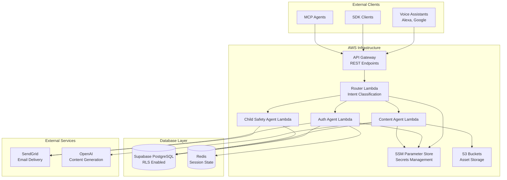

**Code References:**
- `docs/system/architecture.md` - Complete architecture documentation
- `lambda-deployments/router/src/lambda.ts` - Router implementation

## Data Flow: User Registration & Age Verification

### Registration Flow

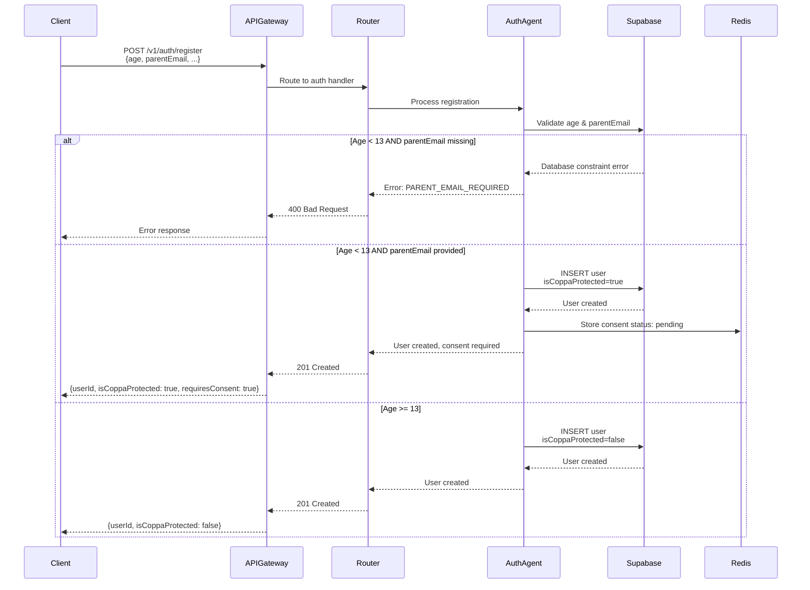

**Code References:**
- `packages/auth-agent/src/auth-agent.ts:99-100` - Registration handler
- `supabase/migrations/20240101000017_add_user_type_support.sql:76-78` - Database constraint

### Database-Level Age Verification

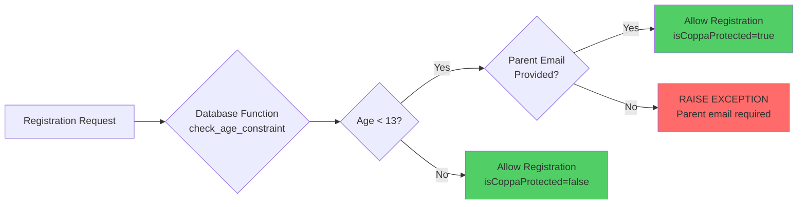

**Database Constraint:**
```sql
-- From migration 20240101000017_add_user_type_support.sql:76-78
IF p_age < 13 AND (p_parent_email IS NULL OR p_parent_email = '') THEN
  RAISE EXCEPTION 'Children under 13 require parent email for COPPA compliance';
END IF;
```

## Data Flow: Parental Consent Workflow

### Consent Request & Verification Flow

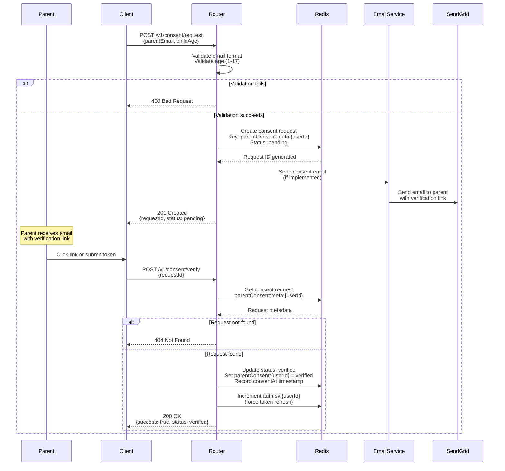

**Code References:**
- `lambda-deployments/router/src/lambda.ts:652-677` - Consent request handler
- `lambda-deployments/router/src/lambda.ts:679-698` - Consent verification handler

### Consent Status Check Flow

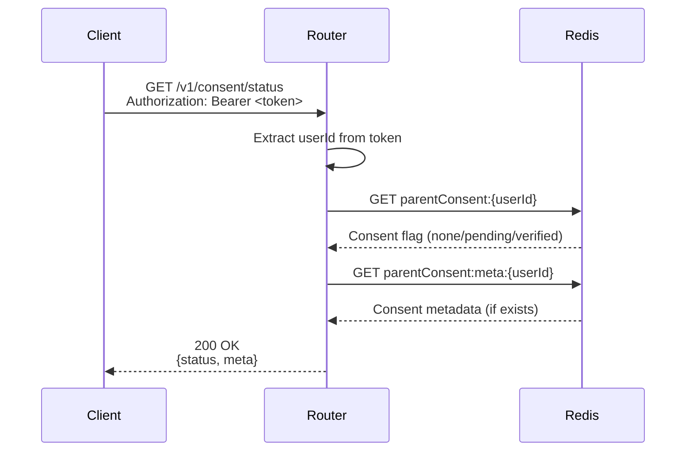

**Code References:**
- `lambda-deployments/router/src/lambda.ts:700-712` - Consent status handler

## Data Flow: Data Collection & Retention

### Data Collection Flow

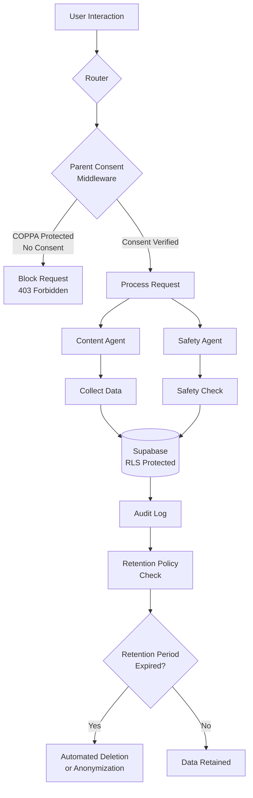

**Code References:**
- `packages/universal-agent/src/middleware/AuthMiddleware.ts:83-108` - Parent consent middleware
- `supabase/migrations/20240101000002_enhanced_schema_and_policies.sql:133-139` - Retention policies

### Data Retention & Deletion Flow

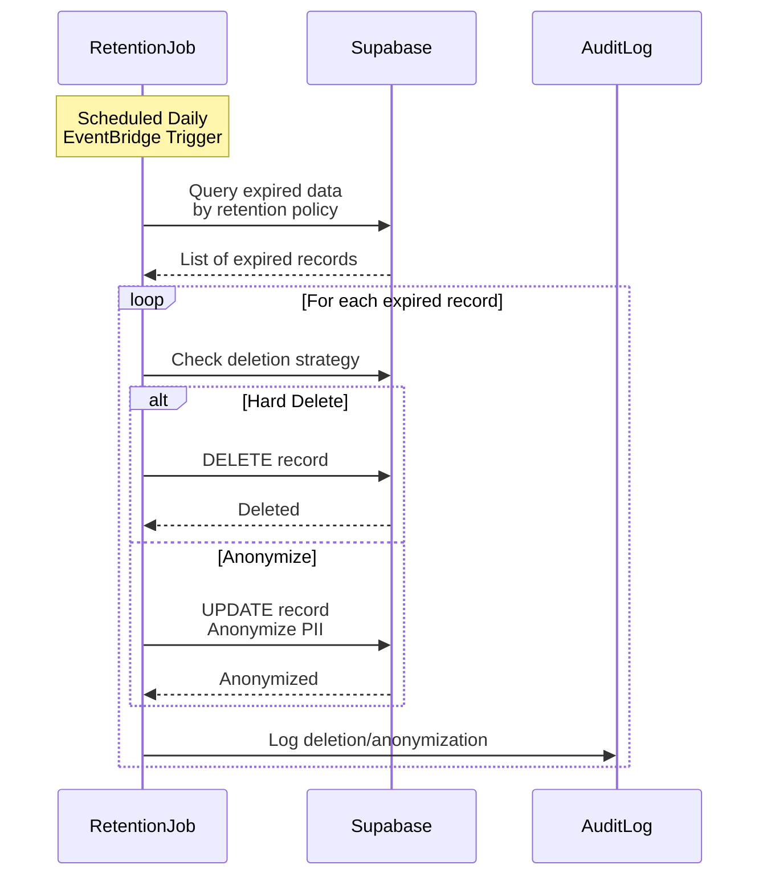

**Retention Policies:**

| Data Type | Retention | Strategy | Code Reference |
|-----------|-----------|----------|----------------|
| Audio Transcripts | 30 days | Hard delete | `supabase/migrations/20240101000002_enhanced_schema_and_policies.sql:133-139` |
| Emotions | 365 days | Anonymize | Same |
| Voice Codes | 1 day | Hard delete | Same |
| Conversation States | 24 hours | Hard delete | Same |
| Audit Logs | 7 years | Anonymize | Legal requirement |

**Code References:**
- `supabase/migrations/20240101000002_enhanced_schema_and_policies.sql:133-139` - Retention policy definitions
- `docs/compliance/gdpr.md:22-50` - Data retention documentation

## Data Flow: Parental Rights

### Data Access Flow

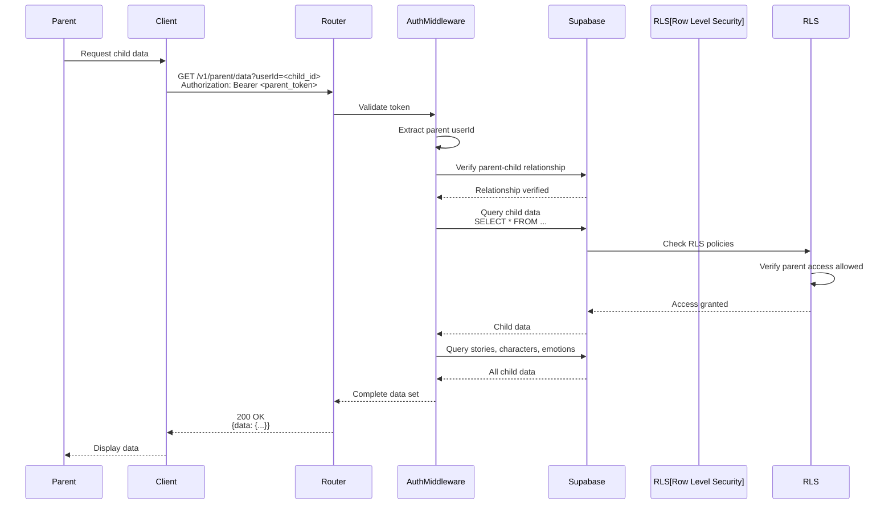

**Code References:**
- `docs/compliance/gdpr.md:80-120` - Data access implementation
- `supabase/migrations/20240101000001_rls_policies.sql` - RLS policy definitions

### Data Deletion Flow

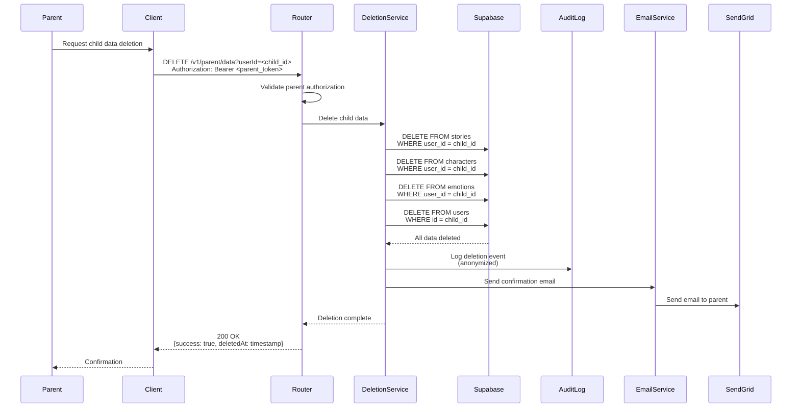

**Code References:**
- `packages/universal-agent/src/services/DeletionService.ts` - Deletion service
- `docs/compliance/gdpr.md:121-160` - Data deletion documentation

### Data Export Flow

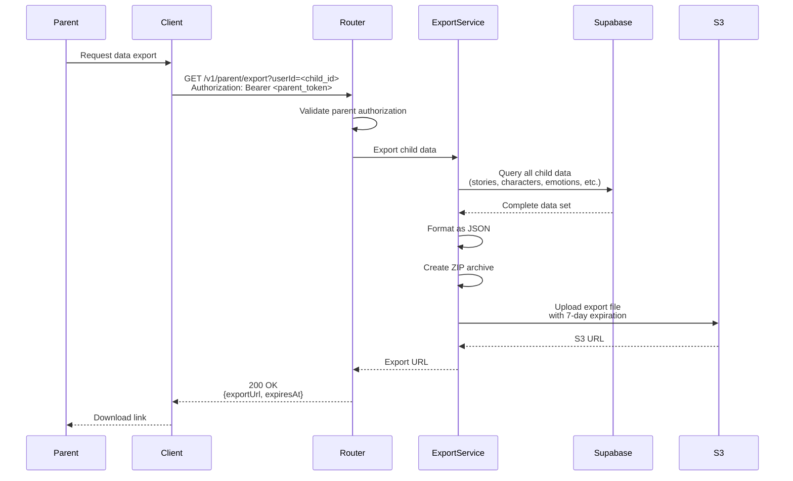

**Code References:**
- `docs/compliance/gdpr.md:161-179` - Data export implementation
- `packages/universal-agent/src/api/RESTAPIGateway.ts` - Export endpoint

## Security Architecture

### Row Level Security (RLS) Flow

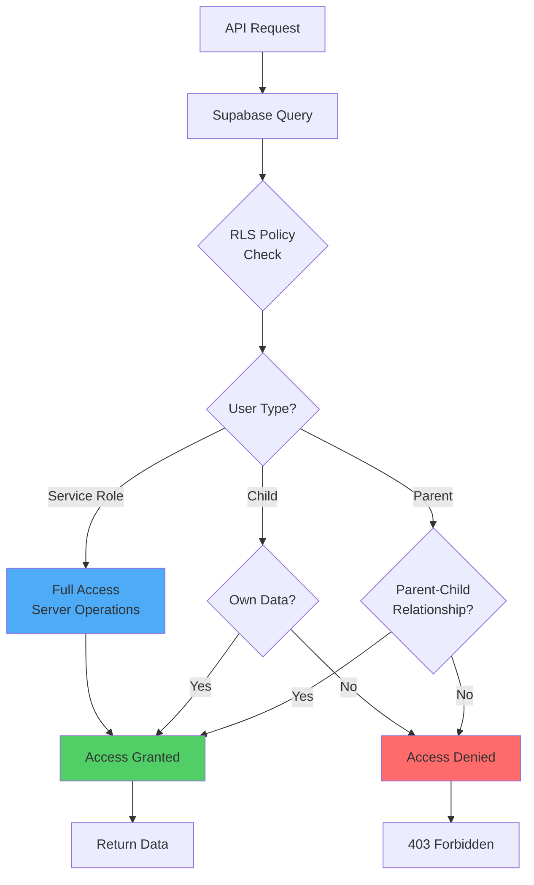

**RLS Policies:**
- User-based access control
- Parent access to child data
- COPPA-protected user restrictions
- Service role access for system operations

**Code References:**
- `supabase/migrations/20240101000001_rls_policies.sql` - Complete RLS policy definitions
- `docs/integrations/supabase.md:42-53` - RLS documentation

### Encryption Flow

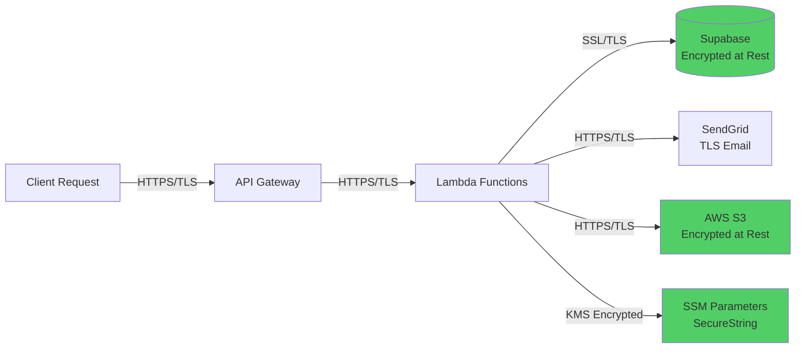

**Encryption Points:**
- **In Transit:** All API calls use HTTPS/TLS
- **At Rest (Database):** Supabase database encryption
- **At Rest (Storage):** S3 bucket encryption
- **Secrets:** SSM SecureString parameters encrypted with KMS

**Code References:**
- `docs/integrations/supabase.md:100-108` - Supabase encryption
- `docs/integrations/aws.md:84-90` - AWS encryption

## Audit Trail Architecture

### Audit Logging Flow

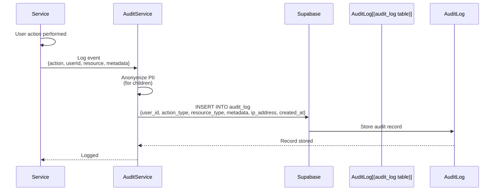

**Logged Events:**
- User authentication
- Consent requests and verifications
- Data access requests
- Data deletion requests
- Safety incidents
- API errors and security violations

**Code References:**
- `supabase/migrations/20240101000000_initial_schema.sql:93-102` - Audit log schema
- `packages/child-safety-agent/src/services/SafetyMonitoringService.ts` - Safety incident logging

## Third-Party Integration Points

### SendGrid Email Flow

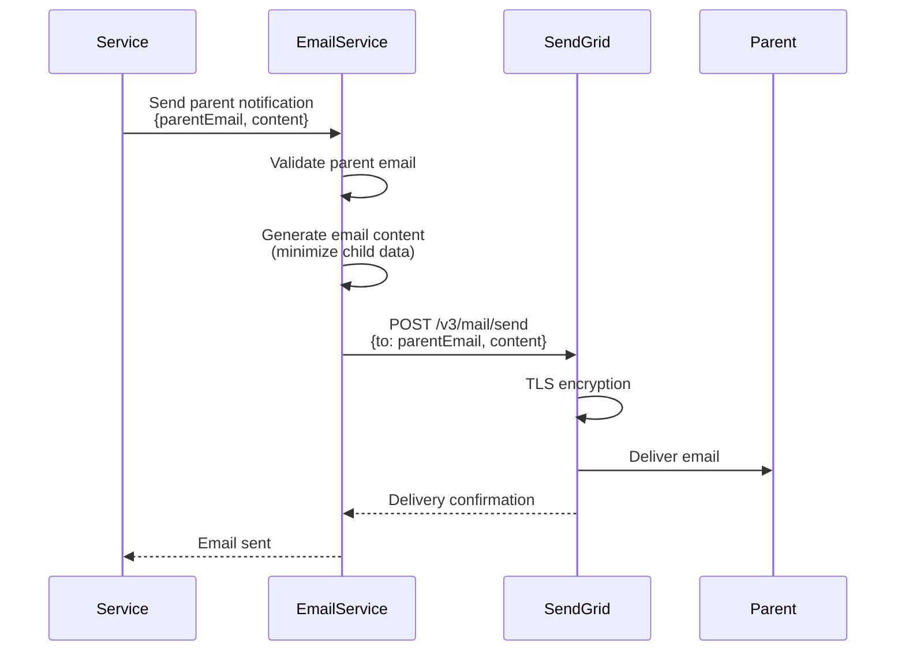

**Data Minimization:**
- Only parent email addresses sent (not child emails)
- Email content limited to necessary information
- No PII in email headers
- TLS encryption for delivery

**Code References:**
- `docs/integrations/sendgrid.md:36-57` - SendGrid privacy documentation
- `packages/child-safety-agent/src/services/ParentNotificationService.ts` - Parent notification service

## Related Documentation

- **[PRIVO Certification Package](./privo-certification-package.md)** - Main certification document
- **[PRIVO API Reference](./privo-api-reference.md)** - Detailed API documentation
- **[System Architecture](../system/architecture.md)** - Complete system architecture
- **[COPPA Compliance](./coppa.md)** - COPPA compliance documentation

---

**Document Version:** 1.0  
**Last Updated:** 2025-01-15
