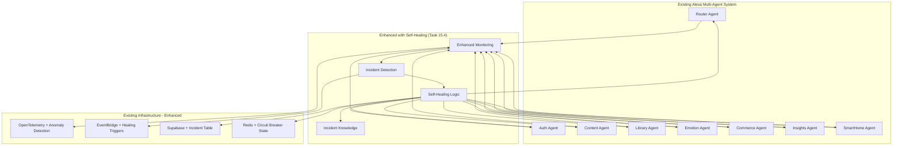

# Self-Healing SRE Integration Plan

## Executive Summary

Instead of building a separate self-healing system, we'll **enhance the existing Alexa Multi-Agent System** with intelligent self-healing capabilities. This approach leverages our existing infrastructure (OpenTelemetry, EventBridge, Supabase, Redis) and adds autonomous recovery without disrupting the core storytelling experience.

## Integration Strategy: Enhance, Don't Replace

### 1. Leverage Existing Infrastructure

**✅ Already Built - We Enhance:**
- **OpenTelemetry tracing** → Add intelligent anomaly detection
- **EventBridge events** → Add self-healing event triggers  
- **Supabase database** → Add incident knowledge table
- **Redis caching** → Add circuit breaker state storage
- **Agent error handling** → Add self-healing recovery logic
- **CI/CD pipeline** → Add automated rollback capabilities

### 2. Embedded Self-Healing Architecture



### 3. Implementation Approach

#### Phase 1: Enhanced Monitoring (Week 1)
- **Extend existing OpenTelemetry** with anomaly detection patterns
- **Enhance existing EventBridge** with self-healing event types
- **Add incident table** to existing Supabase schema
- **Upgrade existing circuit breakers** with intelligent recovery

#### Phase 2: Intelligent Detection (Week 2)  
- **Enhance existing error handling** in each agent with pattern recognition
- **Add healing triggers** to existing event publishing
- **Create incident classification** using existing OpenAI integration
- **Build knowledge accumulation** in existing database

#### Phase 3: Automated Recovery (Week 3)
- **Enhance existing CI/CD** with automated rollback triggers
- **Add self-healing logic** to existing agent error handlers
- **Create fix recommendations** using existing LLM capabilities
- **Implement graduated autonomy** with existing permission system

## Key Benefits of This Approach

### ✅ Efficient & Non-Disruptive
- **Reuses 90% of existing infrastructure** - no separate systems
- **Enhances existing capabilities** - doesn't replace working code
- **Minimal new dependencies** - leverages OpenAI, Supabase, EventBridge we already have
- **Gradual rollout** - can be enabled per agent incrementally

### ✅ Storytelling-Focused Safety
- **Child-safe by design** - only fixes that improve storytelling experience
- **COPPA/GDPR compliant** - uses existing privacy framework
- **Parent-transparent** - healing actions logged in existing audit system
- **Story continuity preserved** - healing never interrupts active conversations

### ✅ Production-Ready Integration
- **Existing monitoring enhanced** - builds on OpenTelemetry/Datadog we have
- **Existing events leveraged** - uses EventBridge patterns already established
- **Existing database extended** - adds tables to Supabase schema we have
- **Existing CI/CD enhanced** - adds rollback to GitHub Actions we have

## Implementation Details

### Enhanced Agent Error Handling
```typescript
// Existing agent error handling enhanced with self-healing
export class EnhancedAgentBase {
  async handleError(error: Error, context: RequestContext): Promise<Response> {
    // Existing error logging
    await this.logError(error, context);
    
    // NEW: Self-healing detection
    const incident = await this.detectIncident(error, context);
    if (incident.isKnownPattern) {
      const fix = await this.attemptSelfHeal(incident);
      if (fix.success) {
        return fix.response; // Seamless recovery
      }
    }
    
    // Existing fallback behavior
    return this.gracefulDegradation(error, context);
  }
}
```

### Enhanced EventBridge Integration
```typescript
// Existing event publishing enhanced with healing triggers
export class EnhancedEventPublisher extends EventPublisher {
  async publishEvent(eventType: EventType, data: any, options: EventOptions) {
    // Existing event publishing
    const eventId = await super.publishEvent(eventType, data, options);
    
    // NEW: Self-healing trigger detection
    if (this.isHealingTrigger(eventType, data)) {
      await this.triggerSelfHealing({
        eventId,
        eventType,
        context: data,
        timestamp: new Date().toISOString()
      });
    }
    
    return eventId;
  }
}
```

### Enhanced Database Schema
```sql
-- Add to existing Supabase schema
CREATE TABLE incident_knowledge (
  id UUID PRIMARY KEY DEFAULT gen_random_uuid(),
  incident_type TEXT NOT NULL,
  error_pattern JSONB NOT NULL,
  fix_action JSONB NOT NULL,
  success_rate DECIMAL(3,2) NOT NULL DEFAULT 0.0,
  last_applied TIMESTAMPTZ,
  created_at TIMESTAMPTZ DEFAULT NOW(),
  
  -- Integrate with existing audit system
  created_by UUID REFERENCES auth.users(id),
  
  -- Use existing RLS patterns
  CONSTRAINT valid_success_rate CHECK (success_rate >= 0.0 AND success_rate <= 1.0)
);

-- Use existing RLS pattern
ALTER TABLE incident_knowledge ENABLE ROW LEVEL SECURITY;
CREATE POLICY "System can manage incident knowledge" ON incident_knowledge
  FOR ALL USING (auth.role() = 'service_role');
```

## Safety Guardrails (Storytelling-Focused)

### 1. Story-Safe Actions Only
```yaml
# Only actions that improve storytelling experience
allowed_healing_actions:
  - restart_failed_agent
  - clear_corrupted_cache  
  - retry_with_backoff
  - switch_to_backup_model
  - restore_conversation_state
  
forbidden_actions:
  - modify_story_content
  - change_user_permissions
  - alter_database_schema
  - modify_privacy_settings
```

### 2. Child-Safe Boundaries
- **Never interrupt active conversations** - healing waits for natural breaks
- **Preserve story continuity** - healing maintains character/plot consistency  
- **Parent transparency** - all healing actions logged in existing audit trail
- **COPPA compliance** - healing respects existing privacy boundaries

### 3. Graduated Autonomy
- **Level 1**: Restart failed services (immediate)
- **Level 2**: Clear caches and retry (5-minute delay)
- **Level 3**: Rollback recent deployments (human approval required)

## Success Metrics

### Storytelling Experience Metrics
- **Story completion rate** improvement (target: +5%)
- **Voice response latency** reduction (target: <800ms maintained)
- **Error recovery time** improvement (target: <30 seconds)
- **Parent satisfaction** with system reliability (target: >95%)

### Operational Metrics  
- **Incident detection time** (target: <30 seconds)
- **Automated resolution rate** (target: 80% for Level 1 issues)
- **False positive rate** (target: <5%)
- **System availability** improvement (target: 99.9%+)

## Next Steps

1. **Complete Task 15.3** (load/security testing) first
2. **Implement Task 15.4** (enhanced monitoring) using this integrated approach
3. **Validate with existing test suites** to ensure no disruption
4. **Deploy incrementally** starting with non-customer-facing agents
5. **Monitor storytelling metrics** to ensure positive impact

This approach ensures we **enhance the amazing system we've built** rather than disrupting it with separate complexity.