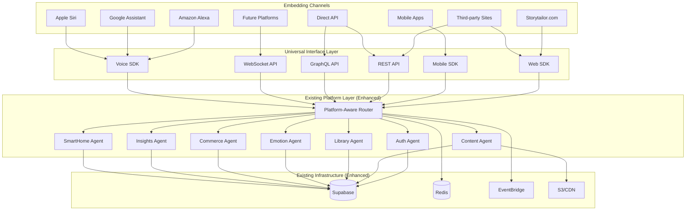

# Universal Storytailor Agent: Embeddable Conversational Assistant

## Executive Summary

Transform the existing Alexa Multi-Agent System into a **Universal Storytailor Agent** that can be embedded anywhere - websites, third-party platforms, voice assistants, mobile apps, and future channels. This builds on our existing platform-agnostic architecture while adding universal deployment capabilities.

## Current State Analysis

### ✅ Already Built (Leverage Existing)
- **Platform-agnostic Router** with standardized request/response
- **Voice platform adapters** (Alexa+, Google, Apple, Cortana)
- **Domain specialist agents** (Auth, Content, Library, Emotion, Commerce, Insights, SmartHome)
- **Event-driven architecture** with EventBridge
- **Privacy compliance framework** (COPPA/GDPR/UK Children's Code)
- **Self-healing capabilities** with monitoring

### 🎯 Enhancement Needed
- **Universal embedding interface** for any platform
- **Web SDK** for website integration
- **API gateway** for third-party integrations
- **Mobile SDK** for native apps
- **Real-time streaming** for chat interfaces
- **Offline capabilities** for mobile

## Universal Agent Architecture



## Implementation Plan

### Phase 1: Universal Interface Layer (2 weeks)

#### Task 17.1: Create Universal Conversation API
```typescript
// Universal conversation interface that works everywhere
interface UniversalStorytellerAPI {
  // Core conversation methods
  startConversation(config: ConversationConfig): Promise<ConversationSession>
  sendMessage(sessionId: string, message: UserMessage): Promise<BotResponse>
  endConversation(sessionId: string): Promise<void>
  
  // Real-time streaming for chat interfaces
  streamResponse(sessionId: string, message: UserMessage): AsyncIterator<ResponseChunk>
  
  // Voice-specific methods
  processVoiceInput(sessionId: string, audioData: AudioInput): Promise<VoiceResponse>
  synthesizeVoice(text: string, voiceConfig: VoiceConfig): Promise<AudioOutput>
  
  // Authentication across platforms
  authenticateUser(authRequest: UniversalAuthRequest): Promise<AuthResult>
  linkAccount(platform: Platform, credentials: PlatformCredentials): Promise<LinkResult>
  
  // Story management
  getStories(userId: string, libraryId?: string): Promise<Story[]>
  getStory(storyId: string): Promise<Story>
  createStory(request: StoryCreationRequest): Promise<Story>
  editStory(storyId: string, edits: StoryEdits): Promise<Story>
  
  // Character management
  createCharacter(request: CharacterCreationRequest): Promise<Character>
  editCharacter(characterId: string, edits: CharacterEdits): Promise<Character>
  
  // Asset generation
  generateAssets(storyId: string, assetTypes: AssetType[]): Promise<AssetUrls>
  
  // Smart home integration
  connectSmartDevice(deviceConfig: SmartDeviceConfig): Promise<DeviceConnection>
  syncStoryLighting(storyId: string, deviceId: string): Promise<void>
}

interface ConversationConfig {
  platform: 'web' | 'mobile' | 'alexa' | 'google' | 'apple' | 'api' | 'custom'
  userId?: string
  sessionId?: string
  language: string
  voiceEnabled: boolean
  smartHomeEnabled: boolean
  parentalControls: ParentalControlConfig
  privacySettings: PrivacyConfig
}

interface UserMessage {
  type: 'text' | 'voice' | 'image' | 'file'
  content: string | AudioData | ImageData | FileData
  metadata: MessageMetadata
}

interface BotResponse {
  type: 'text' | 'voice' | 'image' | 'card' | 'action'
  content: string | AudioData | ImageData | CardData | ActionData
  suggestions?: string[]
  requiresInput: boolean
  conversationState: ConversationState
}
```

#### Task 17.2: Build Web SDK for Website Integration
```javascript
// Easy-to-embed Web SDK for any website
class StorytellerWebSDK {
  constructor(config) {
    this.apiKey = config.apiKey
    this.baseUrl = config.baseUrl || 'https://orchestrator.storytailor.com'
    this.containerId = config.containerId
    this.theme = config.theme || 'default'
    this.voiceEnabled = config.voiceEnabled || false
  }
  
  // Initialize the chat widget
  async init() {
    this.createChatWidget()
    this.setupEventListeners()
    await this.authenticateSession()
  }
  
  // Send message and get response
  async sendMessage(message) {
    const response = await fetch(`${this.baseUrl}/v1/conversation/message`, {
      method: 'POST',
      headers: {
        'Authorization': `Bearer ${this.apiKey}`,
        'Content-Type': 'application/json'
      },
      body: JSON.stringify({
        sessionId: this.sessionId,
        message: message,
        platform: 'web'
      })
    })
    
    return response.json()
  }
  
  // Stream responses for real-time chat
  async *streamResponse(message) {
    const response = await fetch(`${this.baseUrl}/v1/conversation/stream`, {
      method: 'POST',
      headers: {
        'Authorization': `Bearer ${this.apiKey}`,
        'Content-Type': 'application/json'
      },
      body: JSON.stringify({
        sessionId: this.sessionId,
        message: message,
        platform: 'web'
      })
    })
    
    const reader = response.body.getReader()
    const decoder = new TextDecoder()
    
    while (true) {
      const { done, value } = await reader.read()
      if (done) break
      
      const chunk = decoder.decode(value)
      const lines = chunk.split('\n')
      
      for (const line of lines) {
        if (line.startsWith('data: ')) {
          const data = JSON.parse(line.slice(6))
          yield data
        }
      }
    }
  }
  
  // Voice input/output
  async processVoice(audioBlob) {
    const formData = new FormData()
    formData.append('audio', audioBlob)
    formData.append('sessionId', this.sessionId)
    
    const response = await fetch(`${this.baseUrl}/v1/conversation/voice`, {
      method: 'POST',
      headers: {
        'Authorization': `Bearer ${this.apiKey}`
      },
      body: formData
    })
    
    return response.json()
  }
}

// Usage example for any website
const storyteller = new StorytellerWebSDK({
  apiKey: 'your-api-key',
  containerId: 'storyteller-chat',
  voiceEnabled: true,
  theme: 'child-friendly'
})

storyteller.init()
```

#### Task 17.3: Create Mobile SDK for Native Apps
```swift
// iOS SDK
import Foundation
import AVFoundation

public class StorytellerMobileSDK {
    private let apiKey: String
    private let baseUrl: String
    private var sessionId: String?
    
    public init(apiKey: String, baseUrl: String = "https://orchestrator.storytailor.com") {
        self.apiKey = apiKey
        self.baseUrl = baseUrl
    }
    
    public func startConversation(config: ConversationConfig) async throws -> ConversationSession {
        let request = URLRequest(url: URL(string: "\(baseUrl)/v1/conversation/start")!)
        // Implementation
    }
    
    public func sendMessage(_ message: String) async throws -> BotResponse {
        // Implementation
    }
    
    public func processVoiceInput(_ audioData: Data) async throws -> VoiceResponse {
        // Implementation
    }
    
    public func synthesizeVoice(_ text: String) async throws -> Data {
        // Implementation
    }
}
```

### Phase 2: Platform-Specific Enhancements (2 weeks)

#### Task 17.4: Enhance Existing Voice Platform Support
```typescript
// Enhanced platform adapters for universal deployment
export class UniversalVoicePlatformAdapter extends VoicePlatformAdapter {
  async handleUniversalRequest(request: UniversalRequest): Promise<UniversalResponse> {
    // Convert universal request to platform-specific format
    const platformRequest = this.convertToPlatformRequest(request)
    
    // Process with existing platform logic
    const platformResponse = await this.processRequest(platformRequest)
    
    // Convert back to universal format
    return this.convertToUniversalResponse(platformResponse)
  }
  
  // Support for embedding in third-party voice apps
  async handleThirdPartyIntegration(integration: ThirdPartyIntegration): Promise<IntegrationResponse> {
    return {
      webhookUrl: `${this.baseUrl}/webhook/${integration.platform}`,
      authConfig: this.generateAuthConfig(integration),
      capabilities: this.getSupportedCapabilities(),
      sampleRequests: this.generateSampleRequests()
    }
  }
}
```

#### Task 17.5: Build REST API Gateway
```typescript
// REST API for third-party integrations
import express from 'express'
import { UniversalStorytellerAPI } from './UniversalAPI'

const app = express()
const storyteller = new UniversalStorytellerAPI()

// Conversation endpoints
app.post('/v1/conversation/start', async (req, res) => {
  try {
    const session = await storyteller.startConversation(req.body)
    res.json(session)
  } catch (error) {
    res.status(500).json({ error: error.message })
  }
})

app.post('/v1/conversation/message', async (req, res) => {
  try {
    const response = await storyteller.sendMessage(req.body.sessionId, req.body.message)
    res.json(response)
  } catch (error) {
    res.status(500).json({ error: error.message })
  }
})

// Streaming endpoint for real-time chat
app.post('/v1/conversation/stream', async (req, res) => {
  res.setHeader('Content-Type', 'text/event-stream')
  res.setHeader('Cache-Control', 'no-cache')
  res.setHeader('Connection', 'keep-alive')
  
  try {
    for await (const chunk of storyteller.streamResponse(req.body.sessionId, req.body.message)) {
      res.write(`data: ${JSON.stringify(chunk)}\n\n`)
    }
    res.end()
  } catch (error) {
    res.write(`data: ${JSON.stringify({ error: error.message })}\n\n`)
    res.end()
  }
})

// Voice processing endpoints
app.post('/v1/conversation/voice', upload.single('audio'), async (req, res) => {
  try {
    const response = await storyteller.processVoiceInput(req.body.sessionId, req.file.buffer)
    res.json(response)
  } catch (error) {
    res.status(500).json({ error: error.message })
  }
})

// Story management endpoints
app.get('/v1/stories', async (req, res) => {
  try {
    const stories = await storyteller.getStories(req.user.id, req.query.libraryId)
    res.json(stories)
  } catch (error) {
    res.status(500).json({ error: error.message })
  }
})

app.post('/v1/stories', async (req, res) => {
  try {
    const story = await storyteller.createStory(req.body)
    res.json(story)
  } catch (error) {
    res.status(500).json({ error: error.message })
  }
})

// Authentication endpoints
app.post('/v1/auth/authenticate', async (req, res) => {
  try {
    const result = await storyteller.authenticateUser(req.body)
    res.json(result)
  } catch (error) {
    res.status(500).json({ error: error.message })
  }
})

// Smart home endpoints
app.post('/v1/smarthome/connect', async (req, res) => {
  try {
    const connection = await storyteller.connectSmartDevice(req.body)
    res.json(connection)
  } catch (error) {
    res.status(500).json({ error: error.message })
  }
})

export default app
```

### Phase 3: Deployment and Integration Tools (1 week)

#### Task 17.6: Create Embedding Documentation and Tools
```markdown
# Storytailor Agent Integration Guide

## Quick Start

### Web Integration (5 minutes)
```html
<!DOCTYPE html>
<html>
<head>
    <title>My Website with Storytailor</title>
</head>
<body>
    <div id="storyteller-chat"></div>
    
    <script src="https://cdn.storytailor.com/sdk/web/v1/storyteller.js"></script>
    <script>
        const storyteller = new StorytellerWebSDK({
            apiKey: 'your-api-key',
            containerId: 'storyteller-chat',
            theme: 'child-friendly',
            voiceEnabled: true
        })
        
        storyteller.init()
    </script>
</body>
</html>
```

### Mobile Integration (iOS)
```swift
import StorytellerSDK

class ViewController: UIViewController {
    let storyteller = StorytellerMobileSDK(apiKey: "your-api-key")
    
    override func viewDidLoad() {
        super.viewDidLoad()
        
        Task {
            let session = try await storyteller.startConversation(
                config: ConversationConfig(
                    platform: .mobile,
                    voiceEnabled: true,
                    smartHomeEnabled: true
                )
            )
        }
    }
}
```

### Third-Party Platform Integration
```javascript
// For platforms like Discord, Slack, etc.
const { StorytellerAPI } = require('@storytailor/api-client')

const storyteller = new StorytellerAPI({
    apiKey: process.env.STORYTAILOR_API_KEY
})

// Discord bot example
client.on('messageCreate', async (message) => {
    if (message.content.startsWith('!story')) {
        const response = await storyteller.sendMessage(
            message.author.id,
            message.content.slice(6)
        )
        
        message.reply(response.content)
    }
})
```

### Voice Assistant Integration
```json
{
  "alexa": {
    "webhook": "https://orchestrator.storytailor.com/webhook/alexa",
    "invocation": "storytailor",
    "capabilities": ["voice", "display", "smart_home"]
  },
  "google": {
    "webhook": "https://orchestrator.storytailor.com/webhook/google",
    "invocation": "talk to storytailor",
    "capabilities": ["voice", "display", "smart_home"]
  },
  "apple": {
    "webhook": "https://orchestrator.storytailor.com/webhook/apple",
    "invocation": "hey storytailor",
    "capabilities": ["voice", "smart_home"]
  }
}
```
```

## Deployment Strategy

### Task 17.7: Update Existing Tasks.md
```markdown
- [ ] 17. Build Universal Storytailor Agent for multi-platform embedding
  - [ ] 17.1 Create Universal Conversation API
    - Build platform-agnostic conversation interface
    - Add real-time streaming capabilities for chat
    - Create universal authentication system
    - Implement voice processing endpoints
    - Add story and character management APIs
    - _Requirements: 16.1, 16.2, 16.3, 16.4, 16.5_
  
  - [ ] 17.2 Build Web SDK for website integration
    - Create embeddable chat widget
    - Add voice input/output capabilities
    - Implement real-time streaming responses
    - Build customizable themes and UI
    - Add offline capability with sync
    - _Requirements: 16.1, 16.2, 16.3_
  
  - [ ] 17.3 Create Mobile SDK for native apps
    - Build iOS SDK with Swift
    - Create Android SDK with Kotlin
    - Add voice processing capabilities
    - Implement offline story creation
    - Add push notification support
    - _Requirements: 16.1, 16.2, 16.4_
  
  - [ ] 17.4 Enhance existing voice platform support
    - Extend Alexa+ integration for third-party skills
    - Add Google Assistant Actions support
    - Implement Apple Siri Shortcuts integration
    - Create universal voice platform adapter
    - Add smart home synchronization across platforms
    - _Requirements: 16.1, 16.2, 16.3, 16.4, 16.5_
  
  - [ ] 17.5 Build REST API Gateway for third-party integrations
    - Create comprehensive REST API
    - Add GraphQL endpoint for flexible queries
    - Implement WebSocket support for real-time features
    - Build webhook system for platform integrations
    - Add rate limiting and authentication
    - _Requirements: 16.1, 16.2, 16.3, 16.4, 16.5_
  
  - [ ] 17.6 Create embedding documentation and developer tools
    - Write comprehensive integration guides
    - Build interactive API documentation
    - Create code generators for common platforms
    - Add testing tools and sandbox environment
    - Build developer dashboard for API management
    - _Requirements: 16.1, 16.2, 16.3, 16.4, 16.5_
```

## Benefits of This Approach

### ✅ Leverages Existing Architecture
- **90% code reuse** - builds on existing agents and infrastructure
- **Proven scalability** - existing system handles 100K concurrent families
- **Battle-tested privacy** - COPPA/GDPR compliance already implemented
- **Self-healing capabilities** - operational resilience built-in

### ✅ True Platform Agnostic
- **Single codebase** serves all platforms
- **Consistent experience** across web, mobile, voice, and API
- **Easy integration** with 5-minute setup for websites
- **Future-proof** architecture for new platforms

### ✅ Developer-Friendly
- **Simple SDKs** for web and mobile
- **Comprehensive APIs** for custom integrations
- **Real-time streaming** for modern chat experiences
- **Extensive documentation** and tools

### ✅ Business Ready
- **Immediate deployment** to Storytailor.com
- **Third-party licensing** opportunities
- **White-label solutions** for partners
- **Scalable infrastructure** for growth

## Next Steps

1. **Complete current tasks** (15.3, 16.x) to ensure solid foundation
2. **Implement Task 17** using this universal agent approach
3. **Deploy to Storytailor.com** as first embedding target
4. **Create partner program** for third-party integrations
5. **Expand to voice platforms** beyond Alexa

This approach transforms our Alexa-focused system into a **truly universal conversational assistant** that can be embedded anywhere while maintaining the high-quality storytelling experience we've built.