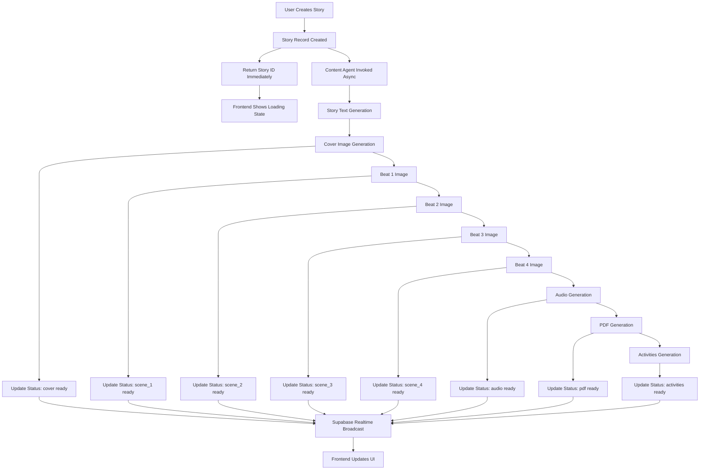

# Complete Pipeline Process Documentation

**Date**: December 28, 2025  
**Version**: 1.0.0

---

## Overview

The Storytailor pipeline system generates stories, characters, and assets progressively, providing immediate feedback to users while content is generated asynchronously. This document describes the complete pipeline process with timelines and data flows.

---

## Architecture Overview



---

## Character Creation Pipeline

### Timeline

```
0s    → User submits character creation
0.1s  → Character record created in database
0.2s  → API returns character ID with status: "generating"
0.3s  → Frontend shows skeleton loader
0.5s  → Content Agent Lambda invoked (async)
2s    → Character headshot image generated
3s    → Character body image generated
4s    → Images uploaded to S3
4.5s  → CDN URLs generated
5s    → Database updated with image URLs
5.1s  → Supabase Realtime UPDATE event
5.2s  → Frontend receives update, shows images
```

### Process Flow

1. **Immediate Response** (0.1s)
   - Character record created with `status: "generating"`
   - `reference_images: null`
   - API returns character ID and Realtime channel info

2. **Asynchronous Image Generation** (0.5s - 5s)
   - Content Agent Lambda invoked with `InvocationType: 'Event'`
   - Headshot image generated (includes inclusivity traits)
   - Body image generated (includes inclusivity traits)
   - Images uploaded to S3 bucket
   - CDN URLs generated (`assets.storytailor.dev`)

3. **Progressive Status Updates** (5s)
   - Database updated with `reference_images` object:
     ```json
     {
       "headshot": {
         "cdnUrl": "https://assets.storytailor.dev/...",
         "s3Url": "https://bucket.s3.amazonaws.com/..."
       },
       "body": {
         "cdnUrl": "https://assets.storytailor.dev/...",
         "s3Url": "https://bucket.s3.amazonaws.com/..."
       }
     }
     ```
   - Supabase Realtime broadcasts UPDATE event
   - Frontend receives update and displays images

### Character Creation Request

```http
POST /api/v1/characters
Authorization: Bearer <token>
Content-Type: application/json

{
  "name": "Alex",
  "age": 7,
  "species": "human",
  "inclusivityTraits": ["wheelchair_user"],
  "appearance": "Friendly and adventurous"
}
```

### Character Creation Response

```json
{
  "success": true,
  "data": {
    "id": "char_123",
    "name": "Alex",
    "status": "generating",
    "realtimeChannel": "characters:id=char_123",
    "reference_images": null
  }
}
```

---

## Story Creation Pipeline

### Timeline

```
0s    → User submits story creation
0.1s  → Story record created in database
0.2s  → Asset generation jobs created
0.3s  → API returns story ID with status: "generating"
0.4s  → Frontend shows loading state with skeleton loaders
0.5s  → Content Agent Lambda invoked (async)

1s    → Story text generation starts
30s   → Story text complete
31s   → Status: content ready
32s   → Supabase Realtime UPDATE

35s   → Cover image generation starts
60s   → Cover image complete
61s   → Status: cover ready
62s   → Supabase Realtime UPDATE
63s   → Frontend shows cover image

65s   → Beat 1 image generation starts
90s   → Beat 1 image complete
91s   → Status: scene_1 ready
92s   → Supabase Realtime UPDATE
93s   → Frontend shows beat 1 image

95s   → Beat 2 image generation starts
120s → Beat 2 image complete
121s → Status: scene_2 ready
122s → Supabase Realtime UPDATE
123s → Frontend shows beat 2 image

125s → Beat 3 image generation starts
150s → Beat 3 image complete
151s → Status: scene_3 ready
152s → Supabase Realtime UPDATE
153s → Frontend shows beat 3 image

155s → Beat 4 image generation starts
180s → Beat 4 image complete
181s → Status: scene_4 ready
182s → Supabase Realtime UPDATE
183s → Frontend shows beat 4 image

185s → Audio generation starts
240s → Audio generation complete
241s → Status: audio ready
242s → Supabase Realtime UPDATE
243s → Frontend shows audio player

245s → PDF generation starts
250s → PDF generation complete
251s → Status: pdf ready
252s → Supabase Realtime UPDATE

255s → Activities generation starts
260s → Activities generation complete
261s → Status: activities ready
262s → Supabase Realtime UPDATE
263s → Frontend shows activities section

265s → All assets complete
266s → Status: overall ready
```

### Process Flow

1. **Immediate Response** (0.1s - 0.3s)
   - Story record created with `status: "generating"`
   - `asset_generation_jobs` created for each asset type
   - API returns story ID and initial status

2. **Story Text Generation** (1s - 30s)
   - OpenAI GPT generates story text
   - Story content saved to database
   - Status updated: `content: { status: "ready" }`

3. **Cover Image Generation** (35s - 60s)
   - Character reference images downloaded
   - Cover image generated with character consistency
   - Image uploaded to S3, CDN URL generated
   - Status updated: `cover: { status: "ready", url: "..." }`
   - Supabase Realtime UPDATE event

4. **Beat Images Generation** (65s - 180s)
   - **Beat 1** (65s - 90s):
     - Uses cover + character references
     - Generated and uploaded
     - Status: `scene_1: { status: "ready", url: "..." }`
   - **Beat 2** (95s - 120s):
     - Uses cover + beat 1 + character references
     - Generated and uploaded
     - Status: `scene_2: { status: "ready", url: "..." }`
   - **Beat 3** (125s - 150s):
     - Uses beat 1 + beat 2 + character references
     - Generated and uploaded
     - Status: `scene_3: { status: "ready", url: "..." }`
   - **Beat 4** (155s - 180s):
     - Uses beat 2 + beat 3 + character references
     - Generated and uploaded
     - Status: `scene_4: { status: "ready", url: "..." }`

5. **Audio Generation** (185s - 240s)
   - Story text converted to audio via ElevenLabs/Polly
   - WebVTT captions generated
   - Audio uploaded to S3
   - Status: `audio: { status: "ready", url: "..." }`

6. **PDF Generation** (245s - 250s)
   - Story text, images, and activities compiled into PDF
   - PDF uploaded to S3
   - Status: `pdf: { status: "ready", url: "..." }`

7. **Activities Generation** (255s - 260s)
   - Educational activities generated based on story
   - Activities saved to database
   - Status: `activities: { status: "ready" }`

### Story Creation Request

```http
POST /api/v1/stories
Authorization: Bearer <token>
Content-Type: application/json

{
  "title": "Adventure Story",
  "characterId": "char_123",
  "storyType": "adventure",
  "userAge": 7,
  "theme": "friendship",
  "generateAssets": true
}
```

### Story Creation Response

```json
{
  "success": true,
  "data": {
    "id": "story_456",
    "title": "Adventure Story",
    "status": "generating",
    "creator_user_id": "user_789",
    "realtimeChannel": "stories:id=story_456",
    "subscribePattern": {
      "table": "stories",
      "filter": "id=eq.story_456",
      "event": "UPDATE"
    },
    "asset_generation_status": {
      "overall": "generating",
      "assets": {
        "content": { "status": "generating", "progress": 0 },
        "cover": { "status": "pending" },
        "scene_1": { "status": "pending" },
        "scene_2": { "status": "pending" },
        "scene_3": { "status": "pending" },
        "scene_4": { "status": "pending" },
        "audio": { "status": "pending" },
        "pdf": { "status": "pending" },
        "activities": { "status": "pending" }
      }
    }
  }
}
```

### Progressive Status Updates

As each asset completes, the `asset_generation_status` is updated:

```json
{
  "asset_generation_status": {
    "overall": "generating",
    "assets": {
      "content": { "status": "ready", "progress": 100 },
      "cover": { "status": "ready", "url": "https://assets.storytailor.dev/...", "progress": 100 },
      "scene_1": { "status": "ready", "url": "https://assets.storytailor.dev/...", "progress": 100 },
      "scene_2": { "status": "generating", "progress": 0 },
      "scene_3": { "status": "pending" },
      "scene_4": { "status": "pending" },
      "audio": { "status": "pending" }
    }
  }
}
```

---

## Asset Generation Status Structure

### Status Values

- `pending`: Asset generation not yet started
- `generating`: Asset generation in progress
- `ready`: Asset generation complete, URL available
- `failed`: Asset generation failed

### Asset Status Object

```typescript
{
  status: "pending" | "generating" | "ready" | "failed",
  progress?: number,        // 0-100
  url?: string,             // CDN URL when ready
  error?: string,           // Error message if failed
  startedAt?: string,       // ISO timestamp
  completedAt?: string       // ISO timestamp
}
```

### Complete Status Example

```json
{
  "overall": "generating",
  "assets": {
    "content": {
      "status": "ready",
      "progress": 100,
      "completedAt": "2024-01-01T12:00:30Z"
    },
    "cover": {
      "status": "ready",
      "progress": 100,
      "url": "https://assets.storytailor.dev/images/stories/story_456/cover-1234567890.png",
      "completedAt": "2024-01-01T12:01:00Z"
    },
    "scene_1": {
      "status": "ready",
      "progress": 100,
      "url": "https://assets.storytailor.dev/images/stories/story_456/beat-1-1234567890.png",
      "completedAt": "2024-01-01T12:01:30Z"
    },
    "scene_2": {
      "status": "generating",
      "progress": 50,
      "startedAt": "2024-01-01T12:01:35Z"
    },
    "scene_3": {
      "status": "pending"
    },
    "scene_4": {
      "status": "pending"
    },
    "audio": {
      "status": "pending"
    },
    "pdf": {
      "status": "pending"
    },
    "activities": {
      "status": "pending"
    }
  }
}
```

---

## Error Handling and Retry Logic

### Retry Strategy

- **Image Generation**: 2-3 retries with different prompts
- **Audio Generation**: 1 retry on failure
- **PDF Generation**: No retries (depends on other assets)
- **Activities Generation**: 1 retry on failure

### Error Status

When an asset fails:

```json
{
  "scene_2": {
    "status": "failed",
    "error": "Image generation timeout after 30 seconds",
    "progress": 0
  }
}
```

The overall status remains `generating` if other assets are still in progress, or becomes `failed` if all critical assets fail.

---

## Supabase Realtime Integration

### Channel Subscription

```javascript
const channel = supabase
  .channel(`stories:id=${storyId}`)
  .on('postgres_changes', {
    event: 'UPDATE',
    schema: 'public',
    table: 'stories',
    filter: `id=eq.${storyId}`
  }, (payload) => {
    // Handle progressive updates
    const status = payload.new.asset_generation_status?.assets || {};
    
    if (status.scene_1?.status === 'ready') {
      // Show beat 1 image
    }
    if (status.scene_2?.status === 'ready') {
      // Show beat 2 image
    }
    // ... etc
  })
  .subscribe();
```

### Update Frequency

- Each asset completion triggers one UPDATE event
- Frontend receives updates in real-time (typically < 1 second delay)
- No polling required

---

## Performance Optimizations

### Parallel Processing

- Audio and PDF generation can start after cover + first beat
- Activities generation can start after story text is ready
- Not all assets must wait for previous ones

### Caching

- Character reference images cached in S3
- CDN caching for all generated assets (1 year TTL)
- Story text cached in database

### Progressive Enhancement

- Frontend can display story text immediately when ready
- Images appear as they complete
- Audio player enabled when audio is ready
- Activities section appears when activities are ready

---

## Monitoring and Debugging

### CloudWatch Logs

- Content Agent Lambda logs all asset generation steps
- Individual beat status updates logged
- Timing information for each asset type

### Database Tracking

- `asset_generation_jobs` table tracks individual jobs
- `asset_generation_status` JSONB column in `stories` table
- Timestamps for start and completion of each asset

### Frontend Debugging

- Browser console shows Supabase Realtime events
- Status updates logged for debugging
- Network tab shows asset URL requests

---

## Best Practices

1. **Always show skeleton loaders** while assets are generating
2. **Use Supabase Realtime** instead of polling for status updates
3. **Handle individual beat statuses** separately, not as a group
4. **Show progress indicators** for better UX
5. **Handle errors gracefully** with retry options where appropriate
6. **Cache generated assets** to avoid regeneration
7. **Monitor performance** and optimize slow steps

---

## Additional Resources

- [REST API Complete Reference](../api/REST_API_COMPLETE_REFERENCE.md)
- [Wized Progressive Loading Guide](../integration-guides/WIZED_PROGRESSIVE_LOADING_GUIDE.md)
- [Supabase Realtime Documentation](https://supabase.com/docs/guides/realtime)

