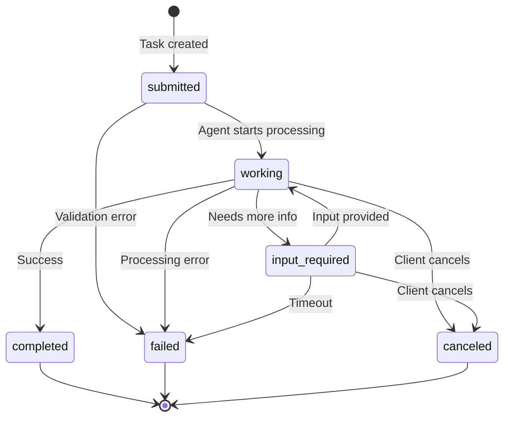

# A2A Protocol - Task Lifecycle

**Last Updated:** December 2025  
**Audience:** Partner Developers, Integration Engineers  
**Purpose:** Complete reference for A2A task states and transitions

## Overview

The A2A (Agent2Agent) protocol uses an asynchronous task model. This document describes the complete lifecycle of tasks from submission to completion, including all possible states, transitions, and error scenarios.

---

## Task States

### submitted

**Description:** Task has been created and queued for processing.

**Characteristics:**
- Initial state for all new tasks
- Task assigned unique ID
- Parameters validated
- Queued for agent processing

**Typical duration:** < 1 second

**Next states:**
- `working` - Agent begins processing
- `failed` - Validation or queueing error

**Example response:**
```json
{
  "jsonrpc": "2.0",
  "id": "req-123",
  "result": {
    "taskId": "task-789",
    "state": "submitted",
    "timestamp": "2025-01-15T10:30:00Z"
  }
}
```

---

### working

**Description:** Task is actively being processed by an agent.

**Characteristics:**
- Agent is executing the task
- Progress updates may be available
- Can transition to input-required if agent needs more info
- Typical for story generation, character creation

**Typical duration:** 10-60 seconds (depends on task type)

**Next states:**
- `completed` - Task finished successfully
- `input-required` - Agent needs additional input
- `failed` - Processing error
- `canceled` - Client canceled task

**Example response:**
```json
{
  "taskId": "task-789",
  "state": "working",
  "progress": 45,
  "message": "Generating story...",
  "timestamp": "2025-01-15T10:30:15Z"
}
```

**Progress updates (if using SSE):**
```
data: {"taskId": "task-789", "state": "working", "progress": 25, "message": "Creating characters..."}

data: {"taskId": "task-789", "state": "working", "progress": 50, "message": "Developing plot..."}

data: {"taskId": "task-789", "state": "working", "progress": 75, "message": "Finalizing story..."}
```

---

### input-required

**Description:** Task is paused, waiting for additional input from client.

**Characteristics:**
- Agent cannot proceed without more information
- Task is paused (not processing)
- Client must provide required input
- Task will resume after input provided

**Typical duration:** Indefinite (waiting for client)

**Next states:**
- `working` - After client provides input
- `canceled` - Client cancels task
- `failed` - Timeout (if configured)

**Example response:**
```json
{
  "taskId": "task-789",
  "state": "input-required",
  "message": "Please clarify: Should the character be brave or cautious?",
  "requiredInput": {
    "field": "characterTrait",
    "type": "choice",
    "options": ["brave", "cautious"],
    "prompt": "What personality trait should the character have?"
  },
  "timestamp": "2025-01-15T10:30:30Z"
}
```

**Providing input:**
```json
POST /a2a/task/{taskId}/input
{
  "field": "characterTrait",
  "value": "brave"
}
```

---

### completed

**Description:** Task finished successfully with result.

**Characteristics:**
- Final state (terminal)
- Result available
- Cannot transition to other states
- Task stored for retrieval

**Typical duration:** Permanent (until task expired/deleted)

**Next states:** None (terminal state)

**Example response:**
```json
{
  "taskId": "task-789",
  "state": "completed",
  "result": {
    "storyId": "story-456",
    "title": "Brave's Cloud Adventure",
    "content": "Once upon a time...",
    "characters": ["Brave the Dragon"],
    "url": "https://storytailor.com/stories/story-456"
  },
  "completedAt": "2025-01-15T10:31:00Z",
  "duration": 45.2
}
```

---

### failed

**Description:** Task failed due to error.

**Characteristics:**
- Final state (terminal)
- Error details available
- Cannot retry automatically
- Client must create new task to retry

**Typical duration:** Permanent (until task expired/deleted)

**Next states:** None (terminal state)

**Example response:**
```json
{
  "taskId": "task-789",
  "state": "failed",
  "error": {
    "code": -32003,
    "message": "Story generation failed due to content validation error",
    "details": {
      "reason": "inappropriate_theme",
      "suggestion": "Try a different story theme"
    }
  },
  "failedAt": "2025-01-15T10:30:45Z",
  "duration": 15.3
}
```

---

### canceled

**Description:** Task was canceled by client before completion.

**Characteristics:**
- Final state (terminal)
- Result not available
- Processing stopped
- Resources cleaned up

**Typical duration:** Permanent (until task expired/deleted)

**Next states:** None (terminal state)

**Example response:**
```json
{
  "taskId": "task-789",
  "state": "canceled",
  "message": "Task was canceled by client",
  "canceledAt": "2025-01-15T10:30:20Z",
  "canceledBy": "agent-456"
}
```

---

## State Transition Diagram



---

## Task Operations

### Creating a Task

**Endpoint:** `POST /a2a/task`

**Request:**
```json
{
  "jsonrpc": "2.0",
  "id": "req-123",
  "method": "story.generate",
  "params": {
    "prompt": "An adventure story",
    "ageRating": 8
  }
}
```

**Response:**
```json
{
  "jsonrpc": "2.0",
  "id": "req-123",
  "result": {
    "taskId": "task-789",
    "state": "submitted"
  }
}
```

---

### Checking Task Status

**Endpoint:** `GET /a2a/status/{taskId}`

**Response (Working):**
```json
{
  "taskId": "task-789",
  "state": "working",
  "progress": 50,
  "message": "Generating story...",
  "createdAt": "2025-01-15T10:30:00Z",
  "updatedAt": "2025-01-15T10:30:15Z"
}
```

**Response (Completed):**
```json
{
  "taskId": "task-789",
  "state": "completed",
  "result": {
    // Task result here
  },
  "completedAt": "2025-01-15T10:31:00Z",
  "duration": 60.5
}
```

---

### Canceling a Task

**Endpoint:** `POST /a2a/task/{taskId}/cancel`

**Request:**
```json
{
  "reason": "User requested cancellation"
}
```

**Response:**
```json
{
  "success": true,
  "taskId": "task-789",
  "state": "canceled"
}
```

**Note:** Can only cancel tasks in `submitted`, `working`, or `input-required` states.

---

### Providing Input to Task

**Endpoint:** `POST /a2a/task/{taskId}/input`

**Request:**
```json
{
  "field": "characterTrait",
  "value": "brave"
}
```

**Response:**
```json
{
  "success": true,
  "taskId": "task-789",
  "state": "working",
  "message": "Input received, resuming processing"
}
```

---

## Task Lifecycle Examples

### Example 1: Successful Story Generation

```
1. Client submits task
   POST /a2a/task → state: submitted

2. Agent starts processing
   GET /a2a/status/{id} → state: working, progress: 0

3. Processing continues
   GET /a2a/status/{id} → state: working, progress: 50

4. Task completes
   GET /a2a/status/{id} → state: completed, result: {...}

Total time: 45 seconds
```

### Example 2: Task Requiring Input

```
1. Client submits task
   POST /a2a/task → state: submitted

2. Agent starts processing
   GET /a2a/status/{id} → state: working, progress: 25

3. Agent needs clarification
   GET /a2a/status/{id} → state: input-required
   Message: "Should character be brave or cautious?"

4. Client provides input
   POST /a2a/task/{id}/input → state: working

5. Processing continues
   GET /a2a/status/{id} → state: working, progress: 75

6. Task completes
   GET /a2a/status/{id} → state: completed

Total time: 90 seconds (includes wait for input)
```

### Example 3: Task Failure

```
1. Client submits task
   POST /a2a/task → state: submitted

2. Agent starts processing
   GET /a2a/status/{id} → state: working, progress: 30

3. Processing fails
   GET /a2a/status/{id} → state: failed
   Error: "Content validation failed"

Client must create new task to retry
```

### Example 4: Client Cancellation

```
1. Client submits task
   POST /a2a/task → state: submitted

2. Agent starts processing
   GET /a2a/status/{id} → state: working, progress: 20

3. Client decides to cancel
   POST /a2a/task/{id}/cancel → state: canceled

4. Processing stops
   GET /a2a/status/{id} → state: canceled
```

---

## Error Scenarios by State

### Errors in "submitted" State

**Validation Error:**
- Invalid parameters
- Missing required fields
- Capability not supported
- Transitions to: `failed`

### Errors in "working" State

**Processing Error:**
- AI service failure
- Database error
- Content validation failure
- Transitions to: `failed`

**Timeout:**
- Task exceeds maximum duration
- Transitions to: `failed` with timeout error

### Errors in "input-required" State

**Input Timeout:**
- Client doesn't provide input within timeout
- Transitions to: `failed` with timeout error

**Invalid Input:**
- Client provides invalid input
- Remains in: `input-required` with error message
- Client must provide valid input

---

## Best Practices

### Polling for Task Status

```javascript
async function waitForTask(taskId, options = {}) {
  const { interval = 2000, timeout = 120000 } = options;
  const startTime = Date.now();
  
  while (true) {
    const task = await GET(`/a2a/status/${taskId}`);
    
    // Terminal states
    if (task.state === 'completed') {
      return task.result;
    }
    if (task.state === 'failed') {
      throw new Error(task.error.message);
    }
    if (task.state === 'canceled') {
      throw new Error('Task was canceled');
    }
    
    // Handle input required
    if (task.state === 'input-required') {
      const input = await promptUserForInput(task.requiredInput);
      await POST(`/a2a/task/${taskId}/input`, input);
      continue;
    }
    
    // Check timeout
    if (Date.now() - startTime > timeout) {
      await POST(`/a2a/task/${taskId}/cancel`);
      throw new Error('Task timeout');
    }
    
    // Wait before next poll
    await sleep(interval);
  }
}
```

### Using Server-Sent Events (SSE)

```javascript
// More efficient than polling
const eventSource = new EventSource(`/a2a/status/${taskId}?stream=true`);

eventSource.onmessage = (event) => {
  const task = JSON.parse(event.data);
  
  if (task.state === 'working') {
    updateProgress(task.progress);
  } else if (task.state === 'completed') {
    handleCompletion(task.result);
    eventSource.close();
  } else if (task.state === 'failed') {
    handleError(task.error);
    eventSource.close();
  }
};
```

### Handling Input Requirements

```javascript
async function handleTaskWithInput(taskId) {
  const task = await GET(`/a2a/status/${taskId}`);
  
  if (task.state === 'input-required') {
    // Prompt user based on required input
    const input = await showInputDialog({
      message: task.message,
      field: task.requiredInput.field,
      type: task.requiredInput.type,
      options: task.requiredInput.options
    });
    
    // Provide input to resume task
    await POST(`/a2a/task/${taskId}/input`, {
      field: task.requiredInput.field,
      value: input
    });
    
    // Continue monitoring
    return await waitForTask(taskId);
  }
}
```

---

## Task Retention and Cleanup

### Task Storage Duration

- **Active tasks:** Stored indefinitely while processing
- **Completed tasks:** Stored for 24 hours after completion
- **Failed tasks:** Stored for 24 hours after failure
- **Canceled tasks:** Stored for 1 hour after cancellation

### Automatic Cleanup

Tasks are automatically deleted after retention period. Clients should:
- Retrieve results promptly after completion
- Store results locally if needed long-term
- Don't rely on task storage for persistence

---

## Related Documentation

- **A2A API Reference:** [API Documentation](./api-reference.md) - Complete endpoint documentation
- **A2A Errors:** [Error Reference](./api-reference.md#error-codes) - Error codes and handling
- **A2A Troubleshooting:** [Troubleshooting Guide](./troubleshooting.md) - Common issues
- **User Journey:** [A2A Integration](../../user-journeys/comprehensive-user-journeys.md) - Integration flows

---

**Storytailor Inc.**  
A2A Protocol Documentation
