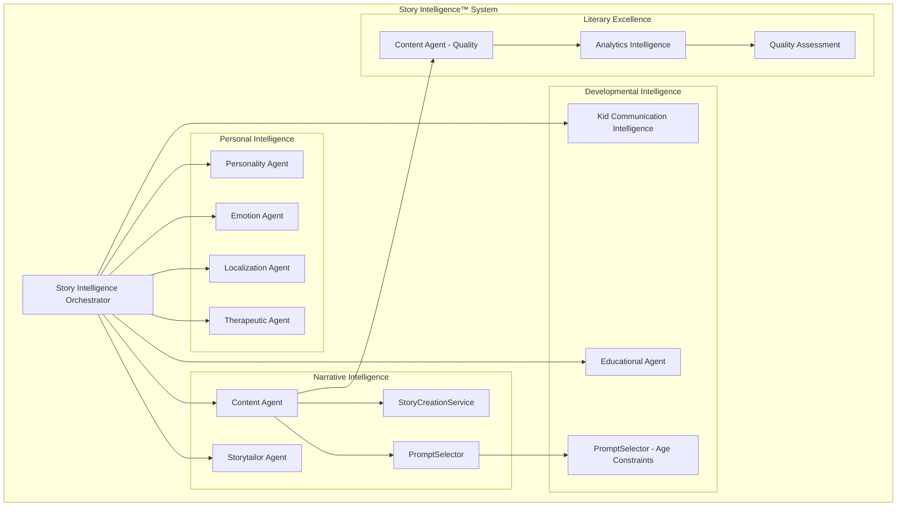
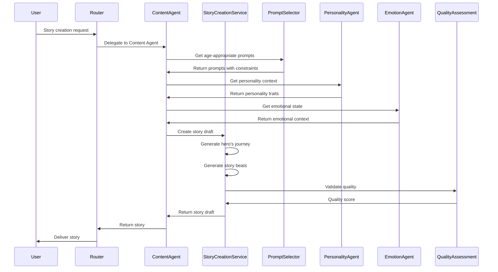

Status: Draft  
Audience: Internal  
Last-Updated: 2025-12-13  
Owner: Documentation Team  
Verified-Against-Code: Yes  
Doc-ID: AUTO  
Notes: Phase 3 - Story Intelligence architecture with code references

# Story Intelligence™ Architecture

## Overview

Story Intelligence™ is implemented through a multi-agent architecture where each of the four pillars is supported by specialized agents and services. This document details the technical implementation of each pillar with code references.

## System Architecture Diagram

## Pillar 1: Narrative Intelligence

### Implementation Overview

Narrative Intelligence is primarily implemented in the Content Agent through story creation services that enforce hero's journey structure and Pulitzer-quality standards.

### Core Components

#### StoryCreationService

**Location:** `packages/content-agent/src/services/StoryCreationService.ts`

**Responsibilities:**
- Hero's journey outline generation
- Story beat content generation
- Story choice generation
- Story editing and refinement

**Key Methods:**
- `generateHeroJourneyOutline()` (lines 205-250) - Creates 12-beat hero's journey structure
- `generateBeatContent()` (lines 332-365) - Generates individual story beats
- `generateChoicesForBeat()` (lines 372-402) - Creates choose-your-adventure choices
- `createStoryDraft()` (lines 46-78) - Orchestrates story draft creation

**Code References:**
- `packages/content-agent/src/services/StoryCreationService.ts:205-250` - Hero's journey generation
- `packages/content-agent/src/services/StoryCreationService.ts:332-365` - Beat content generation
- `packages/content-agent/src/services/StoryCreationService.ts:372-402` - Choice generation

#### PromptSelector

**Location:** `packages/content-agent/src/services/PromptSelector.ts`

**Responsibilities:**
- Base system prompt generation (Pulitzer-quality standards)
- Story-specific prompt selection
- Age-appropriate prompt adaptation

**Key Methods:**
- `getBaseSystemPrompt()` (lines 138-152) - Pulitzer-quality base prompt
- `getStorySpecificPrompt()` (lines 154-264) - Story type-specific prompts
- `getUserPrompt()` (lines 267-268) - User prompt template

**Code References:**
- `packages/content-agent/src/services/PromptSelector.ts:138-152` - Base system prompt
- `packages/content-agent/src/services/PromptSelector.ts:154-264` - Story-specific prompts
- `docs/prompts-library/content-generation.md#prompt-selector` - Complete prompt documentation

### Narrative Structure

**Hero's Journey Implementation:**
1. Ordinary World - Character's normal life
2. Call to Adventure - The inciting incident
3. Refusal of the Call - Initial hesitation
4. Meeting the Mentor - Guidance appears
5. Crossing the Threshold - Entering the adventure
6. Tests, Allies, and Enemies - Challenges and relationships
7. Approach to the Inmost Cave - Preparing for the main challenge
8. Ordeal - The climactic challenge
9. Reward - Success and what's gained
10. The Road Back - Beginning the return journey
11. Resurrection - Final test and transformation
12. Return with the Elixir - How the character has changed

**Code Reference:**
- `packages/content-agent/src/services/StoryCreationService.ts:211-225` - 12-beat hero's journey structure

## Pillar 2: Developmental Intelligence

### Implementation Overview

Developmental Intelligence is implemented through age-appropriate constraints, Kid Communication Intelligence System, and educational adaptations.

### Core Components

#### PromptSelector - Age Constraints

**Location:** `packages/content-agent/src/services/PromptSelector.ts:35-89`

**Responsibilities:**
- Age-appropriate content filtering
- Vocabulary level adaptation
- Sentence structure complexity
- Emotional complexity matching

**Age Groups:**
- **Ages 3-4**: Very simple vocabulary (1-2 syllables), short sentences (5-8 words), basic emotions
- **Ages 5-6**: Elementary vocabulary, moderate sentences (8-12 words), basic problem-solving
- **Ages 7-8**: Age-appropriate vocabulary with explanations, complex sentences, mild challenges
- **Ages 9+**: Rich vocabulary, complex plot structures, nuanced emotional themes

**Code References:**
- `packages/content-agent/src/services/PromptSelector.ts:35-89` - Age-appropriate constraints
- `packages/content-agent/src/services/StoryConversationManager.ts:523-553` - Age-appropriate language patterns

#### Kid Communication Intelligence System

**Location:** `packages/kid-communication-intelligence/src/KidCommunicationIntelligenceService.ts:25-175`

**Components (11 total):**
1. Audio Intelligence - Enhanced child speech understanding
2. Test-Time Adaptation - Real-time adaptation to child's speech patterns
3. Multimodal Interpretation - Combining audio, text, and context
4. Developmental Processing - Age-appropriate processing
5. Invented Word Intelligence - Understanding child-created words
6. Child Logic Interpreter - Understanding child reasoning
7. Emotional Speech Intelligence - Emotion detection from speech
8. Adaptive Transcription - Age-appropriate transcription
9. Continuous Personalization - Learning from interactions
10. Confidence System - Confidence scoring for interpretations
11. Transcription Service - Child-specific transcription

**Code References:**
- `packages/kid-communication-intelligence/src/KidCommunicationIntelligenceService.ts:25-175` - Main service
- `packages/universal-agent/src/UniversalStorytellerAPI.ts:347-373` - Integration in Universal Agent

#### Educational Agent

**Location:** `packages/educational-agent/`

**Responsibilities:**
- Learning-focused narratives
- Educational activity generation
- Learning style adaptations (visual, auditory, kinesthetic)

**Code References:**
- `packages/content-agent/src/services/EducationalActivitiesService.ts:217-297` - Activity generation
- `docs/prompts-library/content-generation.md#educational-activities-prompts` - Educational prompts

## Pillar 3: Personal Intelligence

### Implementation Overview

Personal Intelligence is implemented through personality frameworks, emotion detection, cultural adaptation, and therapeutic support.

### Core Components

#### Personality Agent

**Location:** `packages/personality-agent/src/PersonalityFramework.ts`

**Responsibilities:**
- Brand voice consistency
- Character personality preservation
- Personality-based story recommendations
- Individual personality traits recognition

**Personality Traits:**
- Warmth: 0.9
- Empathy: 0.9
- Whimsy: 0.7
- Youthfulness: 0.8
- Playfulness: 0.7
- Supportiveness: 0.9

**Code References:**
- `packages/personality-agent/src/PersonalityFramework.ts:29-36` - Base personality traits
- `packages/personality-agent/src/PersonalityFramework.ts:51-100` - Personality response generation
- `packages/content-agent/src/services/CharacterGenerationService.ts:104-144` - Character trait extraction

#### Emotion Agent

**Location:** `packages/emotion-agent/`

**Responsibilities:**
- Daily emotional check-ins
- Emotion pattern detection
- Emotional state tracking
- Supportive narrative elements

**Code References:**
- `packages/emotion-agent/src/EmotionAgent.ts:83` - Daily check-ins
- `lambda-deployments/conversation-agent/src/prompts/EmotionResponseGuidance.js:17-195` - Emotion response framework
- `docs/prompts-library/conversation.md#emotion-response-guidance` - Emotion prompts

#### Localization Agent

**Location:** `packages/localization-agent/`

**Responsibilities:**
- Cultural adaptation
- Multi-language support
- Cultural sensitivity
- Religious considerations

**Code References:**
- `packages/localization-agent/` - Cultural adaptation service
- `docs/storytailor/partner_integration.md` - Localization details

#### Therapeutic Agent

**Location:** `packages/therapeutic-agent/`

**Responsibilities:**
- Mental health support
- Therapeutic storytelling
- Crisis detection support
- Emotional regulation support

**Code References:**
- `packages/therapeutic-agent/` - Therapeutic support service
- `packages/content-agent/src/services/PostStorySupport.ts:372-406` - Post-story emotional assessment

### Character Profile Handling

**Location:** `packages/content-agent/src/services/CharacterGenerationService.ts`

**Responsibilities:**
- Character trait extraction from conversation
- Character profile management
- Identity and context handling
- Preference tracking

**Code References:**
- `packages/content-agent/src/services/CharacterGenerationService.ts:104-144` - Trait extraction
- `packages/content-agent/src/services/CharacterGenerationService.ts:419-458` - Conversational character creation
- `docs/prompts-library/content-generation.md#character-generation-prompts` - Character prompts

**Note:** Personal Intelligence uses child profile and preference handling modules, identity and context handling - not "personalization" in the generic sense.

## Pillar 4: Literary Excellence

### Implementation Overview

Literary Excellence is enforced through quality assessment services, multi-stage review processes, and Pulitzer-quality prompts.

### Core Components

#### Story Quality Assessment Service

**Location:** `packages/analytics-intelligence/src/services/StoryQualityAssessmentService.ts:8-659`

**Responsibilities:**
- Quality scoring and validation
- Literary excellence metrics
- Publishing standards enforcement
- Award-caliber quality checks

**Code References:**
- `packages/analytics-intelligence/src/services/StoryQualityAssessmentService.ts:8-659` - Quality assessment service
- `packages/content-agent/src/services/StoryCreationService.ts:233-250` - Pulitzer-quality system prompt

#### Content Agent Quality Enforcement

**Location:** `packages/content-agent/src/services/`

**Quality Standards:**
- Pulitzer Prize narrative quality
- Caldecott Medal illustration standards
- Newbery Award literary excellence
- Professional editing techniques

**Code References:**
- `packages/content-agent/src/services/StoryCreationService.ts:237-238` - Pulitzer-quality system prompt
- `packages/content-agent/src/services/PromptSelector.ts:138-152` - Award-caliber base prompt

## Integration Flow

### Story Creation Request Flow

**Code References:**
- `packages/router/src/services/IntentClassifier.ts:310-332` - Intent classification
- `packages/content-agent/src/services/StoryCreationService.ts:46-78` - Story draft creation
- `packages/analytics-intelligence/src/services/StoryQualityAssessmentService.ts:8-659` - Quality validation

## Data Flow

### Character Profile Data

**Storage:**
- Supabase database (`characters` table)
- Session context (Redis)
- Character traits extracted from conversation

**Code References:**
- `packages/content-agent/src/services/CharacterGenerationService.ts:104-144` - Trait extraction
- `supabase/migrations/` - Database schema for characters

### Story Data

**Storage:**
- Supabase database (`stories` table)
- Story beats, choices, and content
- Quality scores and assessments

**Code References:**
- `supabase/migrations/` - Database schema for stories
- `packages/content-agent/src/services/StoryCreationService.ts:46-78` - Story creation

### Age and Developmental Data

**Storage:**
- User profile (age, developmental stage)
- Session context
- Prompt templates cache

**Code References:**
- `packages/content-agent/src/services/PromptSelector.ts:35-89` - Age constraints
- `lambda-deployments/conversation-agent/src/prompts/FrankieSystemPrompt.js:179-238` - Age-specific adaptations

## Related Documentation

- **Overview:** See [Story Intelligence Overview](./overview.md)
- **Partner API:** See [Story Intelligence Partner API](./partner_api.md)
- **System Architecture:** See [System Architecture](../system/architecture.md)
- **Prompts Library:** See [Prompts Library](../prompts-library/README.md)
