Status: Draft  
Audience: Internal  
Last-Updated: 2025-12-13  
Owner: Documentation Team  
Verified-Against-Code: Yes  
Doc-ID: AUTO  
Notes: Phase 1 - System architecture with Mermaid diagrams incorporating Phase 0.5 deployment verification results

# System Architecture

## Overview

This document describes the complete system architecture of the Storytailor platform, including multi-agent orchestration, data flows, integration patterns, and deployment architecture. All architecture diagrams are verified against actual code and deployment state from Phase 0.5.

## High-Level System Architecture

```mermaid
graph TB
    subgraph "Client Layer"
        WEB[Web Browser]
        MOBILE[Mobile Apps<br/>iOS/Android/RN]
        VOICE[Voice Platforms<br/>Alexa/Google/Apple]
        WIDGET[Embeddable Widget]
    end

    subgraph "API Gateway Layer"
        REST[REST API Gateway<br/>60+ endpoints]
        GRAPHQL[GraphQL API]
        WS[WebSocket API]
        WEBVTT[WebVTT API]
    end

    subgraph "Universal Agent Lambda"
        UA[Universal Agent<br/>storytailor-universal-agent-{ENV}]
        RESTGW[RESTAPIGateway<br/>packages/universal-agent/src/api/RESTAPIGateway.ts:74-3511]
        UCE[UniversalConversationEngine<br/>packages/universal-agent/src/conversation/UniversalConversationEngine.ts]
    end

    subgraph "Orchestration Layer"
        ROUTER[Router<br/>packages/router/src/Router.ts:25-866]
        INTENT[IntentClassifier<br/>packages/router/src/services/IntentClassifier.ts:20-562]
        DELEGATOR[AgentDelegator<br/>packages/router/src/services/AgentDelegator.ts:18-646]
        STATE[ConversationStateManager<br/>packages/router/src/services/ConversationStateManager.ts]
    end

    subgraph "Agent Ecosystem"
        CONTENT[Content Agent<br/>storytailor-content-{ENV}]
        EMOTION[Emotion Agent<br/>storytailor-emotion-agent-{ENV}]
        AUTH[Auth Agent<br/>storytailor-auth-agent-{ENV}]
        LIBRARY[Library Agent<br/>storytailor-library-agent-{ENV}]
        COMMERCE[Commerce Agent<br/>storytailor-commerce-agent-{ENV}]
        SAFETY[Child Safety Agent<br/>storytailor-child-safety-agent-{ENV}]
        SMART[Smart Home Agent<br/>storytailor-smart-home-agent-{ENV}]
        OTHER[20+ Other Agents]
    end

    subgraph "Data Layer"
        SUPABASE[(Supabase PostgreSQL<br/>120+ tables<br/>RLS enabled)]
        REDIS[(Redis<br/>State & Caching)]
    end

    subgraph "External Services"
        OPENAI[OpenAI<br/>Story Generation]
        ELEVEN[ElevenLabs<br/>Voice Synthesis]
        STRIPE[Stripe<br/>Payments]
        HUE[Philips Hue<br/>Smart Lighting]
        STABILITY[Stability AI<br/>Image Generation]
        LIVEKIT[LiveKit<br/>Video/Audio]
        HEDRA[Hedra<br/>Avatar]
    end

    WEB --> REST
    MOBILE --> REST
    VOICE --> REST
    WIDGET --> REST

    REST --> UA
    GRAPHQL --> UA
    WS --> UA
    WEBVTT --> UA

    UA --> RESTGW
    UA --> UCE
    UCE --> ROUTER

    ROUTER --> INTENT
    ROUTER --> DELEGATOR
    ROUTER --> STATE

    DELEGATOR --> CONTENT
    DELEGATOR --> EMOTION
    DELEGATOR --> AUTH
    DELEGATOR --> LIBRARY
    DELEGATOR --> COMMERCE
    DELEGATOR --> SAFETY
    DELEGATOR --> SMART
    DELEGATOR --> OTHER

    CONTENT --> SUPABASE
    EMOTION --> SUPABASE
    AUTH --> SUPABASE
    LIBRARY --> SUPABASE
    COMMERCE --> SUPABASE
    SAFETY --> SUPABASE
    SMART --> SUPABASE
    OTHER --> SUPABASE

    ROUTER --> REDIS
    STATE --> REDIS
    UCE --> REDIS

    CONTENT --> OPENAI
    CONTENT --> STABILITY
    SMART --> HUE
    OTHER --> ELEVEN
    OTHER --> LIVEKIT
    OTHER --> HEDRA
    COMMERCE --> STRIPE

    style UA fill:#e1f5ff
    style ROUTER fill:#fff4e1
    style SUPABASE fill:#d4edda
    style REDIS fill:#f8d7da
```

**Code References:**
- `packages/universal-agent/src/api/RESTAPIGateway.ts:74-3511` - REST API Gateway
- `packages/router/src/Router.ts:25-866` - Router orchestration
- `packages/router/src/services/AgentDelegator.ts:18-646` - Agent delegation
- [Deployment Inventory](./deployment-inventory.md:26-80) - Lambda function inventory

## Multi-Agent Orchestration Flow

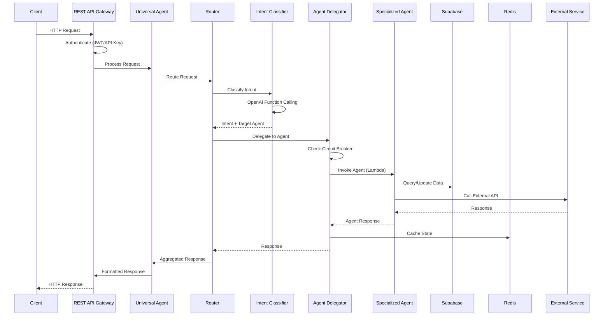

**Code References:**
- `packages/router/src/Router.ts:100-200` - Request processing flow
- `packages/router/src/services/IntentClassifier.ts:43-95` - Intent classification
- `packages/router/src/services/AgentDelegator.ts:36-100` - Agent delegation
- `packages/universal-agent/src/api/RESTAPIGateway.ts:320-536` - Authentication middleware

## Agent Communication Patterns

### Pattern 1: Router-Based Delegation (Primary)

```mermaid
graph LR
    ROUTER[Router<br/>packages/router/src/Router.ts]
    DELEGATOR[AgentDelegator<br/>packages/router/src/services/AgentDelegator.ts:18-646]
    
    subgraph "Lambda Functions"
        AUTH_LAMBDA[Auth Agent Lambda<br/>storytailor-auth-agent-{ENV}]
        CONTENT_LAMBDA[Content Agent Lambda<br/>storytailor-content-{ENV}]
        EMOTION_LAMBDA[Emotion Agent Lambda<br/>storytailor-emotion-agent-{ENV}]
    end

    ROUTER --> DELEGATOR
    DELEGATOR -->|HTTP Invoke| AUTH_LAMBDA
    DELEGATOR -->|HTTP Invoke| CONTENT_LAMBDA
    DELEGATOR -->|HTTP Invoke| EMOTION_LAMBDA
```

**Code References:**
- `packages/router/src/services/AgentDelegator.ts:36-100` - Delegation logic
- `scripts/update-router-http-handler.sh:89-107` - Agent mapping configuration

### Pattern 2: Event-Driven Communication

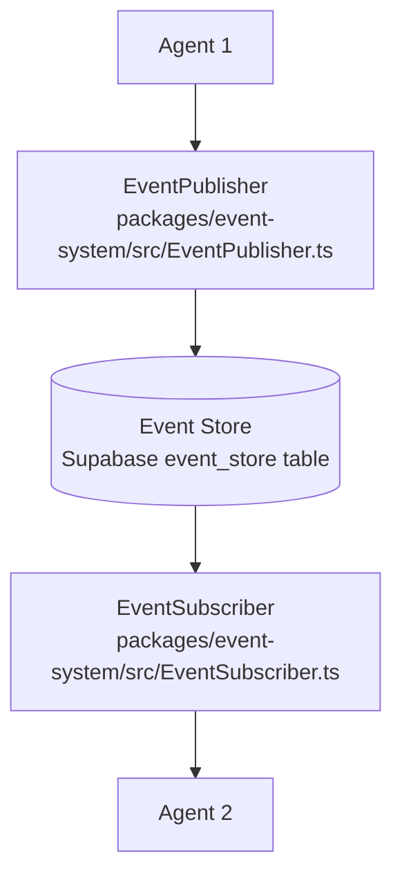

**Code References:**
- `packages/event-system/src/index.ts:1-82` - Event system exports
- `packages/universal-agent/src/UniversalStorytellerAPI.ts:3,70,191` - EventPublisher usage
- `supabase/migrations/20240101000006_event_system.sql` - Event store table

### Pattern 3: Direct API Calls (Universal Agent)

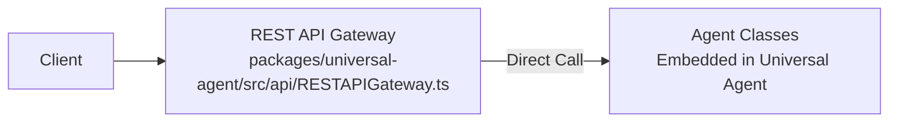

**Code References:**
- `packages/universal-agent/src/api/RESTAPIGateway.ts:156-229` - Agent initialization
- `packages/universal-agent/src/api/RESTAPIGateway.ts:1362-1494` - Localization agent direct call

## Data Flow Architecture

### Story Creation Flow

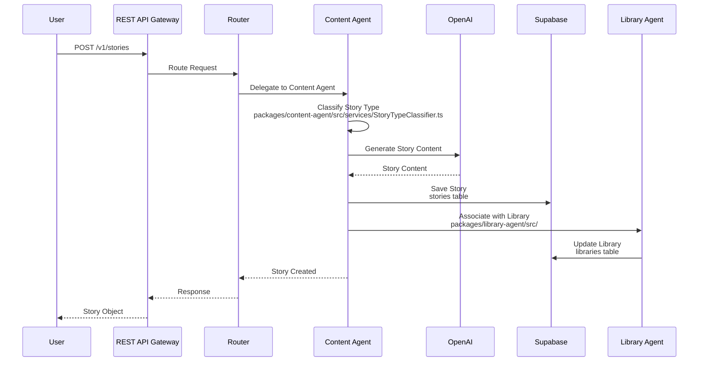

**Code References:**
- `packages/universal-agent/src/api/RESTAPIGateway.ts:825-848` - Story creation endpoint
- `packages/content-agent/src/ContentAgent.ts:1-1422` - Content Agent implementation
- `packages/content-agent/src/services/StoryTypeClassifier.ts` - Story type classification

### Authentication Flow

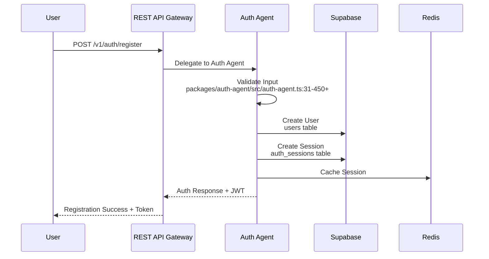

**Code References:**
- `packages/universal-agent/src/api/RESTAPIGateway.ts:973-1077` - Auth routes setup
- `packages/auth-agent/src/auth-agent.ts:31-450+` - Auth Agent implementation
- `supabase/migrations/20240101000003_auth_agent_tables.sql:5-222` - Auth tables

### Smart Home Integration Flow

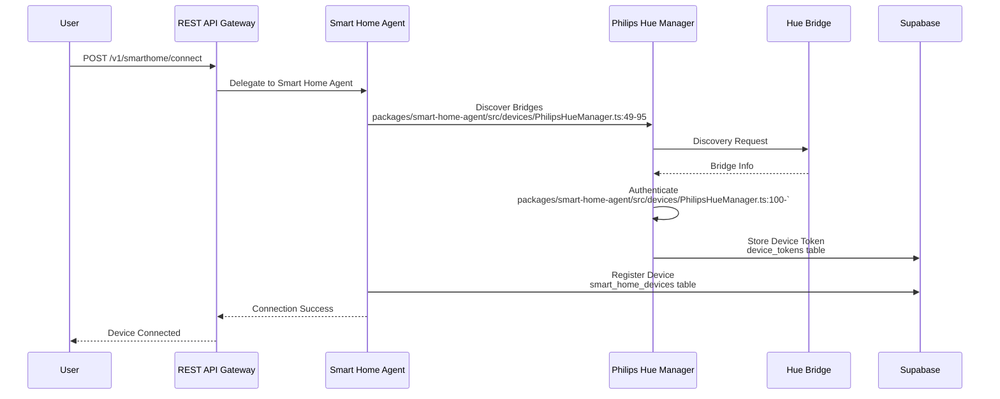

**Code References:**
- `packages/universal-agent/src/api/RESTAPIGateway.ts:1079-1131` - Smart home routes
- `packages/smart-home-agent/src/devices/PhilipsHueManager.ts:18-606` - Hue manager
- `supabase/migrations/20240101000005_smart_home_integration.sql:5-126` - Smart home tables

## Deployment Architecture

### AWS Lambda Deployment

```mermaid
graph TB
    subgraph "AWS Region: us-east-1"
        subgraph "Production Environment"
            PROD_LAMBDA1[storytailor-universal-agent-production<br/>512 MB, 30s timeout]
            PROD_LAMBDA2[storytailor-content-production<br/>1024 MB, 300s timeout]
            PROD_LAMBDA3[storytailor-emotion-agent-production<br/>512 MB, 60s timeout]
            PROD_OTHER[14+ Other Production Lambdas]
        end

        subgraph "Staging Environment"
            STAGING_LAMBDA1[storytailor-universal-staging<br/>256 MB, 30s timeout]
            STAGING_LAMBDA2[storytailor-staging-router<br/>1024 MB, 300s timeout]
            STAGING_OTHER[25+ Other Staging Lambdas]
        end

        subgraph "AWS Services"
            SSM[SSM Parameter Store<br/>50+ parameters]
            S3[S3 Bucket<br/>storytailor-lambda-deploys]
            IAM[IAM Role<br/>storytailor-lambda-role-{ENV}]
        end
    end

    PROD_LAMBDA1 --> SSM
    PROD_LAMBDA2 --> SSM
    PROD_LAMBDA3 --> SSM
    STAGING_LAMBDA1 --> SSM
    STAGING_LAMBDA2 --> SSM

    PROD_LAMBDA1 -.->|Deploy from| S3
    PROD_LAMBDA2 -.->|Deploy from| S3
    STAGING_LAMBDA1 -.->|Deploy from| S3

    PROD_LAMBDA1 --> IAM
    PROD_LAMBDA2 --> IAM
    STAGING_LAMBDA1 --> IAM
```

**Verified Against:**
- [Deployment Inventory](./deployment-inventory.md:26-80) - Lambda function inventory
- `docs/system/ssm_parameters_inventory.md:24-220` - SSM parameters
- `scripts/deploy-universal-agent-proper.sh:40-41` - Region and IAM role

### Database Architecture

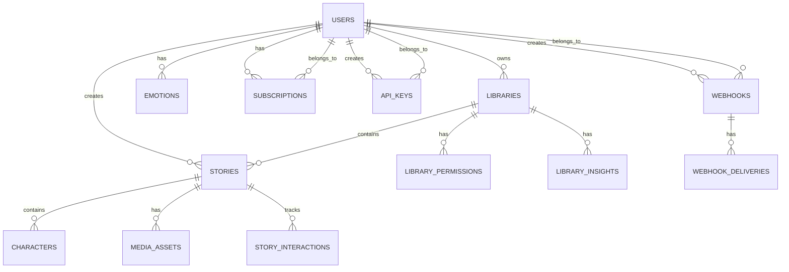

**Verified Against:**
- [Database Schema Inventory](./database-schema-inventory.md:24-343) - Complete table inventory
- `supabase/migrations/20240101000000_initial_schema.sql:1-166` - Core schema

## Integration Architecture

### External Service Integration Pattern

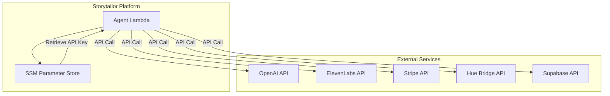

**Code References:**
- `packages/smart-home-agent/src/devices/PhilipsHueManager.ts:28-33` - HTTP client setup
- `packages/content-agent/src/services/ArtGenerationService.ts` - Stability AI integration
- `docs/system/ssm_parameters_inventory.md:78-220` - External service parameters

## Request Processing Architecture

### Complete Request Lifecycle

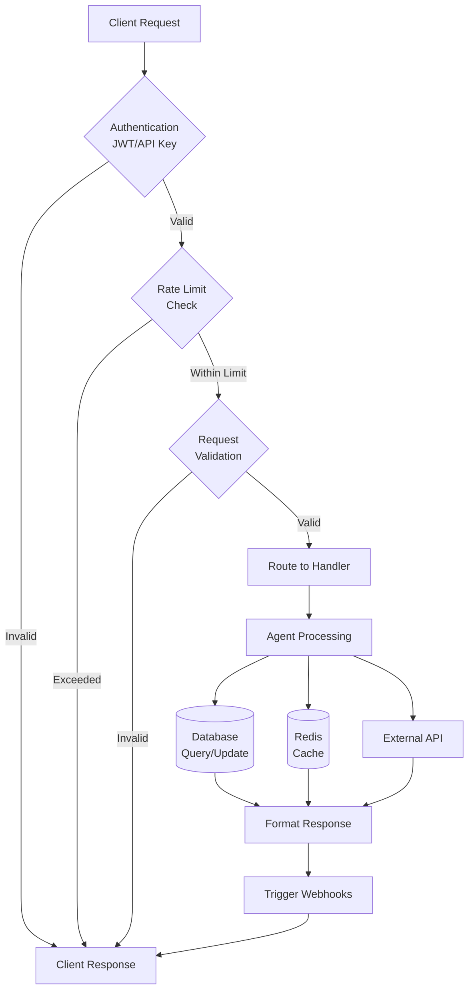

**Code References:**
- `packages/universal-agent/src/api/RESTAPIGateway.ts:320-536` - Authentication and rate limiting middleware
- `packages/universal-agent/src/api/RESTAPIGateway.ts:2580-2593` - Request validation
- `packages/universal-agent/src/api/RESTAPIGateway.ts:2608-2703` - Webhook triggering

## Component Interaction Patterns

### Synchronous Agent Invocation

**Pattern:** Router → AgentDelegator → Lambda Function (HTTP Invoke)

**Code Reference:**
- `packages/router/src/services/AgentDelegator.ts:36-100` - Synchronous delegation
- `scripts/update-router-http-handler.sh:203-219` - Lambda invocation

### Asynchronous Event Publishing

**Pattern:** Agent → EventPublisher → EventStore → EventSubscriber → Other Agents

**Code Reference:**
- `packages/universal-agent/src/UniversalStorytellerAPI.ts:191-192` - Event publishing
- `packages/event-system/src/EventPublisher.ts` - Event publisher implementation

### Direct Agent Embedding

**Pattern:** Universal Agent → Embedded Agent Classes (Local)

**Code Reference:**
- `packages/universal-agent/src/api/RESTAPIGateway.ts:156-229` - Agent initialization
- `packages/universal-agent/src/api/RESTAPIGateway.ts:1362-1494` - Localization agent direct usage

## Security Architecture

### Authentication & Authorization Flow

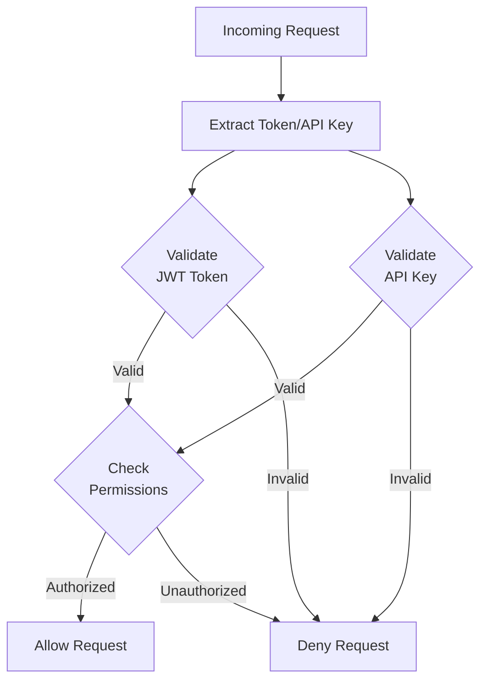

**Code References:**
- `packages/universal-agent/src/api/RESTAPIGateway.ts:320-536` - Authentication middleware
- `packages/universal-agent/src/api/RESTAPIGateway.ts:507-535` - Permission checking
- `packages/universal-agent/src/api/RESTAPIGateway.ts:2995-3037` - API key management

### Data Protection

**Encryption:**
- Database: Supabase RLS + encryption at rest
- API Keys: Hashed storage (`key_hash` column)
- Webhooks: HMAC signatures
- SSM Parameters: SecureString encryption

**Code References:**
- `supabase/migrations/20240101000018_api_keys_and_webhooks.sql:57-72` - API key hashing
- `packages/universal-agent/src/api/RESTAPIGateway.ts:2782-2787` - HMAC signature generation
- `docs/system/ssm_parameters_inventory.md:24-220` - SecureString parameters

## Performance Architecture

### Caching Strategy

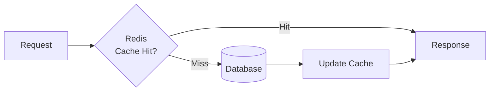

**Code References:**
- `packages/router/src/services/ConversationStateManager.ts` - State caching
- `packages/universal-agent/src/api/RESTAPIGateway.ts:232-253` - Redis rate limiting

### Circuit Breaker Pattern

**Implementation:** AgentDelegator with circuit breaker state

**Code Reference:**
- `packages/router/src/services/AgentDelegator.ts:18-646` - Circuit breaker implementation
- `packages/router/src/services/AgentDelegator.ts:52-57` - Circuit breaker check

## Monitoring & Observability

### Logging Architecture

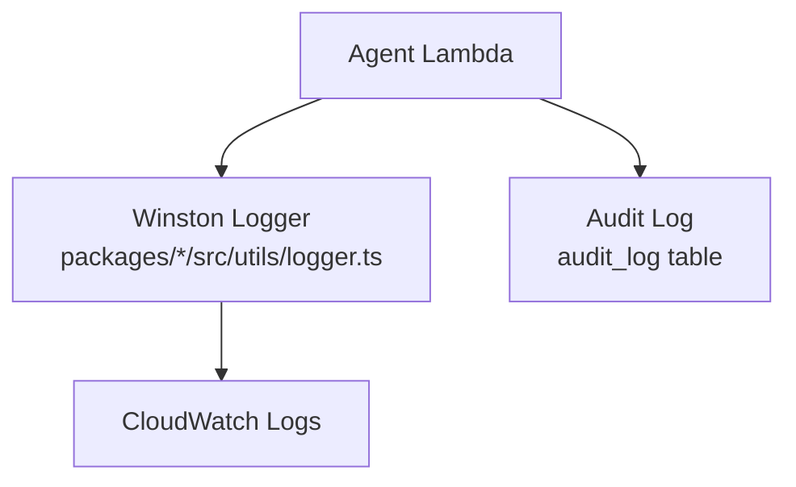

**Code References:**
- `packages/router/src/utils/logger.ts` - Logger utility
- `supabase/migrations/20240101000000_initial_schema.sql:93-102` - Audit log table

### Metrics Collection

**Components:**
- Event System Metrics (`packages/event-system/src/monitoring/MetricsCollector.ts`)
- Health Monitoring Agent (`storytailor-health-monitoring-agent-{ENV}`)
- System Metrics Table (`system_metrics`)

**Verified Against:**
- `docs/system/deployment_inventory.md:34` - Health monitoring agent
- `docs/system/database_schema_inventory.md:343` - System metrics table

## Deployment Patterns

### Standard Deployment Flow

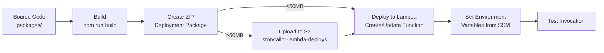

**Code References:**
- `scripts/deploy-universal-agent-proper.sh:57-715` - Complete deployment flow
- `scripts/deploy-universal-agent-proper.sh:565-576` - S3 upload for large packages
- `scripts/deploy-universal-agent-proper.sh:586-618` - Lambda function creation

## Architecture Principles

### 1. Hub-and-Spoke Orchestration

**Pattern:** Router as central hub, agents as spokes

**Implementation:**
- `packages/router/src/Router.ts:25-866` - Central router
- `packages/router/src/services/AgentDelegator.ts:18-646` - Agent delegation

### 2. Stateless Functions

**Pattern:** All Lambda functions are stateless, state stored in Redis/Database

**Implementation:**
- `packages/router/src/services/ConversationStateManager.ts` - State management
- `supabase/migrations/20240101000000_initial_schema.sql:124-132` - Conversation states table

### 3. Circuit Breaker Resilience

**Pattern:** Circuit breakers prevent cascading failures

**Implementation:**
- `packages/router/src/services/AgentDelegator.ts:52-100` - Circuit breaker logic

### 4. Event-Driven Communication

**Pattern:** Agents communicate via events for loose coupling

**Implementation:**
- `packages/event-system/src/EventPublisher.ts` - Event publishing
- `packages/event-system/src/EventSubscriber.ts` - Event subscription

## Technology Stack

### Runtime & Language

- **Primary:** Node.js 22.x (39 functions)
- **Legacy:** Node.js 20.x (3 functions), Node.js 18.x (2 functions)
- **Language:** TypeScript (all packages)

### Frameworks & Libraries

- **Web Framework:** Express.js (`packages/universal-agent/src/api/RESTAPIGateway.ts`)
- **GraphQL:** express-graphql (`packages/universal-agent/src/api/RESTAPIGateway.ts:109`)
- **WebSocket:** ws (`packages/universal-agent/src/api/RESTAPIGateway.ts:97`)
- **Validation:** Joi (`packages/universal-agent/src/api/RESTAPIGateway.ts:2580-2593`)
- **Logging:** Winston (all packages)
- **Database Client:** @supabase/supabase-js
- **Caching:** redis (rate limiting, state)

**Code References:**
- `packages/universal-agent/package.json:17-55` - Dependencies
- `package.json:43-50` - Dev dependencies

## Network Architecture

### Request Routing

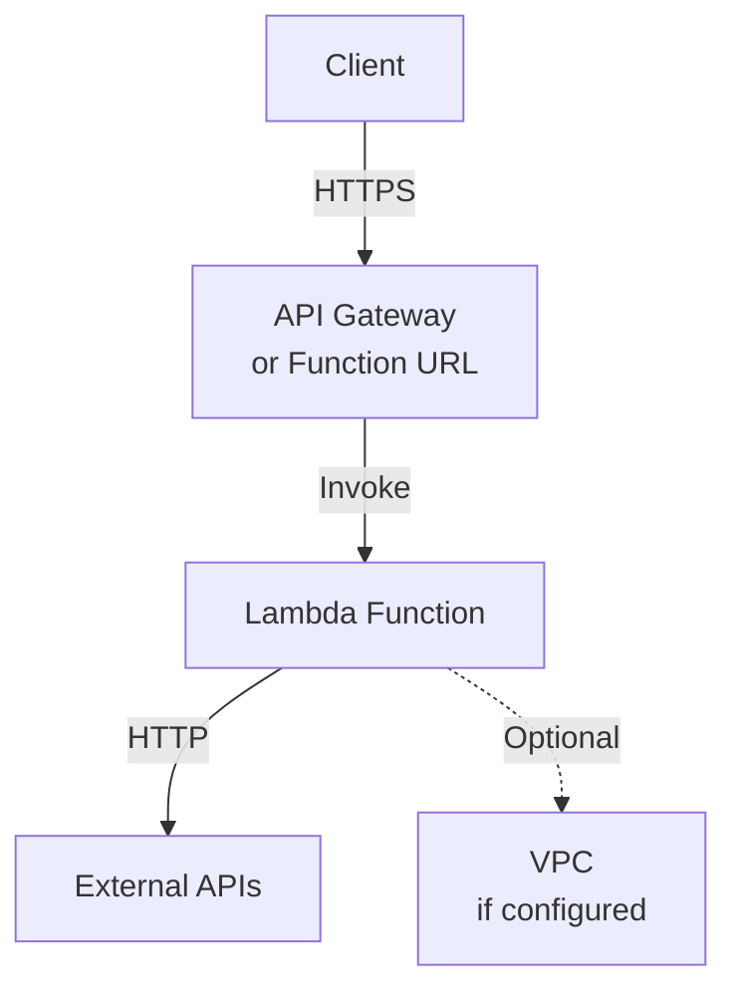

> ASSUMPTION: API Gateway or Lambda Function URL configuration not verified in code. Most functions likely use Lambda Function URLs.

## Data Architecture

### Data Flow Patterns

**Pattern 1: Write-Through Cache**
- Write to database → Update cache
- `packages/router/src/services/ConversationStateManager.ts`

**Pattern 2: Read-Through Cache**
- Check cache → If miss, read from database → Update cache
- `packages/universal-agent/src/api/RESTAPIGateway.ts:232-253`

**Pattern 3: Event Sourcing**
- Events stored in `event_store` table
- `supabase/migrations/20240101000006_event_system.sql`

## Scalability Architecture

### Horizontal Scaling

- **Lambda Functions:** Auto-scaling based on concurrent executions
- **Database:** Supabase managed scaling
- **Redis:** Managed service scaling

### Vertical Scaling

- **Memory:** 256 MB to 1024 MB per function
- **Timeout:** 10s to 300s per function

**Verified Against:**
- `docs/system/deployment_inventory.md:99-127` - Memory and timeout distribution

## Failure Handling Architecture

### Error Handling Flow

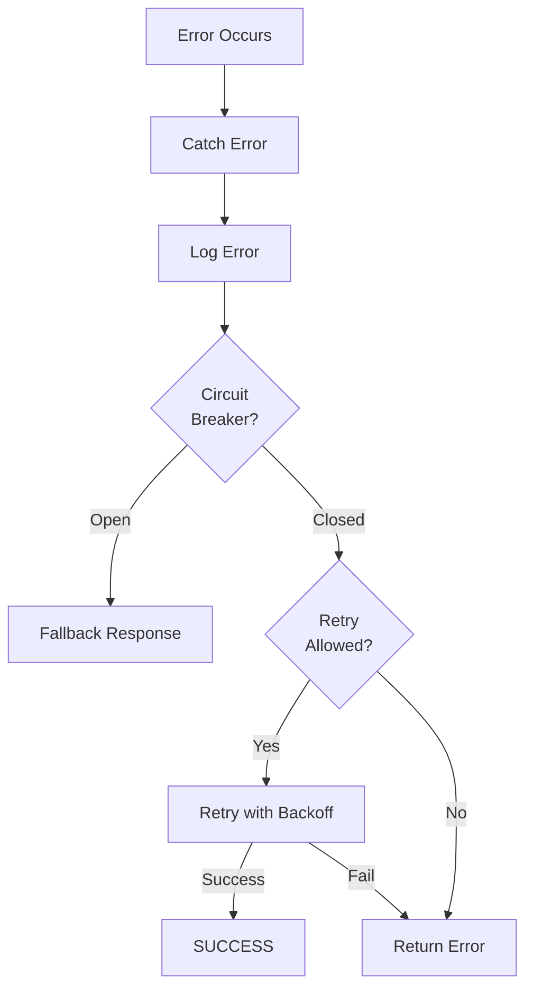

**Code References:**
- `packages/router/src/services/AgentDelegator.ts:83-100` - Error handling and fallback
- `packages/router/src/services/AgentDelegator.ts:52-57` - Circuit breaker check

## Integration Points Summary

| Integration Type | Protocol | Implementation | Code Reference |
|------------------|----------|----------------|----------------|
| **Agent-to-Agent (Synchronous)** | HTTP Lambda Invoke | AgentDelegator | `packages/router/src/services/AgentDelegator.ts:36-100` |
| **Agent-to-Agent (Asynchronous)** | Event System | EventPublisher/Subscriber | `packages/event-system/src/EventPublisher.ts` |
| **Client-to-Platform** | REST API | RESTAPIGateway | `packages/universal-agent/src/api/RESTAPIGateway.ts:74-3511` |
| **Client-to-Platform** | GraphQL | GraphQL endpoint | `packages/universal-agent/src/api/RESTAPIGateway.ts:109` |
| **Client-to-Platform** | WebSocket | WebSocket server | `packages/universal-agent/src/api/RESTAPIGateway.ts:2507-2576` |
| **Platform-to-Database** | PostgreSQL | Supabase client | All agents |
| **Platform-to-Cache** | Redis Protocol | Redis client | `packages/universal-agent/src/api/RESTAPIGateway.ts:232-253` |
| **Platform-to-External** | HTTP/REST | Axios/HTTP clients | All external integrations |

## Architecture Verification Status

| Component | Code Verified | Deployment Verified | Documentation Status |
|-----------|---------------|---------------------|----------------------|
| **Universal Agent** | ✅ Yes | ✅ Yes | ✅ Complete |
| **Router** | ✅ Yes | ⚠️ Staging only | ✅ Complete |
| **Agent Ecosystem** | ✅ Yes | ✅ Partial (44/50+ deployed) | ⚠️ Partial (21/30+ documented) |
| **Database Schema** | ✅ Yes | ✅ Yes | ✅ Complete |
| **API Endpoints** | ✅ Yes | ✅ Yes | ✅ Complete |
| **External Services** | ✅ Yes | ✅ Yes | ⚠️ Partial |
| **Deployment Scripts** | ✅ Yes | ⚠️ 15/44 have scripts | ⚠️ Partial |

**Verified Against:**
- `docs/system/deployment_inventory.md` - Deployment verification
- `docs/system/code_to_deployment_mapping.md` - Code mapping
- `docs/system/gap_analysis.md` - Gap analysis

## Gaps and Assumptions

### Verified Components

- ✅ 44 Lambda functions deployed and verified
- ✅ 120+ database tables with schema verified
- ✅ 60+ API endpoints documented
- ✅ 50+ SSM parameters inventoried
- ✅ Router orchestration flow verified
- ✅ Agent delegation pattern verified

### Assumptions

> ASSUMPTION: API Gateway vs Lambda Function URL configuration not verified - functions likely use Function URLs based on deployment script patterns.

> ASSUMPTION: AWS EventBridge usage not verified in code - event system may use database event_store table instead.

> ASSUMPTION: gRPC protocol mentioned in documentation but not verified in code - agents may use HTTP Lambda invoke instead.

### Known Gaps

1. **Missing Deployment Scripts:** 5 functions deployed but no script found
2. **Handler Paths:** Only 1/44 functions handler path verified
3. **Environment Variables:** Only 1/44 functions fully documented
4. **Network Configuration:** VPC, security groups not documented

TAG: RISK  
TODO[DEVOPS]: Verify API Gateway vs Function URL configuration  
TODO[DEVOPS]: Verify AWS EventBridge usage  
TODO[ENGINEERING]: Verify gRPC protocol implementation  
TODO[DEVOPS]: Document network configuration (VPC, security groups)
