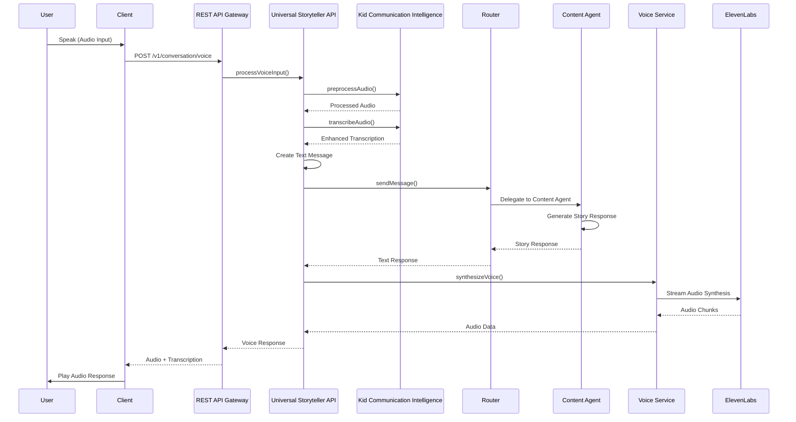

Status: Draft  
Audience: Internal | Partner  
Last-Updated: 2025-12-13  
Owner: Documentation Team  
Verified-Against-Code: Yes  
Doc-ID: AUTO  
Notes: Phase 2.5 - Audio conversational user journey with code references and line numbers for key behaviors

# Audio Conversational User Journey

## Overview

This document describes the complete user journey for creating stories through audio conversational interaction, including voice input processing, transcription with Kid Communication Intelligence, story generation, and audio response synthesis. All steps include code references with file paths and line numbers for key behaviors and flows.

## Journey Flow

### Step 1: Session Initialization

**Action:** User starts an audio conversation session

**Endpoint:** `POST /v1/conversation/start`

**Code Reference:**
- `packages/universal-agent/src/api/RESTAPIGateway.ts:625-657` - Conversation start endpoint
- `packages/universal-agent/src/UniversalStorytellerAPI.ts:150-215` - Session creation
- `packages/universal-agent/src/conversation/UniversalConversationEngine.ts:281-347` - Session initialization

**Request:**
```http
POST /v1/conversation/start
Authorization: Bearer <api-key>
Content-Type: application/json

{
  "platform": "mobile",
  "language": "en",
  "voiceEnabled": true,
  "smartHomeEnabled": false,
  "parentalControls": {
    "ageVerification": true,
    "contentFiltering": "moderate"
  },
  "privacySettings": {
    "dataCollection": "minimal",
    "analytics": false
  }
}
```

**Processing Flow:**

1. **Request Reception** (`packages/universal-agent/src/api/RESTAPIGateway.ts:625-657`)
   ```typescript
   // Code location: packages/universal-agent/src/api/RESTAPIGateway.ts:625-657
   router.post('/start', this.validateRequest({...}), async (req, res) => {
     const config = {
       ...req.body,
       userId: req.user.id
     };
     const session = await this.storytellerAPI.startConversation(config);
   }
   ```

2. **Session Creation** (`packages/universal-agent/src/UniversalStorytellerAPI.ts:150-215`)
   ```typescript
   // Code location: packages/universal-agent/src/UniversalStorytellerAPI.ts:150-215
   async startConversation(config: ConversationConfig): Promise<ConversationSession> {
     const sessionId = this.generateSessionId();
     const session: ConversationSession = {
       sessionId,
       userId: config.userId,
       platform: config.platform,
       startedAt: new Date().toISOString(),
       capabilities: this.getPlatformCapabilities(config.platform),
       state: {
         phase: 'greeting',
         context: {},
         history: []
       }
     };
   }
   ```

3. **Universal Conversation Engine** (`packages/universal-agent/src/conversation/UniversalConversationEngine.ts:281-347`)
   ```typescript
   // Code location: packages/universal-agent/src/conversation/UniversalConversationEngine.ts:281-347
   async startConversation(request: ConversationStartRequest): Promise<ConversationSession> {
     const session: ConversationSession = {
       sessionId,
       userId: request.userId,
       channel: request.channel,
       startedAt: new Date().toISOString(),
       expiresAt: new Date(Date.now() + (request.sessionDuration || 24 * 60 * 60 * 1000)).toISOString(),
       capabilities,
       state: {
         phase: 'greeting',
         context: request.initialContext || {},
         history: [],
         currentStory: null,
         currentCharacter: null,
         channelStates: {}
       }
     };
   }
   ```

**Response:**
```json
{
  "success": true,
  "sessionId": "session-uuid",
  "userId": "user-uuid",
  "platform": "mobile",
  "capabilities": {
    "supportsVoice": true,
    "supportsText": true,
    "supportsStreaming": true
  },
  "state": {
    "phase": "greeting",
    "context": {},
    "history": []
  },
  "startedAt": "2025-12-13T12:00:00Z"
}
```

**Code References:**
- `packages/universal-agent/src/api/RESTAPIGateway.ts:625-657` - Conversation start endpoint
- `packages/universal-agent/src/UniversalStorytellerAPI.ts:150-215` - Session creation
- `packages/universal-agent/src/conversation/UniversalConversationEngine.ts:281-347` - Engine session creation

### Step 2: Voice Input Processing

**Action:** User speaks to create a story or character

**Endpoint:** `POST /v1/conversation/voice`

**Code Reference:**
- `packages/universal-agent/src/api/RESTAPIGateway.ts:737-758` - Voice processing endpoint
- `packages/universal-agent/src/UniversalStorytellerAPI.ts:341-414` - Voice input processing
- `packages/universal-agent/src/UniversalStorytellerAPI.ts:613-670` - Audio transcription

**Request:**
```http
POST /v1/conversation/voice
Authorization: Bearer <api-key>
Content-Type: multipart/form-data

{
  "sessionId": "session-uuid",
  "audio": <binary audio data>,
  "format": "wav",
  "sampleRate": 16000
}
```

**Processing Flow:**

1. **Request Reception** (`packages/universal-agent/src/api/RESTAPIGateway.ts:737-758`)
   ```typescript
   // Code location: packages/universal-agent/src/api/RESTAPIGateway.ts:737-758
   router.post('/voice', async (req, res) => {
     const audioData = req.body.audio || req.file?.buffer;
     if (!audioData) {
       return res.status(400).json({ 
         error: 'Audio data required',
         supportedFormats: ['wav', 'mp3', 'ogg', 'webm']
       });
     }
     const response = await this.storytellerAPI.processVoiceInput(req.body.sessionId, {
       format: req.body.format || 'wav',
       data: audioData,
       sampleRate: req.body.sampleRate || 16000
     });
   }
   ```

2. **Audio Preprocessing with Kid Communication Intelligence** (`packages/universal-agent/src/UniversalStorytellerAPI.ts:350-370`)
   ```typescript
   // Code location: packages/universal-agent/src/UniversalStorytellerAPI.ts:350-370
   // Get child profile if available
   const childProfile: ChildProfile | undefined = session.state.context?.childProfile;
   
   // Preprocess audio with Kid Communication Intelligence if feature is enabled
   let processedAudio: KidAudioInput = {
     data: audioData.data,
     sampleRate: audioData.sampleRate || 16000,
     channels: 1,
     format: 'pcm',
     metadata: {
       childId: session.userId,
       age: childProfile?.age,
       sessionId,
       timestamp: new Date().toISOString()
     }
   };
   
   if (this.kidIntelligenceEnabled && this.kidIntelligence) {
     try {
       processedAudio = await this.kidIntelligence.preprocessAudio(processedAudio, childProfile);
     } catch (error: any) {
       this.logger.warn('Audio preprocessing failed, using original audio', { error: error.message });
     }
   }
   ```

3. **Audio Transcription** (`packages/universal-agent/src/UniversalStorytellerAPI.ts:372-373`)
   ```typescript
   // Code location: packages/universal-agent/src/UniversalStorytellerAPI.ts:372-373
   // Convert audio to text (using Kid Communication Intelligence if enabled)
   const transcription = await this.transcribeAudio(processedAudio, childProfile, sessionId);
   ```

4. **Transcription Enhancement** (`packages/universal-agent/src/UniversalStorytellerAPI.ts:613-670`)
   ```typescript
   // Code location: packages/universal-agent/src/UniversalStorytellerAPI.ts:613-670
   private async transcribeAudio(
     audioInput: KidAudioInput,
     childProfile: ChildProfile | undefined,
     sessionId: string
   ): Promise<TranscriptionResult> {
     // If Kid Communication Intelligence is enabled, use it for enhanced transcription
     if (this.kidIntelligenceEnabled && this.kidIntelligence) {
       try {
         // Get basic transcription
         const basicTranscription: TranscriptionResult = {
           text: "Placeholder transcription", // TODO: Replace with actual transcription service
           confidence: 0.8,
           language: 'en'
         };
         
         // Enhance transcription with Kid Communication Intelligence
         const enhanced = await this.kidIntelligence.enhanceTranscription(
           basicTranscription,
           audioInput,
           childProfile
         );
         
         return enhanced;
       } catch (error: any) {
         this.logger.warn('Transcription enhancement failed, using basic transcription', { error: error.message });
         // Fallback to basic transcription
       }
     }
   }
   ```

5. **Text Message Creation** (`packages/universal-agent/src/UniversalStorytellerAPI.ts:376-388`)
   ```typescript
   // Code location: packages/universal-agent/src/UniversalStorytellerAPI.ts:376-388
   // Process as text message
   const textMessage: UserMessage = {
     type: 'text',
     content: transcription.text,
     metadata: {
       timestamp: new Date().toISOString(),
       platform: session.platform,
       originalAudio: true,
       confidence: transcription.confidence,
       inventedWords: transcription.inventedWords,
       emotionalContext: transcription.emotionalContext,
       developmentalStage: transcription.developmentalStage
     }
   };
   ```

**Code References:**
- `packages/universal-agent/src/api/RESTAPIGateway.ts:737-758` - Voice endpoint
- `packages/universal-agent/src/UniversalStorytellerAPI.ts:341-414` - Voice processing
- `packages/universal-agent/src/UniversalStorytellerAPI.ts:350-370` - Audio preprocessing
- `packages/universal-agent/src/UniversalStorytellerAPI.ts:613-670` - Transcription logic

### Step 3: Message Processing

**Action:** Transcribed text is processed through the conversation engine

**Code Reference:**
- `packages/universal-agent/src/UniversalStorytellerAPI.ts:220-293` - Message sending
- `packages/universal-agent/src/conversation/UniversalConversationEngine.ts:350-508` - Message processing
- `packages/router/src/Router.ts:100-200` - Request routing

**Processing Flow:**

1. **Message Sending** (`packages/universal-agent/src/UniversalStorytellerAPI.ts:220-293`)
   ```typescript
   // Code location: packages/universal-agent/src/UniversalStorytellerAPI.ts:220-293
   async sendMessage(sessionId: string, message: UserMessage): Promise<BotResponse> {
     const session = this.activeSessions.get(sessionId);
     if (!session) {
       throw new Error(`Session ${sessionId} not found`);
     }
     
     // Convert to router format
     const routerRequest = this.convertToRouterRequest(message, session);
     
     // Process through existing router
     const routerResponse = await this.router.routeRequest(routerRequest);
     
     // Convert back to universal format
     const universalResponse = this.convertToUniversalResponse(routerResponse, session);
   }
   ```

2. **Universal Conversation Engine Processing** (`packages/universal-agent/src/conversation/UniversalConversationEngine.ts:350-508`)
   ```typescript
   // Code location: packages/universal-agent/src/conversation/UniversalConversationEngine.ts:350-508
   async processMessage(request: ConversationRequest): Promise<ConversationResponse> {
     const session = await this.validateSession(request.sessionId);
     const adapter = this.channelAdapters.get(request.channel);
     
     // Preprocess message through channel adapter
     const preprocessedMessage = await adapter.preprocessMessage(request.message, session);
     
     // Process through router
     const routerResponse = await this.router.handleRequest(routerRequest, this.mapChannelToPlatform(request.channel));
     
     // Convert router response to universal format
     const universalResponse = await this.convertFromRouterResponse(routerResponse, session, request.channel);
     
     // Post-process response through channel adapter
     const finalResponse = await adapter.postprocessResponse(universalResponse, session);
   }
   ```

3. **Router Processing** (`packages/router/src/Router.ts:100-200`)
   - Intent classification (`packages/router/src/services/IntentClassifier.ts:43-95`)
   - Agent delegation (`packages/router/src/services/AgentDelegator.ts:36-100`)
   - Response aggregation

**Code References:**
- `packages/universal-agent/src/UniversalStorytellerAPI.ts:220-293` - Message sending
- `packages/universal-agent/src/conversation/UniversalConversationEngine.ts:350-508` - Message processing
- `packages/router/src/Router.ts:100-200` - Router processing

### Step 4: Story Generation (Conversational)

**Action:** Story is created through conversational interaction

**Code Reference:**
- `packages/content-agent/src/services/StoryConversationManager.ts:55-118` - Story conversation start
- `packages/content-agent/src/services/StoryConversationManager.ts:123-179` - Story conversation continuation
- `packages/content-agent/src/services/CharacterConversationManager.ts:53-112` - Character conversation

**Processing Flow:**

1. **Story Conversation Start** (`packages/content-agent/src/services/StoryConversationManager.ts:55-118`)
   ```typescript
   // Code location: packages/content-agent/src/services/StoryConversationManager.ts:55-118
   async startStoryConversation(
     userId: string,
     libraryId: string,
     characterId: string,
     storyType: StoryType,
     ageContext?: number
   ): Promise<StoryConversationResponse> {
     const sessionId = this.generateSessionId();
     
     // Create story draft
     const storyDraft = await this.storyCreationService.createStoryDraft({
       characterId,
       storyType,
       userAge: ageContext
     });
     
     // Initialize conversation session
     const session: StoryConversationSession = {
       id: sessionId,
       userId,
       libraryId,
       characterId,
       storyType,
       phase: 'setup',
       currentBeat: 0,
       storyDraft,
       conversationHistory: [],
       choices: storyDraft.choices,
       lastActivity: new Date().toISOString(),
       ageContext
     };
   }
   ```

2. **Story Conversation Continuation** (`packages/content-agent/src/services/StoryConversationManager.ts:123-179`)
   ```typescript
   // Code location: packages/content-agent/src/services/StoryConversationManager.ts:123-179
   async continueStoryConversation(
     sessionId: string,
     userInput: string,
     ageContext?: number
   ): Promise<StoryConversationResponse> {
     const session = await this.getSession(sessionId);
     
     // Add user input to conversation history
     await this.addConversationTurn(sessionId, {
       timestamp: new Date().toISOString(),
       speaker: 'user',
       content: userInput,
       type: 'choice_selection'
     });
     
     // Process user input based on current phase
     let response: StoryConversationResponse;
     
     switch (session.phase) {
       case 'setup':
         response = await this.handleSetupPhase(session, userInput);
         break;
       case 'creation':
         response = await this.handleCreationPhase(session, userInput);
         break;
       case 'editing':
         response = await this.handleEditingPhase(session, userInput);
         break;
       case 'finalization':
         response = await this.handleFinalizationPhase(session, userInput);
         break;
     }
   }
   ```

**Code References:**
- `packages/content-agent/src/services/StoryConversationManager.ts:55-118` - Story conversation start
- `packages/content-agent/src/services/StoryConversationManager.ts:123-179` - Conversation continuation
- `packages/content-agent/src/services/StoryConversationManager.ts:149-164` - Phase handling

### Step 5: Voice Response Synthesis

**Action:** Text response is converted to audio

**Code Reference:**
- `packages/universal-agent/src/UniversalStorytellerAPI.ts:392-400` - Voice synthesis trigger
- `packages/universal-agent/src/UniversalStorytellerAPI.ts:419-423` - Voice synthesis method
- `packages/voice-synthesis/src/VoiceService.ts:113-150` - Voice service streaming
- `packages/voice-synthesis/src/clients/ElevenLabsClient.ts:90-150` - ElevenLabs client

**Processing Flow:**

1. **Voice Synthesis Trigger** (`packages/universal-agent/src/UniversalStorytellerAPI.ts:392-400`)
   ```typescript
   // Code location: packages/universal-agent/src/UniversalStorytellerAPI.ts:392-400
   const response = await this.sendMessage(sessionId, textMessage);
   
   // Convert response to voice if platform supports it
   let audioResponse: AudioData | undefined;
   if (session.capabilities.supportsVoice && response.type === 'text') {
     audioResponse = await this.synthesizeVoice(response.content.toString(), {
       voice: 'storyteller',
       speed: 1.0,
       emotion: this.getEmotionFromContext(session.state)
     });
   }
   ```

2. **Voice Service Call** (`packages/universal-agent/src/UniversalStorytellerAPI.ts:419-423`)
   ```typescript
   // Code location: packages/universal-agent/src/UniversalStorytellerAPI.ts:419-423
   async synthesizeVoice(text: string, voiceConfig: VoiceConfig): Promise<AudioData> {
     // Use existing ElevenLabs integration through voice-synthesis package
     const voiceService = this.getVoiceService();
     return await voiceService.synthesize(text, voiceConfig);
   }
   ```

3. **Voice Service Streaming** (`packages/voice-synthesis/src/VoiceService.ts:113-150`)
   ```typescript
   // Code location: packages/voice-synthesis/src/VoiceService.ts:113-150
   async stream(
     request: VoiceSynthesisRequest,
     onChunk: (chunk: AudioChunk) => void
   ): Promise<VoiceSynthesisResponse> {
     // Determine engine based on failover policy
     const engine = await this.selectEngine(request);
     
     // Route to appropriate engine
     if (engine === 'elevenlabs') {
       response = await this.elevenLabsClient.stream(request, onChunk);
     } else {
       response = await this.pollyClient.stream(request, onChunk);
     }
   }
   ```

4. **ElevenLabs Streaming** (`packages/voice-synthesis/src/clients/ElevenLabsClient.ts:90-150`)
   ```typescript
   // Code location: packages/voice-synthesis/src/clients/ElevenLabsClient.ts:90-150
   async stream(
     request: VoiceSynthesisRequest,
     onChunk: (chunk: AudioChunk) => void
   ): Promise<VoiceSynthesisResponse> {
     // Ensure WebSocket connection
     await this.ensureConnection();
     
     // Prepare streaming request
     const streamRequest: ElevenLabsStreamRequest = {
       text: request.text,
       model_id: this.config.model,
       voice_settings: {
         stability: this.config.stability,
         similarity_boost: this.config.similarityBoost,
         style: this.config.style,
         use_speaker_boost: this.config.useSpeakerBoost,
       }
     };
     
     // Send request and handle streaming response
     const audioData = await this.streamAudio(streamRequest, onChunk);
   }
   ```

**Response:**
```json
{
  "success": true,
  "transcription": "I want to create an adventure story about a brave knight",
  "textResponse": "Great! Let's create an adventure story. What would you like your brave knight to do first?",
  "audioResponse": {
    "url": "https://assets.storytailor.com/audio/response-uuid.mp3",
    "format": "mp3",
    "duration": 5.2
  },
  "conversationState": {
    "phase": "character_creation",
    "context": {
      "storyType": "adventure",
      "characterName": "brave knight"
    }
  },
  "metadata": {
    "transcriptionConfidence": 0.92,
    "responseTime": 2500,
    "inventedWords": [],
    "emotionalContext": "excited",
    "developmentalStage": "concrete_operational"
  }
}
```

**Code References:**
- `packages/universal-agent/src/UniversalStorytellerAPI.ts:392-400` - Voice synthesis trigger
- `packages/universal-agent/src/UniversalStorytellerAPI.ts:419-423` - Synthesis method
- `packages/voice-synthesis/src/VoiceService.ts:113-150` - Voice service
- `packages/voice-synthesis/src/clients/ElevenLabsClient.ts:90-150` - ElevenLabs client

### Step 6: Multi-Turn Conversation

**Action:** User continues conversation through multiple voice interactions

**Processing Flow:**

1. **Voice Input Loop** (`packages/universal-agent/src/api/RESTAPIGateway.ts:737-758`)
   - User sends audio input
   - Audio transcribed with Kid Communication Intelligence
   - Text processed through conversation engine
   - Response synthesized to audio

2. **Conversation State Management** (`packages/router/src/services/ConversationStateManager.ts`)
   - State stored in Redis
   - Context maintained across turns
   - History tracked

3. **Story Building** (`packages/content-agent/src/services/StoryConversationManager.ts:149-179`)
   - Character traits collected
   - Story beats generated
   - Choices presented
   - Story progresses through phases

**Code References:**
- `packages/universal-agent/src/api/RESTAPIGateway.ts:737-758` - Voice endpoint
- `packages/content-agent/src/services/StoryConversationManager.ts:149-179` - Phase handling
- `packages/router/src/services/ConversationStateManager.ts` - State management

### Step 7: Story Completion

**Action:** User completes the story through voice interaction

**Processing Flow:**

1. **Finalization Request** (`packages/content-agent/src/services/StoryConversationManager.ts:159-164`)
   ```typescript
   // Code location: packages/content-agent/src/services/StoryConversationManager.ts:159-164
   case 'finalization':
     response = await this.handleFinalizationPhase(session, userInput);
     break;
   ```

2. **Story Finalization** (`packages/content-agent/src/services/StoryCreationService.ts:173-200`)
   ```typescript
   // Code location: packages/content-agent/src/services/StoryCreationService.ts:173-200
   async finalizeStory(storyId: string, confirmed: boolean): Promise<Story> {
     if (!confirmed) {
       throw new Error('Story finalization requires user confirmation');
     }
     
     const draft = await this.getStoryDraft(storyId);
     const finalStory = await this.convertDraftToFinalStory(draft);
     const content = await this.generateFinalStoryContent(finalStory);
   }
   ```

3. **Audio Response** (`packages/universal-agent/src/UniversalStorytellerAPI.ts:392-400`)
   - Completion message synthesized to audio
   - Story summary provided
   - Next steps suggested

**Code References:**
- `packages/content-agent/src/services/StoryConversationManager.ts:159-164` - Finalization phase
- `packages/content-agent/src/services/StoryCreationService.ts:173-200` - Story finalization

### Step 8: Audio Asset Generation (Optional)

**Action:** User requests full story audio generation

**Endpoint:** `POST /v1/stories/:storyId/assets` (with `assetTypes: ["audio"]`)

**Code Reference:**
- `packages/universal-agent/src/api/RESTAPIGateway.ts:863-882` - Asset generation endpoint
- `packages/content-agent/src/services/AudioGenerationService.ts` - Audio generation service
- `packages/voice-synthesis/src/VoiceService.ts:113-150` - Voice synthesis

**Processing Flow:**

1. **Asset Generation Request** (`packages/universal-agent/src/api/RESTAPIGateway.ts:863-882`)
   ```typescript
   // Code location: packages/universal-agent/src/api/RESTAPIGateway.ts:863-882
   router.post('/:storyId/assets', this.validateRequest({
     assetTypes: Joi.array().items(Joi.string().valid('art', 'audio', 'pdf', 'activities')).default(['art', 'audio', 'pdf', 'activities']),
     regenerate: Joi.boolean().default(false)
   }), async (req, res) => {
     const assets = await this.storytellerAPI.generateAssets(req.params.storyId, req.body.assetTypes, req.body.regenerate);
   }
   ```

2. **Audio Generation Service** (`packages/content-agent/src/services/AudioGenerationService.ts`)
   - Story text extracted
   - Voice synthesis service called
   - Audio file generated
   - Stored in S3 or asset storage

3. **Voice Synthesis** (`packages/voice-synthesis/src/VoiceService.ts:113-150`)
   - ElevenLabs or Polly used
   - Full story text synthesized
   - Audio file created

**Code References:**
- `packages/universal-agent/src/api/RESTAPIGateway.ts:863-882` - Asset endpoint
- `packages/content-agent/src/services/AudioGenerationService.ts` - Audio generation
- `packages/voice-synthesis/src/VoiceService.ts:113-150` - Voice service

### Step 9: WebVTT Synchronization (Optional)

**Action:** User requests WebVTT file for word-level audio synchronization

**Endpoint:** `POST /v1/stories/:storyId/webvtt`

**Code Reference:**
- `packages/universal-agent/src/api/WebVTTService.ts:79-152` - WebVTT generation
- `packages/universal-agent/src/api/WebVTTService.ts:215-250` - Word timestamp generation

**Processing Flow:**

1. **WebVTT Generation** (`packages/universal-agent/src/api/WebVTTService.ts:79-152`)
   ```typescript
   // Code location: packages/universal-agent/src/api/WebVTTService.ts:79-152
   async generateWebVTT(req: Request, res: Response): Promise<void> {
     const { storyId } = req.params;
     const { text, audioUrl } = req.body;
     
     // Generate word-level timestamps
     const wordTimestamps = await this.generateWordTimestamps(text, audioUrl);
     
     // Create WebVTT content
     const webvttContent = this.createWebVTTContent(wordTimestamps);
     
     // Validate sync accuracy (≤ 5ms P90 requirement)
     const syncAccuracy = await this.validateSyncAccuracy(wordTimestamps);
   }
   ```

2. **Word Timestamp Generation** (`packages/universal-agent/src/api/WebVTTService.ts:215-250`)
   - Audio analysis for word timing
   - Precise timestamp calculation
   - Synchronization validation

**Code References:**
- `packages/universal-agent/src/api/WebVTTService.ts:79-152` - WebVTT generation
- `packages/universal-agent/src/api/WebVTTService.ts:215-250` - Timestamp generation

## Complete Journey Timeline

| Step | Action | Endpoint | Duration | Code Reference |
|------|--------|----------|----------|----------------|
| 1 | Session Start | `POST /v1/conversation/start` | 200-500ms | `packages/universal-agent/src/api/RESTAPIGateway.ts:625-657` |
| 2 | Voice Input | `POST /v1/conversation/voice` | 1000-3000ms | `packages/universal-agent/src/api/RESTAPIGateway.ts:737-758` |
| 3 | Audio Preprocessing | Kid Intelligence | 200-500ms | `packages/universal-agent/src/UniversalStorytellerAPI.ts:350-370` |
| 4 | Transcription | Kid Intelligence | 500-2000ms | `packages/universal-agent/src/UniversalStorytellerAPI.ts:613-670` |
| 5 | Message Processing | Router | 1500-4000ms | `packages/router/src/Router.ts:100-200` |
| 6 | Story Generation | Content Agent | 2000-5000ms | `packages/content-agent/src/services/StoryConversationManager.ts:123-179` |
| 7 | Voice Synthesis | ElevenLabs | 1000-3000ms | `packages/voice-synthesis/src/clients/ElevenLabsClient.ts:90-150` |
| 8 | Audio Response | Return to Client | < 100ms | `packages/universal-agent/src/UniversalStorytellerAPI.ts:402-413` |
| 9 | Multi-Turn Loop | Steps 2-7 repeated | Variable | Multiple iterations |
| 10 | Story Completion | Finalization | 2000-4000ms | `packages/content-agent/src/services/StoryCreationService.ts:173-200` |
| 11 | Full Audio Generation | Asset Pipeline | 30000-60000ms | `packages/content-agent/src/services/AudioGenerationService.ts` |
| 12 | WebVTT Generation | WebVTT Service | 1000-2000ms | `packages/universal-agent/src/api/WebVTTService.ts:79-152` |

**Total Journey Time:** ~8-15 seconds per turn, ~5-10 minutes for complete story with audio

## Key Behaviors and Code References

### Kid Communication Intelligence

**Location:** `packages/universal-agent/src/UniversalStorytellerAPI.ts:350-370`

**Behavior:** Enhances audio processing for child speech understanding

**Code:**
```typescript
// Code location: packages/universal-agent/src/UniversalStorytellerAPI.ts:350-370
if (this.kidIntelligenceEnabled && this.kidIntelligence) {
  try {
    processedAudio = await this.kidIntelligence.preprocessAudio(processedAudio, childProfile);
  } catch (error: any) {
    this.logger.warn('Audio preprocessing failed, using original audio', { error: error.message });
  }
}
```

**Components:**
- Audio Intelligence (`packages/kid-communication-intelligence/src/audio/KidAudioIntelligence.ts`)
- Test-Time Adaptation (`packages/kid-communication-intelligence/src/personalization/TestTimeAdaptation.ts`)
- Invented Word Intelligence (`packages/kid-communication-intelligence/src/language/InventedWordIntelligence.ts`)
- Emotional Speech Intelligence (`packages/kid-communication-intelligence/src/emotion/EmotionalSpeechIntelligence.ts`)

### Transcription Enhancement

**Location:** `packages/universal-agent/src/UniversalStorytellerAPI.ts:613-670`

**Behavior:** Enhances transcription with child-specific understanding

**Code:**
```typescript
// Code location: packages/universal-agent/src/UniversalStorytellerAPI.ts:613-670
if (this.kidIntelligenceEnabled && this.kidIntelligence) {
  try {
    const basicTranscription: TranscriptionResult = {
      text: "Placeholder transcription",
      confidence: 0.8,
      language: 'en'
    };
    
    // Enhance transcription with Kid Communication Intelligence
    const enhanced = await this.kidIntelligence.enhanceTranscription(
      basicTranscription,
      audioInput,
      childProfile
    );
    
    return enhanced;
  } catch (error: any) {
    this.logger.warn('Transcription enhancement failed, using basic transcription', { error: error.message });
  }
}
```

### Voice Synthesis

**Location:** `packages/voice-synthesis/src/clients/ElevenLabsClient.ts:90-150`

**Behavior:** Real-time audio synthesis with streaming

**Code:**
```typescript
// Code location: packages/voice-synthesis/src/clients/ElevenLabsClient.ts:90-150
async stream(
  request: VoiceSynthesisRequest,
  onChunk: (chunk: AudioChunk) => void
): Promise<VoiceSynthesisResponse> {
  await this.ensureConnection();
  
  const streamRequest: ElevenLabsStreamRequest = {
    text: request.text,
    model_id: this.config.model,
    voice_settings: {
      stability: this.config.stability,
      similarity_boost: this.config.similarityBoost,
      style: this.config.style,
      use_speaker_boost: this.config.useSpeakerBoost,
    }
  };
  
  const audioData = await this.streamAudio(streamRequest, onChunk);
}
```

## Data Flow Diagram



**Code References:**
- `packages/universal-agent/src/UniversalStorytellerAPI.ts:341-414` - Complete voice processing flow
- `packages/voice-synthesis/src/VoiceService.ts:113-150` - Voice synthesis flow

## Error Handling

### Audio Processing Errors

**400 Bad Request:**
- Invalid audio format
- Missing audio data
- Unsupported sample rate

**Code Reference:**
- `packages/universal-agent/src/api/RESTAPIGateway.ts:740-746` - Audio validation

### Transcription Errors

**Fallback Behavior:**
- Kid Intelligence enhancement fails → Use basic transcription
- Transcription service unavailable → Return error with retry suggestion

**Code Reference:**
- `packages/universal-agent/src/UniversalStorytellerAPI.ts:367-369` - Preprocessing fallback
- `packages/universal-agent/src/UniversalStorytellerAPI.ts:657-659` - Transcription fallback

### Voice Synthesis Errors

**Failover Behavior:**
- ElevenLabs unavailable → Fallback to Polly
- Both unavailable → Return text response only

**Code Reference:**
- `packages/voice-synthesis/src/VoiceService.ts:134-144` - Engine selection and failover

## Best Practices

1. **Audio Format**: Use WAV or MP3 format, 16kHz sample rate
2. **Chunk Size**: Send audio in 1-3 second chunks for real-time processing
3. **Error Handling**: Implement retry logic for transcription failures
4. **Voice Synthesis**: Cache common responses to reduce synthesis calls
5. **Kid Intelligence**: Enable for child users to improve transcription accuracy

**Code References:**
- `packages/universal-agent/src/api/RESTAPIGateway.ts:740-746` - Supported formats
- `packages/voice-synthesis/src/VoiceService.ts:134-144` - Failover policy
