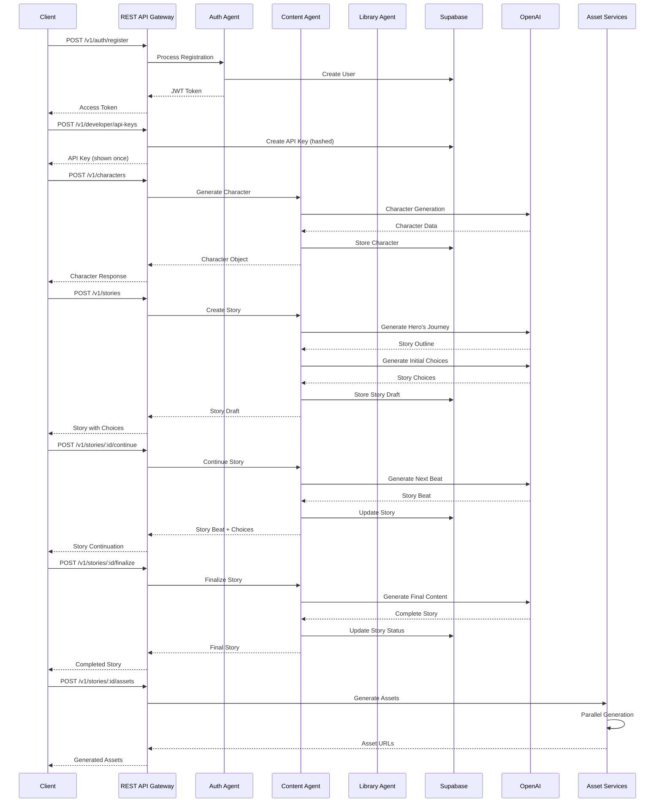

Status: Draft  
Audience: Internal | Partner  
Last-Updated: 2025-12-13  
Owner: Documentation Team  
Verified-Against-Code: Yes  
Doc-ID: AUTO  
Notes: Phase 2.5 - REST API user journey with code references and line numbers for key behaviors

# REST API User Journey

## Overview

This document describes the complete user journey for creating stories through the REST API, from authentication through story creation, character management, asset generation, and completion. All steps include code references with file paths and line numbers for key behaviors and flows.

## Journey Flow

### Step 1: Authentication

**Action:** User authenticates to obtain API access

**Endpoint:** `POST /v1/auth/register` or `POST /v1/auth/login`

**Code Reference:**
- `packages/universal-agent/src/api/RESTAPIGateway.ts:973-1077` - Auth routes setup
- `packages/auth-agent/src/auth-agent.ts:31-450+` - Auth Agent implementation

**Request:**
```http
POST /v1/auth/register
Content-Type: application/json

{
  "email": "user@example.com",
  "password": "secure-password",
  "name": "User Name"
}
```

**Response:**
```json
{
  "success": true,
  "accessToken": "[REDACTED_JWT]",
  "user": {
    "id": "user-uuid",
    "email": "user@example.com"
  }
}
```

**Processing Flow:**
1. Request received at RESTAPIGateway (`packages/universal-agent/src/api/RESTAPIGateway.ts:973-1077`)
2. Validation middleware (`packages/universal-agent/src/api/RESTAPIGateway.ts:2580-2593`)
3. Auth Agent processes registration (`packages/auth-agent/src/auth-agent.ts:31-450+`)
4. User created in Supabase (`supabase/migrations/20240101000003_auth_agent_tables.sql:5-222`)
5. JWT token generated and returned

**Code References:**
- `packages/universal-agent/src/api/RESTAPIGateway.ts:320-536` - Authentication middleware
- `packages/universal-agent/src/api/RESTAPIGateway.ts:2580-2593` - Request validation

### Step 2: API Key Creation (Optional but Recommended)

**Action:** User creates API key for programmatic access

**Endpoint:** `POST /v1/developer/api-keys`

**Code Reference:**
- `packages/universal-agent/src/api/RESTAPIGateway.ts:2900-2950` - API key creation endpoint
- `packages/universal-agent/src/api/RESTAPIGateway.ts:2995-3037` - API key creation logic

**Request:**
```http
POST /v1/developer/api-keys
Authorization: Bearer <jwt-token>
Content-Type: application/json

{
  "name": "Production API Key",
  "permissions": ["stories:read", "stories:write", "characters:read"],
  "rateLimit": {
    "requests": 10000,
    "window": 3600
  }
}
```

**Processing Flow:**
1. Request authenticated (`packages/universal-agent/src/api/RESTAPIGateway.ts:320-536`)
2. API key generated with secure random string (`packages/universal-agent/src/api/RESTAPIGateway.ts:2970-2994`)
3. Key hashed using secure hashing algorithm (`packages/universal-agent/src/api/RESTAPIGateway.ts:2970-2994`)
4. Stored in database with hash (`supabase/migrations/20240101000018_api_keys_and_webhooks.sql:5-56`)
5. Full key returned once (only shown on creation)

**Code References:**
- `packages/universal-agent/src/api/RESTAPIGateway.ts:2995-3037` - Complete API key creation
- `packages/universal-agent/src/api/RESTAPIGateway.ts:2970-2994` - Key hashing logic
- `supabase/migrations/20240101000018_api_keys_and_webhooks.sql:57-72` - Hash storage schema

### Step 3: Character Creation

**Action:** User creates a character for the story

**Endpoint:** `POST /v1/characters`

**Code Reference:**
- `packages/universal-agent/src/api/RESTAPIGateway.ts:906-971` - Character endpoints
- `packages/content-agent/src/services/CharacterGenerationService.ts` - Character generation
- `packages/content-agent/src/services/CharacterDatabaseService.ts` - Character persistence

**Request:**
```http
POST /v1/characters
Authorization: Bearer <api-key>
Content-Type: application/json

{
  "name": "Brave Knight",
  "age": 7,
  "traits": {
    "personality": ["brave", "curious"],
    "appearance": {
      "hairColor": "brown",
      "eyeColor": "blue"
    }
  },
  "libraryId": "library-uuid"
}
```

**Processing Flow:**
1. Request authenticated (`packages/universal-agent/src/api/RESTAPIGateway.ts:320-536`)
2. Request validated (`packages/universal-agent/src/api/RESTAPIGateway.ts:2580-2593`)
3. Character generation service creates character (`packages/content-agent/src/services/CharacterGenerationService.ts`)
4. Character stored in database (`packages/content-agent/src/services/CharacterDatabaseService.ts`)
5. Character associated with library (`packages/library-agent/src/LibraryAgent.ts:200-250`)

**Code References:**
- `packages/universal-agent/src/api/RESTAPIGateway.ts:906-971` - Character route handlers
- `packages/content-agent/src/services/CharacterGenerationService.ts` - Character generation logic
- `packages/content-agent/src/services/CharacterDatabaseService.ts` - Database operations
- `supabase/migrations/20240101000000_initial_schema.sql:51-80` - Characters table schema

### Step 4: Story Creation

**Action:** User creates a story with the character

**Endpoint:** `POST /v1/stories`

**Code Reference:**
- `packages/universal-agent/src/api/RESTAPIGateway.ts:825-848` - Story creation endpoint
- `packages/universal-agent/src/UniversalStorytellerAPI.ts:437-441` - Story creation API
- `packages/content-agent/src/services/StoryCreationService.ts:46-78` - Story draft creation

**Request:**
```http
POST /v1/stories
Authorization: Bearer <api-key>
Content-Type: application/json

{
  "character": {
    "id": "character-uuid",
    "name": "Brave Knight"
  },
  "storyType": "adventure",
  "libraryId": "library-uuid",
  "generateAssets": false
}
```

**Processing Flow:**

1. **Request Reception** (`packages/universal-agent/src/api/RESTAPIGateway.ts:825-848`)
   - Request received at REST API Gateway
   - Authentication validated (`packages/universal-agent/src/api/RESTAPIGateway.ts:320-536`)
   - Request validated (`packages/universal-agent/src/api/RESTAPIGateway.ts:2580-2593`)

2. **Story Creation Service** (`packages/content-agent/src/services/StoryCreationService.ts:46-78`)
   ```typescript
   // Code location: packages/content-agent/src/services/StoryCreationService.ts:46-78
   async createStoryDraft(request: StoryCreationRequest): Promise<StoryDraft> {
     // Generate hero's journey outline
     const outline = await this.generateHeroJourneyOutline(
       request.storyType,
       request.characterId,
       request.userAge,
       request.preferences
     );
     
     // Create initial choices
     const initialChoices = await this.generateInitialChoices(
       request.storyType,
       outline,
       request.userAge
     );
   }
   ```

3. **Hero's Journey Outline Generation** (`packages/content-agent/src/services/StoryCreationService.ts:205-250`)
   ```typescript
   // Code location: packages/content-agent/src/services/StoryCreationService.ts:205-250
   private async generateHeroJourneyOutline(
     storyType: StoryType,
     characterId: string,
     userAge?: number,
     preferences?: any
   ): Promise<string> {
     const response = await this.openai.chat.completions.create({
       model: 'gpt-4',
       messages: [
         { role: 'system', content: 'You are an expert children\'s story writer...' },
         { role: 'user', content: prompt }
       ],
       temperature: 0.8,
       max_tokens: 1500
     });
   }
   ```

4. **Initial Choices Generation** (`packages/content-agent/src/services/StoryCreationService.ts:255-300`)
   ```typescript
   // Code location: packages/content-agent/src/services/StoryCreationService.ts:255-300
   private async generateInitialChoices(
     storyType: StoryType,
     outline: string,
     userAge?: number
   ): Promise<StoryChoice[]> {
     const response = await this.openai.chat.completions.create({
       model: 'gpt-4',
       messages: [
         { role: 'system', content: 'You create engaging story choices...' },
         { role: 'user', content: prompt }
       ],
       temperature: 0.9,
       max_tokens: 800
     });
   }
   ```

5. **Story Draft Creation** (`packages/content-agent/src/services/StoryCreationService.ts:67-74`)
   ```typescript
   // Code location: packages/content-agent/src/services/StoryCreationService.ts:67-74
   const draft: StoryDraft = {
     id: this.generateId(),
     characterId: request.characterId,
     storyType: request.storyType,
     outline,
     currentBeat: 0,
     choices: initialChoices
   };
   ```

6. **Database Persistence** (`supabase/migrations/20240101000000_initial_schema.sql:5-50`)
   - Story saved to `stories` table
   - Character association stored
   - Library association created

7. **Webhook Triggering** (`packages/universal-agent/src/api/RESTAPIGateway.ts:837-842`)
   ```typescript
   // Code location: packages/universal-agent/src/api/RESTAPIGateway.ts:837-842
   await this.triggerWebhook(req.user.id, 'story.created', {
     storyId: story.id,
     storyType: req.body.storyType,
     timestamp: new Date().toISOString()
   });
   ```

**Response:**
```json
{
  "success": true,
  "id": "story-uuid",
  "characterId": "character-uuid",
  "storyType": "adventure",
  "status": "draft",
  "currentBeat": 0,
  "choices": [
    {
      "id": "choice_1",
      "text": "The knight decides to explore the mysterious forest",
      "consequence": "Leads to forest adventure"
    },
    {
      "id": "choice_2",
      "text": "The knight chooses to help the village first",
      "consequence": "Leads to village quest"
    },
    {
      "id": "choice_3",
      "text": "The knight wants to find the magical sword",
      "consequence": "Leads to treasure hunt"
    }
  ],
  "createdAt": "2025-12-13T12:00:00Z"
}
```

**Code References:**
- `packages/universal-agent/src/api/RESTAPIGateway.ts:825-848` - Story creation endpoint
- `packages/content-agent/src/services/StoryCreationService.ts:46-78` - Draft creation
- `packages/content-agent/src/services/StoryCreationService.ts:205-250` - Hero's journey generation
- `packages/content-agent/src/services/StoryCreationService.ts:255-300` - Choices generation

### Step 5: Story Continuation (Choose-Your-Adventure)

**Action:** User selects a choice to continue the story

**Endpoint:** `POST /v1/stories/:storyId/continue`

**Code Reference:**
- `packages/content-agent/src/services/StoryCreationService.ts:83-100` - Story beat continuation
- `packages/content-agent/src/services/StoryConversationManager.ts:123-179` - Conversation continuation

**Request:**
```http
POST /v1/stories/story-uuid/continue
Authorization: Bearer <api-key>
Content-Type: application/json

{
  "choiceId": "choice_1",
  "userInput": "Let's explore the forest"
}
```

**Processing Flow:**

1. **Choice Processing** (`packages/content-agent/src/services/StoryCreationService.ts:88-95`)
   ```typescript
   // Code location: packages/content-agent/src/services/StoryCreationService.ts:88-95
   const beat = await this.generateNextBeat(
     request.storyId,
     request.userChoice,
     request.voiceInput
   );
   ```

2. **Next Beat Generation** (`packages/content-agent/src/services/StoryCreationService.ts:300-400`)
   - Story context retrieved
   - User choice incorporated
   - Next story beat generated using OpenAI
   - Beat follows hero's journey structure

3. **Completion Check** (`packages/content-agent/src/services/StoryCreationService.ts:97`)
   ```typescript
   // Code location: packages/content-agent/src/services/StoryCreationService.ts:97
   const isComplete = beat.sequence >= 12 || beat.content.includes('[STORY_END]');
   ```

4. **Next Choices Generation** (`packages/content-agent/src/services/StoryCreationService.ts:100`)
   ```typescript
   // Code location: packages/content-agent/src/services/StoryCreationService.ts:100
   const choices = isComplete ? [] : await this.generateChoicesForBeat(request.storyId, beat);
   ```

**Response:**
```json
{
  "success": true,
  "beat": {
    "id": "beat-uuid",
    "sequence": 1,
    "content": "As the brave knight entered the mysterious forest, the trees seemed to whisper secrets...",
    "timestamp": "2025-12-13T12:01:00Z"
  },
  "choices": [
    {
      "id": "choice_4",
      "text": "Follow the glowing path deeper into the forest",
      "consequence": "Leads to magical encounter"
    },
    {
      "id": "choice_5",
      "text": "Investigate the strange sounds",
      "consequence": "Leads to creature discovery"
    }
  ],
  "isComplete": false
}
```

**Code References:**
- `packages/content-agent/src/services/StoryCreationService.ts:83-100` - Beat continuation
- `packages/content-agent/src/services/StoryCreationService.ts:300-400` - Beat generation logic

### Step 6: Story Completion

**Action:** User completes the story (after 12 beats or explicit completion)

**Endpoint:** `POST /v1/stories/:storyId/finalize`

**Code Reference:**
- `packages/content-agent/src/services/StoryCreationService.ts:173-200` - Story finalization
- `packages/content-agent/src/services/StoryConversationManager.ts:159-164` - Finalization phase

**Request:**
```http
POST /v1/stories/story-uuid/finalize
Authorization: Bearer <api-key>
Content-Type: application/json

{
  "confirmed": true
}
```

**Processing Flow:**

1. **Finalization Request** (`packages/content-agent/src/services/StoryCreationService.ts:173-200`)
   ```typescript
   // Code location: packages/content-agent/src/services/StoryCreationService.ts:173-200
   async finalizeStory(storyId: string, confirmed: boolean): Promise<Story> {
     if (!confirmed) {
       throw new Error('Story finalization requires user confirmation');
     }
     
     const draft = await this.getStoryDraft(storyId);
     const finalStory = await this.convertDraftToFinalStory(draft);
     const content = await this.generateFinalStoryContent(finalStory);
   }
   ```

2. **Final Story Content Generation** (`packages/content-agent/src/services/StoryCreationService.ts:400-500`)
   - All story beats compiled
   - Narrative coherence validated
   - Quality checks performed

3. **Story Status Update** (`supabase/migrations/20240101000000_initial_schema.sql:5-50`)
   - Story status changed to `completed`
   - `finalizedAt` timestamp set
   - Story content stored

**Response:**
```json
{
  "success": true,
  "story": {
    "id": "story-uuid",
    "title": "The Brave Knight's Adventure",
    "content": "Once upon a time, in a magical kingdom...",
    "status": "completed",
    "finalizedAt": "2025-12-13T12:15:00Z"
  }
}
```

**Code References:**
- `packages/content-agent/src/services/StoryCreationService.ts:173-200` - Finalization logic
- `packages/content-agent/src/services/StoryCreationService.ts:400-500` - Content generation

### Step 7: Asset Generation (Optional)

**Action:** User requests asset generation (art, audio, PDF, activities)

**Endpoint:** `POST /v1/stories/:storyId/assets`

**Code Reference:**
- `packages/universal-agent/src/api/RESTAPIGateway.ts:863-882` - Asset generation endpoint
- `packages/content-agent/src/services/AssetGenerationPipeline.ts:99-150` - Asset pipeline execution

**Request:**
```http
POST /v1/stories/story-uuid/assets
Authorization: Bearer <api-key>
Content-Type: application/json

{
  "assetTypes": ["art", "audio", "pdf", "activities"],
  "regenerate": false
}
```

**Processing Flow:**

1. **Asset Pipeline Initialization** (`packages/content-agent/src/services/AssetGenerationPipeline.ts:70-94`)
   ```typescript
   // Code location: packages/content-agent/src/services/AssetGenerationPipeline.ts:70-94
   this.artService = new ArtGenerationService(this.config.artGeneration);
   this.audioService = new AudioGenerationService(this.config.audioGeneration);
   this.activitiesService = new EducationalActivitiesService(this.config.educationalActivities);
   this.pdfService = new PDFGenerationService(this.config.pdfGeneration);
   ```

2. **Parallel vs Sequential Generation** (`packages/content-agent/src/services/AssetGenerationPipeline.ts:115-131`)
   ```typescript
   // Code location: packages/content-agent/src/services/AssetGenerationPipeline.ts:115-131
   if (this.config.enableParallelGeneration) {
     const promises = await this.generateAssetsInParallel(request, errors, warnings);
     const results = await Promise.allSettled(promises);
   } else {
     await this.generateAssetsSequentially(request, assets, errors, warnings);
   }
   ```

3. **Asset Services:**
   - **Art Generation**: Stability AI integration (`packages/content-agent/src/services/ArtGenerationService.ts`)
   - **Audio Generation**: ElevenLabs integration (`packages/content-agent/src/services/AudioGenerationService.ts`)
   - **PDF Generation**: PDF creation (`packages/content-agent/src/services/PDFGenerationService.ts`)
   - **Educational Activities**: Activity generation (`packages/content-agent/src/services/EducationalActivitiesService.ts`)

4. **Webhook Triggering** (`packages/universal-agent/src/api/RESTAPIGateway.ts:871-876`)
   ```typescript
   // Code location: packages/universal-agent/src/api/RESTAPIGateway.ts:871-876
   await this.triggerWebhook(req.user.id, 'story.assets_generated', {
     storyId: req.params.storyId,
     assetTypes: req.body.assetTypes,
     timestamp: new Date().toISOString()
   });
   ```

**Response:**
```json
{
  "success": true,
  "assets": {
    "art": {
      "coverArt": "https://assets.storytailor.com/stories/story-uuid/cover.jpg",
      "characterArt": "https://assets.storytailor.com/stories/story-uuid/character.jpg"
    },
    "audio": {
      "url": "https://assets.storytailor.com/stories/story-uuid/audio.mp3",
      "duration": 180,
      "format": "mp3"
    },
    "pdf": {
      "url": "https://assets.storytailor.com/stories/story-uuid/story.pdf",
      "pages": 12
    },
    "activities": {
      "worksheets": [
        "https://assets.storytailor.com/stories/story-uuid/worksheet1.pdf"
      ]
    }
  },
  "generationTime": 45000,
  "totalCost": 0.15
}
```

**Code References:**
- `packages/universal-agent/src/api/RESTAPIGateway.ts:863-882` - Asset generation endpoint
- `packages/content-agent/src/services/AssetGenerationPipeline.ts:99-150` - Pipeline execution
- `packages/content-agent/src/services/AssetGenerationPipeline.ts:115-131` - Parallel generation

### Step 8: WebVTT Synchronization (Optional)

**Action:** User requests WebVTT file for word-level audio synchronization

**Endpoint:** `POST /v1/stories/:storyId/webvtt`

**Code Reference:**
- `packages/universal-agent/src/api/RESTAPIGateway.ts:1350-1357` - WebVTT route setup
- `packages/universal-agent/src/api/WebVTTService.ts:79-152` - WebVTT generation
- `packages/universal-agent/src/api/WebVTTRoutes.ts:34-36` - WebVTT endpoint

**Request:**
```http
POST /v1/stories/story-uuid/webvtt
Authorization: Bearer <api-key>
Content-Type: application/json

{
  "text": "Once upon a time, in a magical kingdom...",
  "audioUrl": "https://assets.storytailor.com/stories/story-uuid/audio.mp3"
}
```

**Processing Flow:**

1. **WebVTT Generation** (`packages/universal-agent/src/api/WebVTTService.ts:79-152`)
   ```typescript
   // Code location: packages/universal-agent/src/api/WebVTTService.ts:79-152
   async generateWebVTT(req: Request, res: Response): Promise<void> {
     const wordTimestamps = await this.generateWordTimestamps(text, audioUrl);
     const webvttContent = this.createWebVTTContent(wordTimestamps);
     const syncAccuracy = await this.validateSyncAccuracy(wordTimestamps);
   }
   ```

2. **Word Timestamp Generation** (`packages/universal-agent/src/api/WebVTTService.ts:215-250`)
   - Word-level timing analysis
   - Audio synchronization
   - Timestamp precision validation

3. **Accuracy Validation** (`packages/universal-agent/src/api/WebVTTService.ts:191-209`)
   ```typescript
   // Code location: packages/universal-agent/src/api/WebVTTService.ts:191-209
   public async validateSyncAccuracy(timestamps: WordTimestamp[]): Promise<SyncAccuracy> {
     // Validates ≤ 5ms P90 requirement
     return {
       p50: ...,
       p90: ...,  // Must be ≤ 5ms
       p99: ...,
       average: ...
     };
   }
   ```

**Response:**
```json
{
  "success": true,
  "webvtt_url": "https://assets.storytailor.com/stories/story-uuid/webvtt.vtt",
  "sync_accuracy_ms": 4.2,
  "word_count": 450,
  "processing_time_ms": 1200
}
```

**Code References:**
- `packages/universal-agent/src/api/WebVTTService.ts:79-152` - WebVTT generation
- `packages/universal-agent/src/api/WebVTTService.ts:191-209` - Accuracy validation
- `packages/universal-agent/src/api/WebVTTService.ts:215-250` - Timestamp generation

### Step 9: Story Retrieval

**Action:** User retrieves completed story

**Endpoint:** `GET /v1/stories/:storyId`

**Code Reference:**
- `packages/universal-agent/src/api/RESTAPIGateway.ts:814-819` - Story retrieval endpoint
- `packages/library-agent/src/services/StoryService.ts` - Story service

**Request:**
```http
GET /v1/stories/story-uuid?includeAssets=true
Authorization: Bearer <api-key>
```

**Processing Flow:**
1. Request authenticated (`packages/universal-agent/src/api/RESTAPIGateway.ts:320-536`)
2. Story retrieved from database (`packages/library-agent/src/services/StoryService.ts`)
3. Assets included if requested (`packages/universal-agent/src/api/RESTAPIGateway.ts:816`)
4. Response formatted and returned

**Response:**
```json
{
  "success": true,
  "story": {
    "id": "story-uuid",
    "title": "The Brave Knight's Adventure",
    "content": "Once upon a time...",
    "character": {
      "id": "character-uuid",
      "name": "Brave Knight"
    },
    "storyType": "adventure",
    "status": "completed",
    "assets": {
      "coverArt": "https://assets.storytailor.com/stories/story-uuid/cover.jpg",
      "audio": "https://assets.storytailor.com/stories/story-uuid/audio.mp3",
      "pdf": "https://assets.storytailor.com/stories/story-uuid/story.pdf"
    },
    "createdAt": "2025-12-13T12:00:00Z",
    "finalizedAt": "2025-12-13T12:15:00Z"
  }
}
```

**Code References:**
- `packages/universal-agent/src/api/RESTAPIGateway.ts:814-819` - Story retrieval
- `packages/library-agent/src/services/StoryService.ts` - Story service

## Complete Journey Timeline

| Step | Action | Endpoint | Duration | Code Reference |
|------|--------|----------|----------|----------------|
| 1 | Authentication | `POST /v1/auth/register` | 200-500ms | `packages/universal-agent/src/api/RESTAPIGateway.ts:973-1077` |
| 2 | API Key Creation | `POST /v1/developer/api-keys` | 100-200ms | `packages/universal-agent/src/api/RESTAPIGateway.ts:2995-3037` |
| 3 | Character Creation | `POST /v1/characters` | 1000-3000ms | `packages/content-agent/src/services/CharacterGenerationService.ts` |
| 4 | Story Creation | `POST /v1/stories` | 2000-5000ms | `packages/content-agent/src/services/StoryCreationService.ts:46-78` |
| 5 | Story Continuation | `POST /v1/stories/:id/continue` | 1500-4000ms | `packages/content-agent/src/services/StoryCreationService.ts:83-100` |
| 6 | Story Finalization | `POST /v1/stories/:id/finalize` | 2000-4000ms | `packages/content-agent/src/services/StoryCreationService.ts:173-200` |
| 7 | Asset Generation | `POST /v1/stories/:id/assets` | 30000-60000ms | `packages/content-agent/src/services/AssetGenerationPipeline.ts:99-150` |
| 8 | WebVTT Generation | `POST /v1/stories/:id/webvtt` | 1000-2000ms | `packages/universal-agent/src/api/WebVTTService.ts:79-152` |
| 9 | Story Retrieval | `GET /v1/stories/:id` | 100-300ms | `packages/universal-agent/src/api/RESTAPIGateway.ts:814-819` |

**Total Journey Time:** ~40-75 seconds (excluding asset generation) or ~70-135 seconds (including asset generation)

## Error Handling

### Authentication Errors

**401 Unauthorized:**
- Invalid JWT token
- Expired API key
- Missing authentication header

**Code Reference:**
- `packages/universal-agent/src/api/RESTAPIGateway.ts:400-450` - Token extraction
- `packages/universal-agent/src/api/RESTAPIGateway.ts:450-500` - JWT validation

### Validation Errors

**400 Bad Request:**
- Invalid request body
- Missing required fields
- Invalid story type

**Code Reference:**
- `packages/universal-agent/src/api/RESTAPIGateway.ts:2580-2593` - Request validation

### Rate Limiting

**429 Too Many Requests:**
- Rate limit exceeded
- Retry-After header included

**Code Reference:**
- `packages/universal-agent/src/api/RESTAPIGateway.ts:232-253` - Rate limiting

## Data Flow Diagram



**Code References:**
- `packages/universal-agent/src/api/RESTAPIGateway.ts:825-848` - Story creation flow
- `packages/content-agent/src/services/StoryCreationService.ts:46-200` - Story creation logic

## Key Behaviors and Code References

### Story Type Classification

**Location:** `packages/content-agent/src/services/StoryTypeClassifier.ts:15-68`

**Behavior:** Classifies user intent to determine story type

**Code:**
```typescript
// Code location: packages/content-agent/src/services/StoryTypeClassifier.ts:15-68
async classifyStoryIntent(request: StoryClassificationRequest): Promise<StoryClassificationResult> {
  const response = await this.openai.chat.completions.create({
    model: 'gpt-4',
    messages: [
      { role: 'system', content: systemPrompt },
      { role: 'user', content: userPrompt }
    ],
    functions: [this.getClassificationFunction()],
    function_call: { name: 'classify_story_type' }
  });
}
```

### Hero's Journey Structure

**Location:** `packages/content-agent/src/services/StoryCreationService.ts:205-250`

**Behavior:** Generates 12-beat hero's journey outline

**Code:**
```typescript
// Code location: packages/content-agent/src/services/StoryCreationService.ts:205-250
private async generateHeroJourneyOutline(
  storyType: StoryType,
  characterId: string,
  userAge?: number,
  preferences?: any
): Promise<string> {
  const prompt = `Create a hero's journey outline for a ${storyType} story suitable for age ${userAge || 5}.
  
The story should follow these 12 beats:
1. Ordinary World - Character's normal life
2. Call to Adventure - The inciting incident
...
12. Return with the Elixir - How the character has changed`;
}
```

### Choose-Your-Adventure Choices

**Location:** `packages/content-agent/src/services/StoryCreationService.ts:255-300`

**Behavior:** Generates engaging choices for each story beat

**Code:**
```typescript
// Code location: packages/content-agent/src/services/StoryCreationService.ts:255-300
private async generateInitialChoices(
  storyType: StoryType,
  outline: string,
  userAge?: number
): Promise<StoryChoice[]> {
  const response = await this.openai.chat.completions.create({
    model: 'gpt-4',
    messages: [
      { role: 'system', content: 'You create engaging story choices...' },
      { role: 'user', content: prompt }
    ],
    temperature: 0.9,
    max_tokens: 800
  });
}
```

## Webhook Events

**Events Triggered During Journey:**

1. **story.created** - When story is created (`packages/universal-agent/src/api/RESTAPIGateway.ts:837-842`)
2. **story.assets_generated** - When assets are generated (`packages/universal-agent/src/api/RESTAPIGateway.ts:871-876`)
3. **character.created** - When character is created (if implemented)

**Code References:**
- `packages/universal-agent/src/api/RESTAPIGateway.ts:2608-2703` - Webhook delivery system
- `packages/universal-agent/src/api/RESTAPIGateway.ts:2782-2787` - HMAC signature generation

## Best Practices

1. **Use API Keys for Production**: More secure and configurable than JWT tokens
2. **Handle Rate Limits**: Implement exponential backoff on 429 responses
3. **Cache Story Data**: Cache completed stories to reduce API calls
4. **Monitor Webhooks**: Verify HMAC signatures and handle retries
5. **Error Handling**: Implement retry logic for transient errors (5xx)

**Code References:**
- `packages/universal-agent/src/api/RESTAPIGateway.ts:232-253` - Rate limiting
- `packages/universal-agent/src/api/RESTAPIGateway.ts:2782-2787` - HMAC verification
