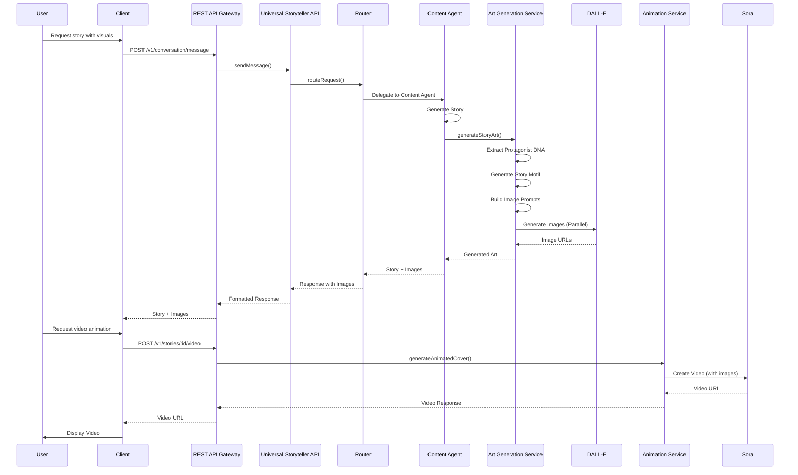

Status: Draft  
Audience: Internal | Partner  
Last-Updated: 2025-12-13  
Owner: Documentation Team  
Verified-Against-Code: Yes  
Doc-ID: AUTO  
Notes: Phase 2.5 - Video conversational user journey with code references and line numbers for key behaviors

# Video Conversational User Journey

## Overview

This document describes the complete user journey for creating stories through video conversational interaction, including image generation, video creation, visual content processing, and multimedia responses. All steps include code references with file paths and line numbers for key behaviors and flows.

## Journey Flow

### Step 1: Session Initialization with Video Support

**Action:** User starts a video conversation session

**Endpoint:** `POST /v1/conversation/start`

**Code Reference:**
- `packages/universal-agent/src/api/RESTAPIGateway.ts:625-657` - Conversation start endpoint
- `packages/universal-agent/src/conversation/UniversalConversationEngine.ts:281-347` - Session initialization
- `packages/universal-agent/src/conversation/adapters/WebChatChannelAdapter.ts:36-94` - Web chat adapter

**Request:**
```http
POST /v1/conversation/start
Authorization: Bearer <api-key>
Content-Type: application/json

{
  "platform": "web",
  "language": "en",
  "voiceEnabled": true,
  "videoEnabled": true,
  "smartHomeEnabled": false,
  "customization": {
    "theme": "default",
    "features": {
      "imageGeneration": true,
      "videoGeneration": true
    }
  }
}
```

**Processing Flow:**

1. **Request Reception** (`packages/universal-agent/src/api/RESTAPIGateway.ts:625-657`)
   ```typescript
   // Code location: packages/universal-agent/src/api/RESTAPIGateway.ts:625-657
   router.post('/start', this.validateRequest({...}), async (req, res) => {
     const config = {
       ...req.body,
       userId: req.user.id
     };
     const session = await this.storytellerAPI.startConversation(config);
   }
   ```

2. **Web Chat Adapter Initialization** (`packages/universal-agent/src/conversation/adapters/WebChatChannelAdapter.ts:36-94`)
   ```typescript
   // Code location: packages/universal-agent/src/conversation/adapters/WebChatChannelAdapter.ts:36-94
   async preprocessMessage(message: UniversalMessage, session: ConversationSession): Promise<UniversalMessage> {
     switch (message.type) {
       case 'text':
         return this.preprocessTextMessage(message, session);
       case 'voice':
         return this.preprocessVoiceMessage(message, session);
       case 'image':
         return this.preprocessImageMessage(message, session);
       case 'file':
         return this.preprocessFileMessage(message, session);
     }
   }
   ```

3. **Capabilities Detection** (`packages/universal-agent/src/UniversalStorytellerAPI.ts:494-550`)
   ```typescript
   // Code location: packages/universal-agent/src/UniversalStorytellerAPI.ts:494-550
   private getPlatformCapabilities(platform: string): PlatformCapabilities {
     switch (platform) {
       case 'web':
         return {
           ...baseCapabilities,
           supportsVoice: true,
           supportsImages: true,
           supportsFiles: true,
           supportsRealtime: true,
           supportsSmartHome: true,
           maxResponseTime: 3000
         };
     }
   }
   ```

**Response:**
```json
{
  "success": true,
  "sessionId": "session-uuid",
  "userId": "user-uuid",
  "platform": "web",
  "capabilities": {
    "supportsVoice": true,
    "supportsText": true,
    "supportsImages": true,
    "supportsVideo": true,
    "supportsStreaming": true
  },
  "state": {
    "phase": "greeting",
    "context": {},
    "history": []
  },
  "startedAt": "2025-12-13T12:00:00Z"
}
```

**Code References:**
- `packages/universal-agent/src/api/RESTAPIGateway.ts:625-657` - Conversation start
- `packages/universal-agent/src/conversation/adapters/WebChatChannelAdapter.ts:36-94` - Web chat adapter
- `packages/universal-agent/src/UniversalStorytellerAPI.ts:494-550` - Platform capabilities

### Step 2: Text or Voice Input with Visual Request

**Action:** User requests story creation with visual content

**Endpoint:** `POST /v1/conversation/message` or `POST /v1/conversation/voice`

**Code Reference:**
- `packages/universal-agent/src/api/RESTAPIGateway.ts:659-683` - Message endpoint
- `packages/universal-agent/src/api/RESTAPIGateway.ts:737-758` - Voice endpoint
- `packages/universal-agent/src/conversation/UniversalConversationEngine.ts:350-508` - Message processing

**Request (Text):**
```http
POST /v1/conversation/message
Authorization: Bearer <api-key>
Content-Type: application/json

{
  "sessionId": "session-uuid",
  "message": {
    "type": "text",
    "content": "Create an adventure story about a brave knight with pictures",
    "metadata": {
      "requestVisuals": true,
      "imageCount": 5
    }
  }
}
```

**Request (Voice):**
```http
POST /v1/conversation/voice
Authorization: Bearer <api-key>
Content-Type: multipart/form-data

{
  "sessionId": "session-uuid",
  "audio": <binary audio data>,
  "format": "wav",
  "sampleRate": 16000
}
```

**Processing Flow:**

1. **Message Reception** (`packages/universal-agent/src/api/RESTAPIGateway.ts:659-683`)
   ```typescript
   // Code location: packages/universal-agent/src/api/RESTAPIGateway.ts:659-683
   router.post('/message', this.validateRequest({...}), async (req, res) => {
     const response = await this.storytellerAPI.sendMessage(req.body.sessionId, req.body.message);
     
     // Trigger webhook for message events
     await this.triggerWebhook(req.user.id, 'conversation.message', {
       sessionId: req.body.sessionId,
       messageType: req.body.message.type,
       responseType: response.type,
       timestamp: new Date().toISOString()
     });
   }
   ```

2. **Web Chat Adapter Preprocessing** (`packages/universal-agent/src/conversation/adapters/WebChatChannelAdapter.ts:36-56`)
   ```typescript
   // Code location: packages/universal-agent/src/conversation/adapters/WebChatChannelAdapter.ts:36-56
   async preprocessMessage(message: UniversalMessage, session: ConversationSession): Promise<UniversalMessage> {
     switch (message.type) {
       case 'text':
         return this.preprocessTextMessage(message, session);
       case 'image':
         return this.preprocessImageMessage(message, session);
     }
   }
   ```

3. **Message Processing** (`packages/universal-agent/src/conversation/UniversalConversationEngine.ts:350-508`)
   - Message preprocessed through channel adapter
   - Router processes request
   - Content Agent generates story
   - Visual content requested

**Code References:**
- `packages/universal-agent/src/api/RESTAPIGateway.ts:659-683` - Message endpoint
- `packages/universal-agent/src/conversation/adapters/WebChatChannelAdapter.ts:36-56` - Message preprocessing
- `packages/universal-agent/src/conversation/UniversalConversationEngine.ts:350-508` - Message processing

### Step 3: Story Generation with Visual Context

**Action:** Story is created with visual generation requests

**Code Reference:**
- `packages/content-agent/src/services/StoryCreationService.ts:46-78` - Story draft creation
- `packages/content-agent/src/services/StoryConversationManager.ts:55-118` - Story conversation
- `packages/content-agent/src/services/ArtGenerationService.ts:286-335` - Art generation

**Processing Flow:**

1. **Story Draft Creation** (`packages/content-agent/src/services/StoryCreationService.ts:46-78`)
   ```typescript
   // Code location: packages/content-agent/src/services/StoryCreationService.ts:46-78
   async createStoryDraft(request: StoryCreationRequest): Promise<StoryDraft> {
     const outline = await this.generateHeroJourneyOutline(
       request.storyType,
       request.characterId,
       request.userAge,
       request.preferences
     );
     
     const initialChoices = await this.generateInitialChoices(
       request.storyType,
       outline,
       request.userAge
     );
   }
   ```

2. **Story Conversation Start** (`packages/content-agent/src/services/StoryConversationManager.ts:55-118`)
   ```typescript
   // Code location: packages/content-agent/src/services/StoryConversationManager.ts:55-118
   async startStoryConversation(
     userId: string,
     libraryId: string,
     characterId: string,
     storyType: StoryType,
     ageContext?: number
   ): Promise<StoryConversationResponse> {
     const sessionId = this.generateSessionId();
     
     // Create story draft
     const storyDraft = await this.storyCreationService.createStoryDraft({
       characterId,
       storyType,
       userAge: ageContext
     });
   }
   ```

3. **Visual Content Request Detection**
   - System detects `requestVisuals: true` in metadata
   - Triggers art generation pipeline
   - Images generated alongside story content

**Code References:**
- `packages/content-agent/src/services/StoryCreationService.ts:46-78` - Story creation
- `packages/content-agent/src/services/StoryConversationManager.ts:55-118` - Conversation start

### Step 4: Image Generation

**Action:** Visual assets are generated for the story

**Code Reference:**
- `packages/content-agent/src/services/ArtGenerationService.ts:286-335` - Story art generation
- `packages/content-agent/src/services/ArtGenerationService.ts:84-136` - Protagonist DNA extraction
- `packages/content-agent/src/services/ArtGenerationService.ts:138-200` - Story motif generation
- `packages/content-agent/src/services/AssetGenerationPipeline.ts:327-342` - Parallel art generation

**Processing Flow:**

1. **Art Generation Service** (`packages/content-agent/src/services/ArtGenerationService.ts:286-335`)
   ```typescript
   // Code location: packages/content-agent/src/services/ArtGenerationService.ts:286-335
   async generateStoryArt(story: Story, character: Character): Promise<GeneratedArt> {
     const protagonistDNA = this.extractProtagonistDNA(character);
     const motif = this.generateStoryMotif(story);
     const paletteJourney = this.generatePaletteJourney(story, motif);
     const coverMoment = this.findCoverArtMoment(story);
     const bodyIllustrations = this.generateBodyIllustrations(story, protagonistDNA);
     
     // Generate character art
     const characterHeadshotPrompt = this.buildCharacterPrompt(protagonistDNA, 'headshot');
     const characterBodyshotPrompt = this.buildCharacterPrompt(protagonistDNA, 'bodyshot');
     
     // Generate cover art prompt
     const coverArtPrompt = this.buildCoverArtPrompt(coverMoment, protagonistDNA, motif, paletteJourney);
     
     // Generate all images in parallel
     const [
       characterHeadshot,
       characterBodyshot,
       coverArt,
       ...bodyIllustrationImages
     ] = await Promise.all([
       this.generateImage(characterHeadshotPrompt),
       this.generateImage(characterBodyshotPrompt),
       this.generateImage(coverArtPrompt),
       ...bodyIllustrations.map(ill => this.generateImage(ill.prompt))
     ]);
   }
   ```

2. **Protagonist DNA Extraction** (`packages/content-agent/src/services/ArtGenerationService.ts:84-136`)
   ```typescript
   // Code location: packages/content-agent/src/services/ArtGenerationService.ts:84-136
   extractProtagonistDNA(character: Character): ProtagonistDNA {
     const traits = character.traits;
     const appearance = traits.appearance;
     
     // Build core visual description
     const visualElements: string[] = [];
     visualElements.push(traits.species);
     if (traits.age) visualElements.push(`${traits.age} years old`);
     if (traits.gender) visualElements.push(traits.gender);
     
     // Physical appearance
     if (appearance.eyeColor) visualElements.push(`${appearance.eyeColor} eyes`);
     if (appearance.hairColor && appearance.hairTexture) {
       visualElements.push(`${appearance.hairTexture} ${appearance.hairColor} hair`);
     }
     
     // Create concise visual description (≤60 words)
     const visualDescription = this.truncateToWordLimit(
       visualElements.join(', '),
       60
     );
   }
   ```

3. **Story Motif Generation** (`packages/content-agent/src/services/ArtGenerationService.ts:138-200`)
   ```typescript
   // Code location: packages/content-agent/src/services/ArtGenerationService.ts:138-200
   generateStoryMotif(story: Story): StoryMotif {
     const content = story.content;
     
     // Extract primary theme from story type and content
     const themeMap: Record<string, string> = {
       'Adventure': 'exploration and discovery',
       'Bedtime': 'comfort and peaceful dreams',
       'Birthday': 'celebration and joy',
       'Educational': 'learning and growth',
       // ... more themes
     };
   }
   ```

4. **Image Generation** (`packages/content-agent/src/services/ArtGenerationService.ts:400-500`)
   - DALL-E 3 API calls for each image
   - Character consistency maintained
   - Visual style applied
   - Images stored in S3 or asset storage

**Code References:**
- `packages/content-agent/src/services/ArtGenerationService.ts:286-335` - Story art generation
- `packages/content-agent/src/services/ArtGenerationService.ts:84-136` - Protagonist DNA
- `packages/content-agent/src/services/ArtGenerationService.ts:138-200` - Story motif
- `packages/content-agent/src/services/AssetGenerationPipeline.ts:327-342` - Parallel generation

### Step 5: Video Generation (Optional)

**Action:** User requests video animation from generated images

**Endpoint:** `POST /v1/stories/:storyId/video` or via Content Agent action

**Code Reference:**
- `lambda-deployments/content-agent/src/services/AnimationService.ts:87-295` - Animation service
- `lambda-deployments/content-agent/src/services/AnimationService.ts:210-264` - Sora video generation
- `lambda-deployments/content-agent/src/lambda.ts:252-292` - Video generation handler

**Request:**
```http
POST /v1/stories/story-uuid/video
Authorization: Bearer <api-key>
Content-Type: application/json

{
  "images": [
    "https://assets.storytailor.com/stories/story-uuid/cover.jpg",
    "https://assets.storytailor.com/stories/story-uuid/beat1.jpg",
    "https://assets.storytailor.com/stories/story-uuid/beat2.jpg"
  ],
  "storyText": "Once upon a time...",
  "characterTraits": {
    "name": "Brave Knight",
    "visualDescription": "A brave knight with brown hair and blue eyes"
  },
  "duration": 10
}
```

**Processing Flow:**

1. **Animation Service** (`lambda-deployments/content-agent/src/services/AnimationService.ts:87-295`)
   ```typescript
   // Code location: lambda-deployments/content-agent/src/services/AnimationService.ts:87-295
   async generateAnimatedCover(request: AnimationRequest): Promise<AnimationResponse> {
     // Build prompt with GLOBAL_STYLE
     const { GLOBAL_STYLE, FALLBACK_PALETTE } = await import('../constants/GlobalArtStyle');
     
     const prompt = `${GLOBAL_STYLE}
     
     ANIMATED MICRO EPISODE - THERAPEUTIC STORYTELLING
     
     Context: Educational bibliotherapy content for young audiences ages 3-10.
     Purpose: Transform collaborative story session into animated episode while maintaining therapeutic storytelling quality.
     
     CHARACTER & VISUAL CONSISTENCY:
     Protagonist: ${request.characterTraits.name}
     Appearance: ${request.characterTraits.visualDescription || 'As shown in images'}
     CRITICAL: Character must look EXACTLY as depicted in these ${request.images.length} images throughout animation.
     `;
   }
   ```

2. **Sora API Call** (`lambda-deployments/content-agent/src/services/AnimationService.ts:210-264`)
   ```typescript
   // Code location: lambda-deployments/content-agent/src/services/AnimationService.ts:210-264
   // Sora-2 API call with image-to-video
   const soraResponse = await (openai as any).videos.create({
     model: process.env.SORA_MODEL || 'sora-2',
     prompt: prompt,
     // Pass images as keyframes for image-to-video generation
     images: request.images.length > 0 ? request.images.map(url => ({
       type: 'url',
       url: url
     })) : undefined,
     duration: request.duration || 10,
     resolution: '1024x1024',
     aspect_ratio: '1:1'
   });
   
   // Handle Sora response (URL or base64)
   const videoData = soraResponse.data?.[0];
   
   if (videoData.url) {
     videoUrl = await this.persistVideoToS3(videoData.url, `animation-${Date.now()}`);
   } else if (videoData.b64_json || videoData.b64_mp4) {
     const videoBuffer = Buffer.from(videoData.b64_json || videoData.b64_mp4, 'base64');
     videoUrl = await this.persistVideoToS3Direct(videoBuffer, `animation-${Date.now()}`);
   }
   ```

3. **Video Storage** (`lambda-deployments/content-agent/src/services/AnimationService.ts:243-250`)
   - Video uploaded to S3
   - URL returned to client
   - Metadata stored

**Response:**
```json
{
  "success": true,
  "animatedCoverUrl": "https://assets.storytailor.com/videos/story-uuid/animation.mp4",
  "duration": 10,
  "format": "video/mp4"
}
```

**Code References:**
- `lambda-deployments/content-agent/src/services/AnimationService.ts:87-295` - Animation service
- `lambda-deployments/content-agent/src/services/AnimationService.ts:210-264` - Sora generation
- `lambda-deployments/content-agent/src/lambda.ts:252-292` - Video handler

### Step 6: Response Formatting for Web

**Action:** Response is formatted for web display with images and video

**Code Reference:**
- `packages/universal-agent/src/conversation/adapters/WebChatChannelAdapter.ts:58-94` - Response postprocessing
- `packages/universal-agent/src/conversation/adapters/WebChatChannelAdapter.ts:96-150` - Response adaptation

**Processing Flow:**

1. **Response Postprocessing** (`packages/universal-agent/src/conversation/adapters/WebChatChannelAdapter.ts:58-94`)
   ```typescript
   // Code location: packages/universal-agent/src/conversation/adapters/WebChatChannelAdapter.ts:58-94
   async postprocessResponse(response: UniversalResponse, session: ConversationSession): Promise<UniversalResponse> {
     // Format response for web display
     if (response.type === 'text') {
       return {
         ...response,
         content: this.formatTextForWeb(response.content.toString()),
         metadata: {
           ...response.metadata,
           formattedForWeb: true,
           supportsMarkdown: true
         }
       };
     }
     
     // Handle voice responses in web chat
     if (response.type === 'voice' && webChatState.voiceEnabled) {
       return {
         ...response,
         alternatives: [
           {
             type: 'text',
             content: this.stripSSML(response.content.toString()),
             condition: 'voice_disabled',
             priority: 1
           }
         ]
       };
     }
   }
   ```

2. **Response Adaptation** (`packages/universal-agent/src/conversation/adapters/WebChatChannelAdapter.ts:96-150`)
   ```typescript
   // Code location: packages/universal-agent/src/conversation/adapters/WebChatChannelAdapter.ts:96-150
   async adaptResponse(response: UniversalResponse, session: ConversationSession): Promise<any> {
     const webResponse = {
       id: this.generateMessageId(),
       type: 'bot_message',
       timestamp: new Date().toISOString(),
       content: this.adaptContentForWeb(response),
       metadata: {
         confidence: response.metadata.confidence,
         agentsUsed: response.metadata.agentsUsed,
         responseTime: response.metadata.generationTime
       },
       ui: {
         showAvatar: true,
         showTimestamp: webChatState.showTimestamps,
         allowCopy: true,
         allowShare: true,
         theme: webChatState.theme
       }
     };
     
     // Add rich content if available
     if (this.hasRichContent(response, session)) {
       webResponse.richContent = this.extractRichContent(response, session);
     }
   }
   ```

**Response:**
```json
{
  "success": true,
  "response": {
    "id": "response-uuid",
    "type": "bot_message",
    "content": "Great! I've created an adventure story about a brave knight. Here are the images:",
    "images": [
      {
        "url": "https://assets.storytailor.com/stories/story-uuid/cover.jpg",
        "type": "cover",
        "description": "Cover art showing the brave knight"
      },
      {
        "url": "https://assets.storytailor.com/stories/story-uuid/beat1.jpg",
        "type": "illustration",
        "description": "The knight enters the forest"
      }
    ],
    "video": {
      "url": "https://assets.storytailor.com/videos/story-uuid/animation.mp4",
      "duration": 10,
      "format": "mp4"
    },
    "metadata": {
      "responseTime": 4500,
      "agentsUsed": ["content", "art"]
    },
    "ui": {
      "showAvatar": true,
      "allowShare": true
    }
  }
}
```

**Code References:**
- `packages/universal-agent/src/conversation/adapters/WebChatChannelAdapter.ts:58-94` - Response postprocessing
- `packages/universal-agent/src/conversation/adapters/WebChatChannelAdapter.ts:96-150` - Response adaptation

### Step 7: Multi-Turn Visual Conversation

**Action:** User continues conversation with visual content requests

**Processing Flow:**

1. **Story Continuation** (`packages/content-agent/src/services/StoryConversationManager.ts:123-179`)
   - User selects choice or provides input
   - Next story beat generated
   - Visual content generated for new beat

2. **Progressive Image Generation** (`packages/content-agent/src/services/AssetGenerationPipeline.ts:176-254`)
   ```typescript
   // Code location: packages/content-agent/src/services/AssetGenerationPipeline.ts:176-254
   async regenerateAssets(request: AssetRegenerationRequest): Promise<GeneratedAssets> {
     // Regenerate only changed assets
     for (const assetType of request.assetTypesToRegenerate) {
       switch (assetType) {
         case 'art':
           if (request.updatedStory && request.updatedCharacter) {
             updatedAssets.art = await this.artService.regenerateArt(
               updatedAssets.art,
               request.updatedStory,
               request.updatedCharacter,
               request.changedElements
             );
           }
           break;
       }
     }
   }
   ```

3. **Visual Consistency** (`packages/content-agent/src/services/ArtGenerationService.ts:340-379`)
   - Character appearance maintained across images
   - Visual style consistency
   - Color palette continuity

**Code References:**
- `packages/content-agent/src/services/StoryConversationManager.ts:123-179` - Conversation continuation
- `packages/content-agent/src/services/AssetGenerationPipeline.ts:176-254` - Asset regeneration
- `packages/content-agent/src/services/ArtGenerationService.ts:340-379` - Visual consistency

### Step 8: Story Completion with Full Visual Assets

**Action:** User completes story with all visual assets

**Processing Flow:**

1. **Story Finalization** (`packages/content-agent/src/services/StoryCreationService.ts:173-200`)
   ```typescript
   // Code location: packages/content-agent/src/services/StoryCreationService.ts:173-200
   async finalizeStory(storyId: string, confirmed: boolean): Promise<Story> {
     const draft = await this.getStoryDraft(storyId);
     const finalStory = await this.convertDraftToFinalStory(draft);
     const content = await this.generateFinalStoryContent(finalStory);
   }
   ```

2. **Complete Asset Generation** (`packages/content-agent/src/services/AssetGenerationPipeline.ts:99-150`)
   ```typescript
   // Code location: packages/content-agent/src/services/AssetGenerationPipeline.ts:99-150
   async generateAssets(request: AssetGenerationRequest): Promise<GeneratedAssets> {
     if (this.config.enableParallelGeneration) {
       const promises = await this.generateAssetsInParallel(request, errors, warnings);
       const results = await Promise.allSettled(promises);
     } else {
       await this.generateAssetsSequentially(request, assets, errors, warnings);
     }
   }
   ```

3. **Asset Types Generated:**
   - **Cover Art**: Main story illustration (`packages/content-agent/src/services/ArtGenerationService.ts:286-335`)
   - **Character Art**: Headshot and bodyshot (`packages/content-agent/src/services/ArtGenerationService.ts:294-295`)
   - **Body Illustrations**: Story beat illustrations (`packages/content-agent/src/services/ArtGenerationService.ts:291`)
   - **Video Animation**: Optional animated cover (`lambda-deployments/content-agent/src/services/AnimationService.ts:87-295`)

**Code References:**
- `packages/content-agent/src/services/StoryCreationService.ts:173-200` - Story finalization
- `packages/content-agent/src/services/AssetGenerationPipeline.ts:99-150` - Asset generation
- `packages/content-agent/src/services/ArtGenerationService.ts:286-335` - Art generation

## Complete Journey Timeline

| Step | Action | Endpoint | Duration | Code Reference |
|------|--------|----------|----------|----------------|
| 1 | Session Start | `POST /v1/conversation/start` | 200-500ms | `packages/universal-agent/src/api/RESTAPIGateway.ts:625-657` |
| 2 | Message/Voice Input | `POST /v1/conversation/message` or `/voice` | 1000-3000ms | `packages/universal-agent/src/api/RESTAPIGateway.ts:659-683` |
| 3 | Story Generation | Content Agent | 2000-5000ms | `packages/content-agent/src/services/StoryCreationService.ts:46-78` |
| 4 | Image Generation | Art Service | 15000-30000ms | `packages/content-agent/src/services/ArtGenerationService.ts:286-335` |
| 5 | Video Generation | Animation Service | 30000-60000ms | `lambda-deployments/content-agent/src/services/AnimationService.ts:87-295` |
| 6 | Response Formatting | Web Chat Adapter | < 100ms | `packages/universal-agent/src/conversation/adapters/WebChatChannelAdapter.ts:58-94` |
| 7 | Multi-Turn Loop | Steps 2-6 repeated | Variable | Multiple iterations |
| 8 | Story Completion | Finalization | 2000-4000ms | `packages/content-agent/src/services/StoryCreationService.ts:173-200` |
| 9 | Full Asset Generation | Asset Pipeline | 45000-90000ms | `packages/content-agent/src/services/AssetGenerationPipeline.ts:99-150` |

**Total Journey Time:** ~20-30 seconds per turn (with images), ~2-3 minutes for complete story with all assets

## Key Behaviors and Code References

### Protagonist DNA Extraction

**Location:** `packages/content-agent/src/services/ArtGenerationService.ts:84-136`

**Behavior:** Extracts visual character description for consistent image generation

**Code:**
```typescript
// Code location: packages/content-agent/src/services/ArtGenerationService.ts:84-136
extractProtagonistDNA(character: Character): ProtagonistDNA {
  const traits = character.traits;
  const appearance = traits.appearance;
  
  // Build core visual description
  const visualElements: string[] = [];
  visualElements.push(traits.species);
  if (traits.age) visualElements.push(`${traits.age} years old`);
  if (appearance.eyeColor) visualElements.push(`${appearance.eyeColor} eyes`);
  if (appearance.hairColor && appearance.hairTexture) {
    visualElements.push(`${appearance.hairTexture} ${appearance.hairColor} hair`);
  }
  
  // Create concise visual description (≤60 words)
  const visualDescription = this.truncateToWordLimit(
    visualElements.join(', '),
    60
  );
}
```

### Story Motif Generation

**Location:** `packages/content-agent/src/services/ArtGenerationService.ts:138-200`

**Behavior:** Generates visual theme and motif for story-wide consistency

**Code:**
```typescript
// Code location: packages/content-agent/src/services/ArtGenerationService.ts:138-200
generateStoryMotif(story: Story): StoryMotif {
  const content = story.content;
  
  // Extract primary theme from story type and content
  const themeMap: Record<string, string> = {
    'Adventure': 'exploration and discovery',
    'Bedtime': 'comfort and peaceful dreams',
    'Birthday': 'celebration and joy',
    'Educational': 'learning and growth',
    // ... more themes
  };
  
  return {
    primaryTheme: themeMap[story.storyType] || 'adventure and wonder',
    visualElements: [...],
    symbolism: [...],
    atmosphere: 'warm and inviting'
  };
}
```

### Parallel Image Generation

**Location:** `packages/content-agent/src/services/ArtGenerationService.ts:301-311`

**Behavior:** Generates multiple images in parallel for performance

**Code:**
```typescript
// Code location: packages/content-agent/src/services/ArtGenerationService.ts:301-311
const [
  characterHeadshot,
  characterBodyshot,
  coverArt,
  ...bodyIllustrationImages
] = await Promise.all([
  this.generateImage(characterHeadshotPrompt),
  this.generateImage(characterBodyshotPrompt),
  this.generateImage(coverArtPrompt),
  ...bodyIllustrations.map(ill => this.generateImage(ill.prompt))
]);
```

### Sora Video Generation

**Location:** `lambda-deployments/content-agent/src/services/AnimationService.ts:210-264`

**Behavior:** Generates animated video from story images using Sora-2

**Code:**
```typescript
// Code location: lambda-deployments/content-agent/src/services/AnimationService.ts:210-264
const soraResponse = await (openai as any).videos.create({
  model: process.env.SORA_MODEL || 'sora-2',
  prompt: prompt,
  images: request.images.length > 0 ? request.images.map(url => ({
    type: 'url',
    url: url
  })) : undefined,
  duration: request.duration || 10,
  resolution: '1024x1024',
  aspect_ratio: '1:1'
});
```

## Data Flow Diagram



**Code References:**
- `packages/content-agent/src/services/ArtGenerationService.ts:286-335` - Complete art generation flow
- `lambda-deployments/content-agent/src/services/AnimationService.ts:87-295` - Video generation flow

## Error Handling

### Image Generation Errors

**Fallback Behavior:**
- DALL-E API failure → Retry with exponential backoff
- Image generation timeout → Return partial results
- Character consistency failure → Regenerate with adjusted prompts

**Code Reference:**
- `packages/content-agent/src/services/AssetGenerationPipeline.ts:327-342` - Art generation with timeout
- `packages/content-agent/src/services/AssetGenerationFailureHandler.ts` - Failure handling

### Video Generation Errors

**Fallback Behavior:**
- Sora API unavailable → Return static images
- Video generation timeout → Return image sequence
- Feature flag disabled → Return static cover image

**Code Reference:**
- `lambda-deployments/content-agent/src/services/AnimationService.ts:203-210` - Sora feature flag check
- `lambda-deployments/content-agent/src/services/AnimationService.ts:95-102` - Insufficient images fallback

## Best Practices

1. **Image Generation**: Request images early in conversation for faster response
2. **Character Consistency**: Use Protagonist DNA for all image generations
3. **Visual Style**: Maintain story motif across all visual assets
4. **Video Generation**: Generate video only after story completion
5. **Caching**: Cache generated images to reduce regeneration costs

**Code References:**
- `packages/content-agent/src/services/ArtGenerationService.ts:84-136` - Protagonist DNA
- `packages/content-agent/src/services/ArtGenerationService.ts:138-200` - Story motif
- `packages/content-agent/src/services/AssetGenerationPipeline.ts:327-342` - Parallel generation
