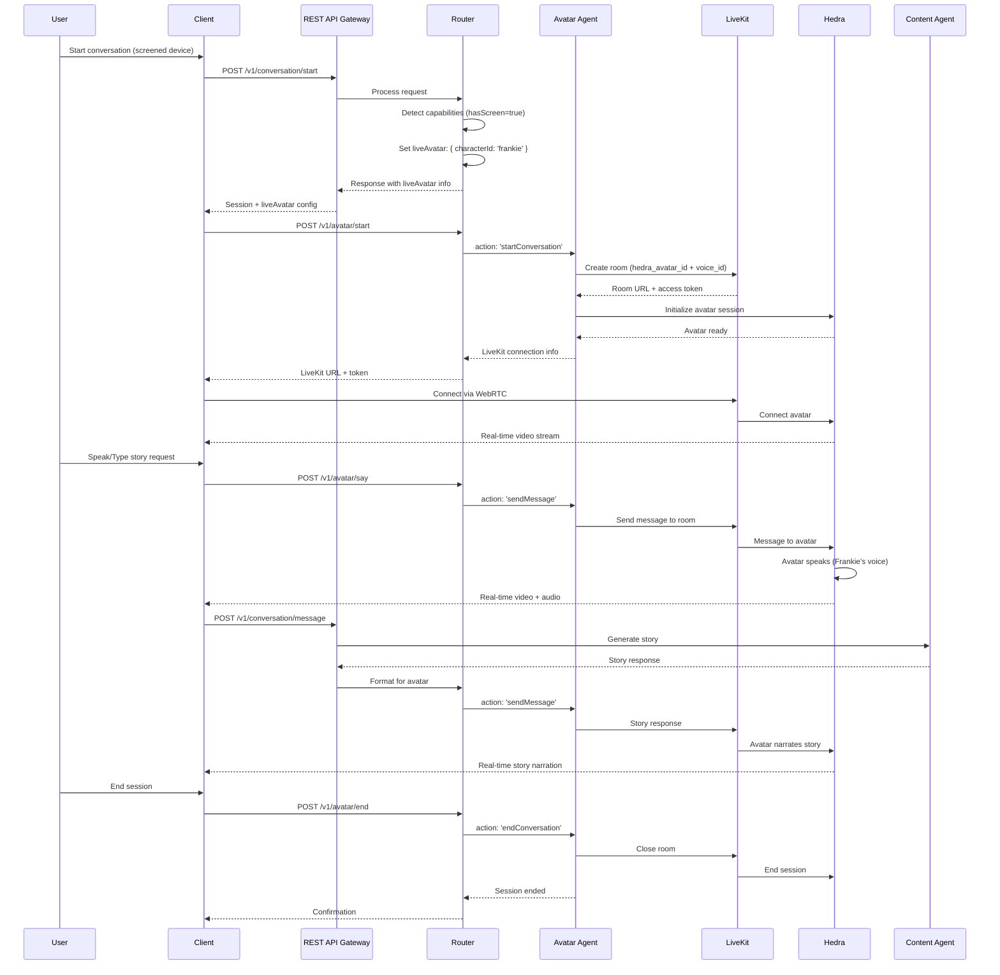

Status: Draft  
Audience: Internal | Partner  
Last-Updated: 2025-12-13  
Owner: Documentation Team  
Verified-Against-Code: Yes  
Doc-ID: AUTO  
Notes: Phase 2.5 - Video with live avatar user journey with code references and line numbers for key behaviors

# Video with Live Avatar User Journey

## Overview

This document describes the complete user journey for creating stories through video conversational interaction with live avatar (Hedra + LiveKit), including avatar session initialization, real-time video streaming, and interactive story creation. All steps include code references with file paths and line numbers for key behaviors and flows.

**Note:** This feature requires Hedra and LiveKit credentials to be configured. See `HEDRA_AVATAR_INTEGRATION_STATUS.md` for credential setup.

## Journey Flow

### Step 1: Session Initialization with Avatar Support

**Action:** User starts a video conversation session on a screened device

**Endpoint:** `POST /v1/conversation/start`

**Code Reference:**
- `packages/universal-agent/src/api/RESTAPIGateway.ts:625-657` - Conversation start endpoint
- `packages/router/src/services/ModalityAdaptor.ts` - Modality adaptation (avatar mode selection)
- `packages/router/src/lambda.ts:1067-1159` - Avatar request handling

**Request:**
```http
POST /v1/conversation/start
Authorization: Bearer <api-key>
Content-Type: application/json

{
  "platform": "web",
  "language": "en",
  "voiceEnabled": true,
  "videoEnabled": true,
  "smartHomeEnabled": false,
  "deviceCapabilities": {
    "hasScreen": true,
    "supportsVideo": true,
    "supportsAnimation": true
  }
}
```

**Processing Flow:**

1. **Request Reception** (`packages/universal-agent/src/api/RESTAPIGateway.ts:625-657`)
   ```typescript
   // Code location: packages/universal-agent/src/api/RESTAPIGateway.ts:625-657
   router.post('/start', this.validateRequest({...}), async (req, res) => {
     const config = {
       ...req.body,
       userId: req.user.id
     };
     const session = await this.storytellerAPI.startConversation(config);
   }
   ```

2. **Modality Adaptation** (`packages/router/src/services/ModalityAdaptor.ts`)
   - Router detects device capabilities (`hasScreen: true`, `supportsVideo: true`, `supportsAnimation: true`)
   - ModalityAdaptor sets `showAvatar: true`, `avatarMode: 'live'`
   - Experience mode determined: `full_interactive` or `semi_interactive`

3. **Avatar Mode Selection** (Based on `LIVE_AVATAR_INTEGRATION_STATUS.md:32-36`)
   ```typescript
   // Code location: packages/router/src/services/ModalityAdaptor.ts (inferred from status doc)
   // Avatar Mode Selection:
   // - full_interactive: showAvatar: true, avatarMode: 'live'
   // - semi_interactive: showAvatar: true, avatarMode: 'live'
   // - audio_only: showAvatar: false, avatarMode: 'none'
   // - static_web: showAvatar: false, avatarMode: 'static'
   ```

**Response:**
```json
{
  "success": true,
  "sessionId": "session-uuid",
  "userId": "user-uuid",
  "platform": "web",
  "capabilities": {
    "supportsVoice": true,
    "supportsText": true,
    "supportsImages": true,
    "supportsVideo": true,
    "supportsAnimation": true,
    "supportsStreaming": true
  },
  "liveAvatar": {
    "characterId": "frankie",
    "enabled": true,
    "mode": "live"
  },
  "state": {
    "phase": "greeting",
    "context": {},
    "history": []
  },
  "startedAt": "2025-12-13T12:00:00Z"
}
```

**Code References:**
- `packages/universal-agent/src/api/RESTAPIGateway.ts:625-657` - Conversation start
- `packages/router/src/services/ModalityAdaptor.ts` - Modality adaptation (inferred from status docs)
- `LIVE_AVATAR_INTEGRATION_STATUS.md:32-36` - Avatar mode selection

### Step 2: Avatar Session Initialization

**Action:** Client calls avatar start endpoint to initialize Hedra session

**Endpoint:** `POST /v1/avatar/start`

**Code Reference:**
- `lambda-deployments/router/src/lambda.ts:1067-1159` - Avatar request handling
- `lambda-deployments/router/src/lambda.ts:1118-1125` - Action mapping
- `LIVE_AVATAR_INTEGRATION_STATUS.md:19-28` - Router integration
- `HEDRA_AVATAR_INTEGRATION_STATUS.md:41-55` - Avatar Agent flow

**Request:**
```http
POST /v1/avatar/start
Authorization: Bearer <api-key>
Content-Type: application/json

{
  "characterId": "frankie",
  "voice": "kQJQj1e9P2YDvAdvp2BW"
}
```

**Processing Flow:**

1. **Router Request Handling** (`lambda-deployments/router/src/lambda.ts:1067-1159`)
   ```typescript
   // Code location: lambda-deployments/router/src/lambda.ts:1067-1159
   async function handleAvatarRequest(body: any): Promise<any> {
     const { subAction, data } = body;
     
     // Map router subActions to Avatar Agent action names
     const actionMap: Record<string, string> = {
       start: 'startConversation',
       say: 'sendMessage',
       end: 'endConversation',
       video: 'generateVideo',
       status: 'getVideoStatus'
     };
     
     const mappedAction = actionMap[subAction] || subAction;
   }
   ```

2. **Avatar Agent Invocation** (`lambda-deployments/router/src/lambda.ts:1129-1135`)
   ```typescript
   // Code location: lambda-deployments/router/src/lambda.ts:1129-1135
   // Call the deployed Avatar Agent
   const endpoint = process.env.AVATAR_AGENT_ENDPOINT || 'https://aye0n63rs1.execute-api.us-east-1.amazonaws.com/staging/avatar';
   const resp = await fetch(endpoint, {
     method: 'POST',
     headers: { 'Content-Type': 'application/json' },
     body: JSON.stringify({ action: mappedAction, data })
   });
   ```

3. **Avatar Agent Processing** (Based on `HEDRA_AVATAR_INTEGRATION_STATUS.md:41-55`)
   - Avatar Agent receives `action: 'startConversation'`
   - Creates LiveKit room with `hedra_avatar_id` and `voice_id` in metadata
   - Returns LiveKit room URL and access token
   - LiveKit Agent (Python) joins room and connects Hedra avatar

4. **Hedra Session Creation** (Based on `HEDRA_AVATAR_INTEGRATION_STATUS.md:41-55`)
   - Hedra Realtime API called
   - Avatar created or retrieved (Frankie's avatar ID: `char_frankie_default`)
   - Voice ID configured: `kQJQj1e9P2YDvAdvp2BW` (ElevenLabs)
   - Real-time streaming session initialized

**Response:**
```json
{
  "success": true,
  "agentName": "avatar",
  "data": {
    "sessionId": "avatar-1234567890-abc123",
    "avatarId": "hedra-avatar-uuid",
    "livekitUrl": "wss://your-livekit-server.com",
    "accessToken": "livekit-token",
    "roomName": "avatar-1234567890-abc123",
    "status": "initializing",
    "voiceId": "kQJQj1e9P2YDvAdvp2BW"
  }
}
```

**Code References:**
- `lambda-deployments/router/src/lambda.ts:1067-1159` - Avatar request handling
- `lambda-deployments/router/src/lambda.ts:1118-1125` - Action mapping
- `HEDRA_AVATAR_INTEGRATION_STATUS.md:41-55` - Avatar Agent flow
- `LIVE_AVATAR_INTEGRATION_STATUS.md:19-28` - Router integration

### Step 3: WebRTC Connection

**Action:** Client connects to LiveKit room via WebRTC

**Code Reference:**
- `HEDRA_AVATAR_INTEGRATION_STATUS.md:66-81` - Architecture flow
- `HEDRA_AVATAR_INTEGRATION_STATUS.md:55-61` - LiveKit integration

**Processing Flow:**

1. **LiveKit Connection** (Based on `HEDRA_AVATAR_INTEGRATION_STATUS.md:66-81`)
   - Client uses `livekitUrl` and `accessToken` from Step 2
   - WebRTC connection established to LiveKit room
   - Real-time audio/video streaming begins

2. **Hedra Avatar Activation** (Based on `HEDRA_AVATAR_INTEGRATION_STATUS.md:76-80`)
   - LiveKit Agent (Python service) joins room
   - Hedra avatar connected with voice ID
   - Avatar ready for real-time interaction

3. **Avatar Display** (Based on `LIVE_AVATAR_INTEGRATION_STATUS.md:50-51`)
   - Avatar displays on client screen
   - Real-time facial animation
   - Voice synchronization (lip-sync)
   - Emotion expression

**Code References:**
- `HEDRA_AVATAR_INTEGRATION_STATUS.md:66-81` - Complete architecture
- `HEDRA_AVATAR_INTEGRATION_STATUS.md:55-61` - LiveKit integration

### Step 4: Real-Time Conversation with Avatar

**Action:** User interacts with live avatar through voice or text

**Endpoint:** `POST /v1/avatar/say` (for avatar) or `POST /v1/conversation/message` (for story)

**Code Reference:**
- `lambda-deployments/router/src/lambda.ts:1118-1125` - Action mapping
- `HEDRA_AVATAR_INTEGRATION_STATUS.md:41-55` - Message sending flow
- `packages/universal-agent/src/UniversalStorytellerAPI.ts:220-293` - Message processing

**Request (Avatar Message):**
```http
POST /v1/avatar/say
Authorization: Bearer <api-key>
Content-Type: application/json

{
  "sessionId": "avatar-1234567890-abc123",
  "message": "Let's create an adventure story about a brave knight"
}
```

**Request (Story Message):**
```http
POST /v1/conversation/message
Authorization: Bearer <api-key>
Content-Type: application/json

{
  "sessionId": "session-uuid",
  "message": {
    "type": "text",
    "content": "Let's create an adventure story about a brave knight"
  }
}
```

**Processing Flow:**

1. **Avatar Message Handling** (`lambda-deployments/router/src/lambda.ts:1118-1125`)
   ```typescript
   // Code location: lambda-deployments/router/src/lambda.ts:1118-1125
   const actionMap: Record<string, string> = {
     start: 'startConversation',
     say: 'sendMessage',  // Maps to Avatar Agent
     end: 'endConversation',
     video: 'generateVideo',
     status: 'getVideoStatus'
   };
   ```

2. **Avatar Agent Message Processing** (Based on `HEDRA_AVATAR_INTEGRATION_STATUS.md:41-55`)
   - Avatar Agent receives `action: 'sendMessage'`
   - Message sent to Hedra avatar via LiveKit
   - Avatar speaks with Frankie's voice (`kQJQj1e9P2YDvAdvp2BW`)
   - Real-time video stream updated

3. **Story Processing** (`packages/universal-agent/src/UniversalStorytellerAPI.ts:220-293`)
   - Message processed through conversation engine
   - Router delegates to Content Agent
   - Story generated
   - Response formatted for avatar delivery

4. **Avatar Response** (Based on `HEDRA_AVATAR_INTEGRATION_STATUS.md:55-61`)
   - Response text sent to avatar
   - Avatar speaks response with lip-sync
   - Facial expressions match emotional context
   - Real-time video stream updated

**Response:**
```json
{
  "success": true,
  "response": "Great! Let's create an adventure story. What would you like your brave knight to do first?",
  "avatarState": {
    "sessionId": "avatar-1234567890-abc123",
    "isSpeaking": true,
    "emotion": "excited"
  },
  "storyContext": {
    "storyType": "adventure",
    "characterName": "brave knight"
  }
}
```

**Code References:**
- `lambda-deployments/router/src/lambda.ts:1118-1125` - Action mapping
- `packages/universal-agent/src/UniversalStorytellerAPI.ts:220-293` - Message processing
- `HEDRA_AVATAR_INTEGRATION_STATUS.md:41-55` - Avatar message flow

### Step 5: Story Creation with Avatar Interaction

**Action:** Story is created through interactive conversation with live avatar

**Code Reference:**
- `packages/content-agent/src/services/StoryConversationManager.ts:55-118` - Story conversation
- `packages/content-agent/src/services/CharacterConversationManager.ts:53-112` - Character conversation
- `HEDRA_AVATAR_INTEGRATION_STATUS.md:55-61` - Real-time interaction

**Processing Flow:**

1. **Character Creation** (`packages/content-agent/src/services/CharacterConversationManager.ts:53-112`)
   ```typescript
   // Code location: packages/content-agent/src/services/CharacterConversationManager.ts:53-112
   async startCharacterConversation(
     userId: string,
     libraryId: string,
     ageContext?: number
   ): Promise<ConversationResponse> {
     const sessionId = `char_conv_${Date.now()}_${Math.random().toString(36).substr(2, 9)}`;
     
     const request: CharacterGenerationRequest = {
       userId,
       sessionId,
       libraryId,
       conversationHistory: [],
       currentPhase: 'greeting',
       ageContext
     };
     
     const result = await this.characterService.processCharacterGeneration(request);
   }
   ```

2. **Story Conversation** (`packages/content-agent/src/services/StoryConversationManager.ts:55-118`)
   ```typescript
   // Code location: packages/content-agent/src/services/StoryConversationManager.ts:55-118
   async startStoryConversation(
     userId: string,
     libraryId: string,
     characterId: string,
     storyType: StoryType,
     ageContext?: number
   ): Promise<StoryConversationResponse> {
     const sessionId = this.generateSessionId();
     
     // Create story draft
     const storyDraft = await this.storyCreationService.createStoryDraft({
       characterId,
       storyType,
       userAge: ageContext
     });
   }
   ```

3. **Avatar Interaction** (Based on `HEDRA_AVATAR_INTEGRATION_STATUS.md:55-61`)
   - Each user input sent to avatar via `/v1/avatar/say`
   - Avatar speaks responses in real-time
   - Story beats delivered through avatar
   - Visual expressions match story emotions

**Code References:**
- `packages/content-agent/src/services/StoryConversationManager.ts:55-118` - Story conversation
- `packages/content-agent/src/services/CharacterConversationManager.ts:53-112` - Character conversation
- `HEDRA_AVATAR_INTEGRATION_STATUS.md:55-61` - Real-time interaction

### Step 6: Story Continuation with Avatar

**Action:** User continues story through avatar interaction

**Processing Flow:**

1. **User Input** (`POST /v1/avatar/say`)
   - User speaks or types choice
   - Message sent to avatar session

2. **Story Beat Generation** (`packages/content-agent/src/services/StoryCreationService.ts:83-100`)
   ```typescript
   // Code location: packages/content-agent/src/services/StoryCreationService.ts:83-100
   const beat = await this.generateNextBeat(
     request.storyId,
     request.userChoice,
     request.voiceInput
   );
   ```

3. **Avatar Delivery** (Based on `HEDRA_AVATAR_INTEGRATION_STATUS.md:55-61`)
   - Story beat text sent to avatar
   - Avatar narrates story beat
   - Facial expressions match narrative tone
   - Real-time video stream updated

4. **Next Choices** (`packages/content-agent/src/services/StoryCreationService.ts:100`)
   ```typescript
   // Code location: packages/content-agent/src/services/StoryCreationService.ts:100
   const choices = isComplete ? [] : await this.generateChoicesForBeat(request.storyId, beat);
   ```

**Code References:**
- `packages/content-agent/src/services/StoryCreationService.ts:83-100` - Beat continuation
- `HEDRA_AVATAR_INTEGRATION_STATUS.md:55-61` - Avatar delivery

### Step 7: Story Completion with Avatar

**Action:** User completes story through avatar interaction

**Processing Flow:**

1. **Finalization Request** (`packages/content-agent/src/services/StoryConversationManager.ts:159-164`)
   ```typescript
   // Code location: packages/content-agent/src/services/StoryConversationManager.ts:159-164
   case 'finalization':
     response = await this.handleFinalizationPhase(session, userInput);
     break;
   ```

2. **Story Finalization** (`packages/content-agent/src/services/StoryCreationService.ts:173-200`)
   ```typescript
   // Code location: packages/content-agent/src/services/StoryCreationService.ts:173-200
   async finalizeStory(storyId: string, confirmed: boolean): Promise<Story> {
     const draft = await this.getStoryDraft(storyId);
     const finalStory = await this.convertDraftToFinalStory(draft);
     const content = await this.generateFinalStoryContent(finalStory);
   }
   ```

3. **Avatar Completion Message** (Based on `HEDRA_AVATAR_INTEGRATION_STATUS.md:55-61`)
   - Completion message sent to avatar
   - Avatar celebrates story completion
   - Summary provided through avatar
   - Next steps suggested

**Code References:**
- `packages/content-agent/src/services/StoryConversationManager.ts:159-164` - Finalization phase
- `packages/content-agent/src/services/StoryCreationService.ts:173-200` - Story finalization

### Step 8: Avatar Session End

**Action:** User ends avatar session

**Endpoint:** `POST /v1/avatar/end`

**Code Reference:**
- `lambda-deployments/router/src/lambda.ts:1118-1125` - Action mapping
- `HEDRA_AVATAR_INTEGRATION_STATUS.md:41-55` - Session end flow

**Request:**
```http
POST /v1/avatar/end
Authorization: Bearer <api-key>
Content-Type: application/json

{
  "sessionId": "avatar-1234567890-abc123"
}
```

**Processing Flow:**

1. **Session End Request** (`lambda-deployments/router/src/lambda.ts:1118-1125`)
   ```typescript
   // Code location: lambda-deployments/router/src/lambda.ts:1118-1125
   const actionMap: Record<string, string> = {
     start: 'startConversation',
     say: 'sendMessage',
     end: 'endConversation',  // Maps to Avatar Agent
     video: 'generateVideo',
     status: 'getVideoStatus'
   };
   ```

2. **Avatar Agent Session End** (Based on `HEDRA_AVATAR_INTEGRATION_STATUS.md:41-55`)
   - Avatar Agent receives `action: 'endConversation'`
   - LiveKit room closed
   - Hedra session terminated
   - Resources cleaned up

**Response:**
```json
{
  "success": true,
  "message": "Avatar session ended successfully"
}
```

**Code References:**
- `lambda-deployments/router/src/lambda.ts:1118-1125` - Action mapping
- `HEDRA_AVATAR_INTEGRATION_STATUS.md:41-55` - Session end

### Step 9: Video Generation (Optional)

**Action:** User requests video generation from avatar session

**Endpoint:** `POST /v1/avatar/video`

**Code Reference:**
- `lambda-deployments/router/src/lambda.ts:1118-1125` - Action mapping
- `tmp-ci/repo/packages/avatar-agent/src/index.ts:34-45` - Video generation handler
- `HEDRA_AVATAR_INTEGRATION_STATUS.md:41-55` - Video generation flow

**Request:**
```http
POST /v1/avatar/video
Authorization: Bearer <api-key>
Content-Type: application/json

{
  "sessionId": "avatar-1234567890-abc123",
  "storyId": "story-uuid"
}
```

**Processing Flow:**

1. **Video Generation Request** (`lambda-deployments/router/src/lambda.ts:1118-1125`)
   ```typescript
   // Code location: lambda-deployments/router/src/lambda.ts:1118-1125
   const actionMap: Record<string, string> = {
     start: 'startConversation',
     say: 'sendMessage',
     end: 'endConversation',
     video: 'generateVideo',  // Maps to Avatar Agent
     status: 'getVideoStatus'
   };
   ```

2. **Avatar Agent Video Generation** (`tmp-ci/repo/packages/avatar-agent/src/index.ts:34-45`)
   ```typescript
   // Code location: tmp-ci/repo/packages/avatar-agent/src/index.ts:34-45
   async function handleGenerateVideo(data: any): Promise<APIGatewayProxyResultV2> {
     // Staging-only bypass for CI smokes
     if (process.env.STAGE === 'staging' || process.env.AVATAR_TEST_BYPASS === 'true') {
       return json(200, { success: true, jobId: `job-${Date.now()}` });
     }
     // Real implementation would call Hedra/LiveKit
   }
   ```

3. **Video Status Check** (`tmp-ci/repo/packages/avatar-agent/src/index.ts:47-58`)
   ```typescript
   // Code location: tmp-ci/repo/packages/avatar-agent/src/index.ts:47-58
   async function handleGetVideoStatus(data: any): Promise<APIGatewayProxyResultV2> {
     const jobId = data?.jobId as string | undefined;
     if (!jobId) return json(400, { success: false, error: 'jobId is required' });
     
     if (process.env.STAGE === 'staging' || process.env.AVATAR_TEST_BYPASS === 'true') {
       if (jobId.startsWith('job-')) {
         return json(200, { success: true, status: 'ready', videoUrl: 'https://storytailor-video.s3.amazonaws.com/placeholders/video-ready.mp4' });
       }
     }
   }
   ```

**Response:**
```json
{
  "success": true,
  "jobId": "video-job-uuid",
  "status": "processing"
}
```

**Status Check:**
```http
POST /v1/avatar/status
Authorization: Bearer <api-key>
Content-Type: application/json

{
  "jobId": "video-job-uuid"
}
```

**Response:**
```json
{
  "success": true,
  "status": "ready",
  "videoUrl": "https://assets.storytailor.com/videos/story-uuid/avatar-video.mp4"
}
```

**Code References:**
- `lambda-deployments/router/src/lambda.ts:1118-1125` - Action mapping
- `tmp-ci/repo/packages/avatar-agent/src/index.ts:34-45` - Video generation
- `tmp-ci/repo/packages/avatar-agent/src/index.ts:47-58` - Video status

## Complete Journey Timeline

| Step | Action | Endpoint | Duration | Code Reference |
|------|--------|----------|----------|----------------|
| 1 | Session Start | `POST /v1/conversation/start` | 200-500ms | `packages/universal-agent/src/api/RESTAPIGateway.ts:625-657` |
| 2 | Avatar Session Start | `POST /v1/avatar/start` | 1000-2000ms | `lambda-deployments/router/src/lambda.ts:1067-1159` |
| 3 | WebRTC Connection | LiveKit SDK | 500-1000ms | `HEDRA_AVATAR_INTEGRATION_STATUS.md:66-81` |
| 4 | Real-Time Conversation | `POST /v1/avatar/say` | 800-2000ms | `lambda-deployments/router/src/lambda.ts:1118-1125` |
| 5 | Story Creation | Content Agent | 2000-5000ms | `packages/content-agent/src/services/StoryConversationManager.ts:55-118` |
| 6 | Story Continuation | `POST /v1/avatar/say` | 1500-4000ms | `packages/content-agent/src/services/StoryCreationService.ts:83-100` |
| 7 | Story Completion | Finalization | 2000-4000ms | `packages/content-agent/src/services/StoryCreationService.ts:173-200` |
| 8 | Avatar Session End | `POST /v1/avatar/end` | 200-500ms | `lambda-deployments/router/src/lambda.ts:1118-1125` |
| 9 | Video Generation | `POST /v1/avatar/video` | 30000-60000ms | `tmp-ci/repo/packages/avatar-agent/src/index.ts:34-45` |

**Total Journey Time:** ~10-20 seconds per turn, ~5-10 minutes for complete story with avatar

## Key Behaviors and Code References

### Device Capability Detection

**Location:** `packages/router/src/services/ModalityAdaptor.ts` (inferred from status docs)

**Behavior:** Detects device capabilities and sets avatar mode

**Code:**
```typescript
// Code location: packages/router/src/services/ModalityAdaptor.ts (inferred)
// Avatar Mode Selection:
// - full_interactive: showAvatar: true, avatarMode: 'live'
// - semi_interactive: showAvatar: true, avatarMode: 'live'
// - audio_only: showAvatar: false, avatarMode: 'none'
// - static_web: showAvatar: false, avatarMode: 'static'
```

**Code References:**
- `LIVE_AVATAR_INTEGRATION_STATUS.md:32-36` - Avatar mode selection
- `packages/router/src/services/ModalityAdaptor.ts` - Modality adaptation (inferred)

### Avatar Action Mapping

**Location:** `lambda-deployments/router/src/lambda.ts:1118-1125`

**Behavior:** Maps router subActions to Avatar Agent actions

**Code:**
```typescript
// Code location: lambda-deployments/router/src/lambda.ts:1118-1125
const actionMap: Record<string, string> = {
  start: 'startConversation',
  say: 'sendMessage',
  end: 'endConversation',
  video: 'generateVideo',
  status: 'getVideoStatus'
};

const mappedAction = actionMap[subAction] || subAction;
```

### Hedra Integration

**Location:** Based on `HEDRA_AVATAR_INTEGRATION_STATUS.md:41-55`

**Behavior:** Creates Hedra realtime session with LiveKit

**Flow:**
1. Avatar Agent creates LiveKit room
2. Room metadata includes `hedra_avatar_id` and `voice_id`
3. LiveKit Agent (Python) joins room
4. Hedra avatar connected with Frankie's voice
5. Real-time streaming begins

**Code References:**
- `HEDRA_AVATAR_INTEGRATION_STATUS.md:41-55` - Complete Hedra flow
- `HEDRA_AVATAR_INTEGRATION_STATUS.md:24-27` - Default avatar config

### Frankie Configuration

**Location:** Based on `HEDRA_AVATAR_INTEGRATION_STATUS.md:24-27`

**Configuration:**
- Character ID: `char_frankie_default`
- ElevenLabs Voice ID: `kQJQj1e9P2YDvAdvp2BW`
- Hedra Config: `children_friendly` style, fast response, interruptions enabled

**Code References:**
- `HEDRA_AVATAR_INTEGRATION_STATUS.md:24-27` - Default avatar config
- `HEDRA_AVATAR_INTEGRATION_STATUS.md:5` - Frankie voice ID

## Data Flow Diagram



**Code References:**
- `HEDRA_AVATAR_INTEGRATION_STATUS.md:66-81` - Complete architecture
- `lambda-deployments/router/src/lambda.ts:1067-1159` - Router handling
- `HEDRA_AVATAR_INTEGRATION_STATUS.md:41-55` - Avatar Agent flow

## Error Handling

### Credential Errors

**Missing Credentials:**
- Hedra API key not configured → Avatar session fails
- LiveKit credentials missing → Fallback to static avatar
- Frankie avatar ID missing → Avatar created on-demand

**Code Reference:**
- `HEDRA_AVATAR_INTEGRATION_STATUS.md:29-37` - Missing credentials list

### Avatar Agent Errors

**Fallback Behavior:**
- Avatar Agent unavailable → Router returns error, client shows static avatar
- LiveKit connection failure → Retry with exponential backoff
- Hedra API failure → Fallback to voice-only mode

**Code Reference:**
- `lambda-deployments/router/src/lambda.ts:1144-1158` - Error handling

### WebRTC Connection Errors

**Fallback Behavior:**
- WebRTC connection fails → Retry connection
- LiveKit room unavailable → Create new room
- Avatar not responding → Show static image fallback

## Best Practices

1. **Device Detection**: Always check `hasScreen`, `supportsVideo`, `supportsAnimation` before enabling avatar
2. **Session Management**: Start avatar session after conversation session is established
3. **Error Handling**: Implement fallback to static avatar or voice-only mode
4. **Credential Management**: Store Hedra and LiveKit credentials in SSM Parameter Store
5. **Performance**: Avatar sessions add ~800ms latency - optimize for real-time interaction

**Code References:**
- `HEDRA_AVATAR_INTEGRATION_STATUS.md:29-37` - Credential requirements
- `LIVE_AVATAR_INTEGRATION_STATUS.md:38-51` - Flow for screened experiences

## Known Limitations

1. **Credentials Required**: Hedra and LiveKit credentials must be configured
2. **Voice-Only Devices**: Do not use Hedra - use ElevenLabs Conversational AI instead
3. **Avatar Creation**: Frankie's avatar can be created on-demand if not pre-configured
4. **Action Name Mapping**: Router maps `start` → `startConversation`, verify Avatar Agent expects this

TAG: RISK  
TODO[DEVOPS]: Configure Hedra and LiveKit credentials in SSM Parameter Store  
TODO[ENGINEERING]: Verify Avatar Agent action names match router mapping  
TODO[ENGINEERING]: Test end-to-end avatar session flow

**Code References:**
- `HEDRA_AVATAR_INTEGRATION_STATUS.md:29-37` - Missing credentials
- `LIVE_AVATAR_INTEGRATION_STATUS.md:82-95` - Issues found
